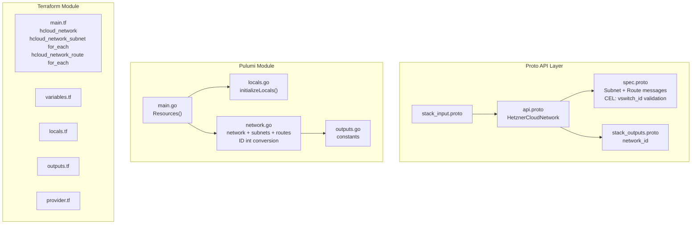

# HetznerCloudNetwork: Private Networking with Subnets and Routes

**Date**: February 19, 2026
**Type**: Feature
**Components**: API Definitions, Pulumi CLI Integration, Terraform Module

## Summary

Added the `HetznerCloudNetwork` deployment component (R04, enum 3510, id_prefix: `hcnet`) to OpenMCF. This is the fourth Hetzner Cloud component and the **first multi-resource bundle**, combining `hcloud_network` + `hcloud_network_subnet` (repeated) + `hcloud_network_route` (repeated) into a single composable unit. It establishes new patterns for sub-resource keying, Pulumi ID type conversion, and Terraform `for_each` maps that will be reused by at least five subsequent components.

## Problem Statement / Motivation

Hetzner Cloud servers and load balancers require private network connectivity. Without a network component, there is no way to provision the foundational networking infrastructure that all subsequent compute and load balancing components depend on.

### Pain Points

- No way to manage Hetzner Cloud private networks through OpenMCF
- HetznerCloudServer (R07) and HetznerCloudLoadBalancer (R11) need network_id references via StringValueOrRef
- All three planned infra charts require private networking as their foundation
- Networks without subnets are unusable -- they must be bundled as a single component

## Solution / What's New

Implemented `HetznerCloudNetwork` bundling a parent network with inline subnets and optional static routes. The component is designed as a single unit because a Hetzner Cloud network is unusable without subnets -- servers and load balancers attach to subnets, not directly to the network.

### Design Decision: Natural Key Strategy for Sub-Resources

This is the first component where sub-resources (subnets, routes) are separate Terraform/Pulumi resources rather than inline blocks. Each needs a stable, unique key for state management. We use **natural keys from provider-unique fields**:

- **Subnets** keyed by `ip_range` (unique per network, enforced by Hetzner)
- **Routes** keyed by `destination` (unique per network, enforced by Hetzner)

This ensures reordering items in the YAML manifest does not trigger infrastructure replacements. CIDRs are sanitized for resource names (e.g., `10.0.1.0/24` becomes `subnet-10-0-1-0-24`).

### Design Decision: Require At Least One Subnet

The `subnets` field enforces `min_items = 1` via buf.validate. This aligns with the bundling rationale: a network without subnets has no practical use. Routes remain optional since default routing handles most cases.

### Design Decision: Include vSwitch Support

The `vswitch_id` field on subnets and `expose_routes_to_vswitch` on the network enable hybrid cloud/dedicated server connectivity. A CEL validation ensures `vswitch_id` is provided when subnet type is `vswitch`.

### Component Architecture



## Implementation Details

### Proto Schema

- **Spec**: `ip_range` (network CIDR), `repeated Subnet subnets` (min 1), `repeated Route routes` (optional), `delete_protection`, `expose_routes_to_vswitch`
- **Subnet**: `SubnetType type` enum (cloud/server/vswitch), `network_zone` (string), `ip_range`, optional `vswitch_id`
- **Route**: `destination` (CIDR), `gateway` (IP address)
- **CEL validation**: `vswitch_id` required when subnet type is `vswitch`
- **Outputs**: `network_id` (string) -- referenced by HetznerCloudServer, HetznerCloudLoadBalancer via StringValueOrRef

### Pulumi Module -- New Patterns

**ID type conversion**: The Pulumi hcloud SDK requires `pulumi.IntInput` for `NetworkId` in subnet/route args, but `Network.ID()` returns `pulumi.IDOutput` (string). Conversion via `ApplyT`:

```go
networkIdInt := createdNetwork.ID().ApplyT(func(id pulumi.ID) (int, error) {
    return strconv.Atoi(string(id))
}).(pulumi.IntOutput)
```

**Sub-resource keying**: Subnets and routes use sanitized CIDR strings as Pulumi resource names via a `sanitizeCidr()` helper that replaces `.` and `/` with `-`.

### Terraform Module -- New Patterns

**`for_each` maps**: Subnets and routes use `for_each` with natural keys instead of `count` or `dynamic` blocks:

```hcl
resource "hcloud_network_subnet" "this" {
  for_each = { for s in var.spec.subnets : s.ip_range => s }
  ...
}
```

### Validation

- 16/16 Ginkgo spec tests pass (7 valid cases, 9 invalid cases)
- `go build` / `go vet` clean
- `terraform validate` passes
- Kind map generated and compiles

## Benefits

- Enables private networking for all Hetzner Cloud compute and load balancing resources
- Establishes reusable patterns for multi-resource bundles (natural keying, ID conversion, for_each)
- CEL validation catches vSwitch misconfiguration at API admission time
- Full provider coverage including vSwitch support for hybrid deployments

## Impact

- **Users**: Can define complete private networks with subnets and routes as a single composable unit
- **Future components**: R07 (Server), R11 (LoadBalancer) reference `network_id` via StringValueOrRef
- **Pattern**: First multi-resource bundle -- sets the template for R06, R07, R08, R10, R11

## Files Changed

| Area | Files | Description |
|------|-------|-------------|
| Proto | 4 | spec (with CEL + Subnet/Route messages), api, stack_input, stack_outputs |
| Enum | 1 | cloud_resource_kind.proto (added 3510) |
| Tests | 1 | spec_test.go (16 test cases) |
| Pulumi | 5 | module (4 files) + entrypoint |
| Terraform | 5 | provider, variables, locals, main, outputs |
| Hack | 1 | manifest.yaml |
| Generated | 5+ | .pb.go stubs, BUILD.bazel, kind_map_gen.go |

## Related Work

- Follows patterns established by R01 (SshKey), R02 (PlacementGroup), R03 (Firewall)
- Referenced by upcoming R07 (Server) and R11 (LoadBalancer) via StringValueOrRef
- Natural keying and ID conversion patterns will be reused by R06, R07, R08, R10, R11

---

**Status**: Production Ready
**Timeline**: Single session
