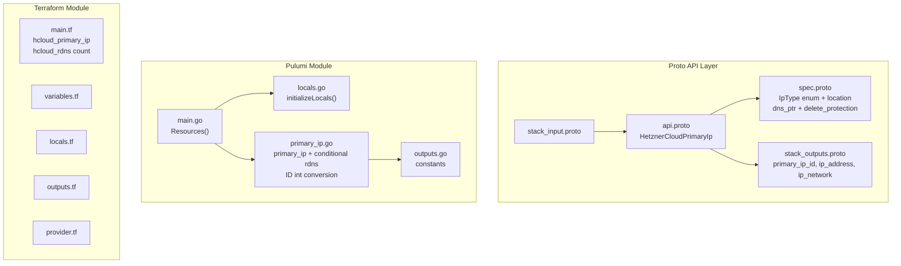

# HetznerCloudPrimaryIp: Managed Public IPs with Reverse DNS

**Date**: February 19, 2026
**Type**: Feature
**Components**: API Definitions, Pulumi CLI Integration, Terraform Module

## Summary

Added the `HetznerCloudPrimaryIp` deployment component (R05, enum 3511, id_prefix: `hcpip`) to Planton. This component manages Hetzner Cloud Primary IPs -- persistent public IPv4 addresses or IPv6 /64 blocks that survive server deletion and can be reassigned. It bundles optional reverse DNS (rDNS) as a conditional child resource. Five provider fields are intentionally hardcoded or omitted to enforce safe-by-default behavior in Planton's independent component model.

## Problem Statement / Motivation

Hetzner Cloud servers need stable public IP addresses for production use cases like mail servers, DNS endpoints, and services that require consistent IP identity. Auto-assigned server IPs are ephemeral and change on server recreation.

### Pain Points

- No way to manage persistent public IPs through Planton independently of servers
- HetznerCloudServer (R07) needs primary_ip_id references via StringValueOrRef to assign stable IPs
- Mail servers and identity-verified services require reverse DNS, which is tightly coupled to the IP resource
- The planned hetzner-load-balanced-app and hetzner-ha-server-cluster infra charts need pre-allocated IPs

## Solution / What's New

Implemented `HetznerCloudPrimaryIp` as a standalone IP allocation component with optional rDNS. The spec is deliberately minimal (4 fields) while the IaC modules handle provider complexity behind the scenes.

### Design Decisions

**D1: `auto_delete` hardcoded to `false`** -- In Planton's component model, resources are managed independently. If `auto_delete` were `true`, deleting the assigned server would silently destroy the Primary IP, breaking Planton state management. This is a safety-critical default.

**D2: No `assignee_id` in spec** -- Server assignment is the HetznerCloudServer component's responsibility, not the IP component's. This maintains clean separation of concerns and composability.

**D3: `assignee_type` hardcoded to `"server"`** -- The only type Hetzner Cloud currently supports. Exposing a single-value field adds noise without value.

**D4: Single `dns_ptr` string for rDNS** -- Covers the dominant use case (one rDNS record per IP). For IPv6, rDNS is set on the primary address in the /64 block. Per-address IPv6 rDNS is an edge case that can be added later as a backward-compatible extension.

**D5: No `datacenter` field** -- Deprecated in the provider (removal after 2026-07-01). Only `location` is exposed.

### Component Architecture

## Implementation Details

### Proto Schema

- **Spec**: `IpType type` (required enum: ipv4/ipv6, ForceNew), `location` (required string, ForceNew), `dns_ptr` (optional string), `delete_protection` (bool)
- **IpType enum**: Embedded in the spec message -- `ip_type_unspecified`, `ipv4`, `ipv6`
- **Outputs**: `primary_ip_id` (string), `ip_address` (string), `ip_network` (string, empty for IPv4)

### Pulumi Module

Follows the parent+child resource pattern from R04 (Network). The Primary IP is created first, then a conditional rDNS resource references it:

- Uses CG02 pattern for ID string-to-int conversion (`ApplyT` + `strconv.Atoi`)
- rDNS conditionally created only when `spec.DnsPtr != ""`
- rDNS references `createdPrimaryIp.IpAddress` directly (no manual wiring)
- Three stack outputs exported: `primary_ip_id`, `ip_address`, `ip_network`

### Terraform Module

- `hcloud_primary_ip` with hardcoded `assignee_type = "server"` and `auto_delete = false`
- `hcloud_rdns` with `count` conditional on `dns_ptr` being non-null and non-empty
- rDNS references `hcloud_primary_ip.this.id` and `hcloud_primary_ip.this.ip_address`

### Validation

- 10/10 Ginkgo spec tests pass (6 valid cases, 4 invalid cases)
- `go build` / `go vet` clean
- `terraform validate` passes
- Kind map generated and compiles

## Benefits

- Enables stable public IP management independent of server lifecycle
- Safe-by-default: auto_delete=false prevents accidental IP destruction on server removal
- rDNS bundling covers the common mail server and identity verification use case
- Clean composability: Server component references IP via StringValueOrRef output

## Impact

- **Users**: Can allocate persistent public IPv4/IPv6 addresses with optional rDNS as a single unit
- **Future components**: R07 (Server) references `primary_ip_id` via StringValueOrRef
- **Infra charts**: hetzner-load-balanced-app and hetzner-ha-server-cluster use pre-allocated IPs

## Files Changed

| Area | Files | Description |
|------|-------|-------------|
| Proto | 4 | spec (with IpType enum), api, stack_input, stack_outputs |
| Enum | 1 | cloud_resource_kind.proto (added 3511) |
| Tests | 1 | spec_test.go (10 test cases) |
| Pulumi | 5 | module (4 files) + entrypoint |
| Terraform | 5 | provider, variables, locals, main, outputs |
| Hack | 1 | manifest.yaml |
| Generated | 5+ | .pb.go stubs, BUILD.bazel, kind_map_gen.go |

## Related Work

- Follows patterns established by R01-R04, especially R04 (Network) for parent+child resource pattern
- Uses CG02 (ID type conversion) pattern established during R04
- Uses CG01 (label handling) pattern established during R01
- Referenced by upcoming R07 (Server) via StringValueOrRef for stable IP assignment
- R06 (FloatingIp) will follow a very similar pattern (IP + rDNS + optional assignment)

---

**Status**: Production Ready
**Timeline**: Single session
