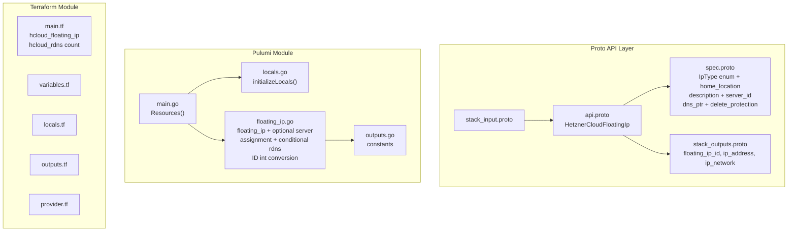

# HetznerCloudFloatingIp: Reassignable IPs with Server Assignment and Reverse DNS

**Date**: February 19, 2026
**Type**: Feature
**Components**: API Definitions, Pulumi CLI Integration, Terraform Module

## Summary

Added the `HetznerCloudFloatingIp` deployment component (R06, enum 3512, id_prefix: `hcfip`) to Planton. This component manages Hetzner Cloud Floating IPs -- reassignable public IPv4 addresses or IPv6 /64 blocks that can move between servers in the same location for failover scenarios. It bundles optional reverse DNS (rDNS) and optional server assignment. This is the first Hetzner Cloud component to use `StringValueOrRef` for cross-component wiring, establishing the pattern for R07-R11.

## Problem Statement / Motivation

Production workloads on Hetzner Cloud need IP addresses that survive server replacement and can be moved between servers for failover. Unlike Primary IPs (R05) which are assigned at server creation, Floating IPs are explicitly reassignable -- the canonical tool for HA failover scenarios.

### Pain Points

- No way to manage reassignable failover IPs through Planton
- HA server clusters (hetzner-ha-server-cluster infra chart) need Floating IPs that can move between servers
- Floating IPs require reverse DNS for mail servers and identity-verified services
- Cross-component wiring (Floating IP -> Server assignment) had no established pattern in Hetzner Cloud

## Solution / What's New

Implemented `HetznerCloudFloatingIp` with three design decisions that deviate from the original plan:

### Design Decisions

**D1: Dropped `hcloud_floating_ip_assignment` -- use `server_id` on main resource instead.** The plan bundled a separate assignment resource, but the main `hcloud_floating_ip` resource already supports `server_id` natively (on create, update, and delete). Within Planton's single-component model, the separate resource adds complexity with zero benefit. Both Pulumi and Terraform handle this cleanly.

**D2: `StringValueOrRef` for `server_id` WITHOUT `default_kind` option.** This is the first Hetzner Cloud component to use `StringValueOrRef`. Since HetznerCloudServer (R07, enum 3520) isn't registered yet, we can't reference its enum in the `default_kind` field option. Using `StringValueOrRef` now (vs plain `string`) is critical because migrating from scalar to message type later would be a breaking protobuf wire format change. The `default_kind` option will be added as a backward-compatible enhancement when R07 is registered.

**D3: `home_location` always required** -- even though the TF provider makes it optional when `server_id` is provided. Explicit is better: users should always know where their IP is homed. This is consistent with PrimaryIp's required `location` and avoids a complex CEL cross-field validation.

### Component Architecture

## Implementation Details

### Proto Schema

- **Spec**: `IpType type` (required enum: ipv4/ipv6, ForceNew), `home_location` (required string, ForceNew), `description` (optional string), `server_id` (optional StringValueOrRef), `dns_ptr` (optional string), `delete_protection` (bool)
- **IpType enum**: Embedded in the spec message -- `ip_type_unspecified`, `ipv4`, `ipv6` (same shape as PrimaryIp)
- **Outputs**: `floating_ip_id` (string), `ip_address` (string), `ip_network` (string, empty for IPv4)
- **StringValueOrRef import**: First Hetzner Cloud proto to import `dev/planton/shared/foreignkey/v1/foreign_key.proto`

### Pulumi Module

- `FloatingIpArgs` populated with required fields; `Description` and `ServerId` conditionally set only when non-empty
- `server_id` resolved via `spec.ServerId.GetValue()` -> `strconv.Atoi()` -> `pulumi.IntPtr()` (platform resolves references before IaC execution)
- rDNS uses `FloatingIpId` (not `PrimaryIpId`) on `hcloud.RdnsArgs` with CG02 ID int conversion
- Three stack outputs: `floating_ip_id`, `ip_address`, `ip_network`

### Terraform Module

- `hcloud_floating_ip.this` with `server_id = tonumber(var.spec.server_id)` when non-null
- Conditional `hcloud_rdns.this` using `count` on `dns_ptr`
- rDNS references `floating_ip_id` (not `primary_ip_id`)

### Comparison with PrimaryIp (R05)

| Aspect | PrimaryIp | FloatingIp |
|--------|-----------|------------|
| Location field | `location` | `home_location` |
| Description | Not supported by provider | Optional string |
| Server assignment | Not in spec (server references IP) | Optional `StringValueOrRef` |
| Provider hardcoding | `assignee_type=server`, `auto_delete=false` | None needed |
| IpType enum | Same | Same |
| rDNS pattern | Same | Same (uses `floating_ip_id`) |

### Validation

- 10/10 Ginkgo spec tests pass (6 valid cases, 4 invalid cases)
- `go build` / `go vet` clean
- `terraform validate` passes
- Kind map generated and compiles

## Benefits

- Enables reassignable failover IP management as a first-class Planton component
- Establishes `StringValueOrRef` pattern for Hetzner Cloud cross-component wiring (R07-R11 will follow)
- Simpler IaC than planned: one resource instead of two (dropped unnecessary assignment resource)
- Clean composability: infra charts can wire Server -> FloatingIp assignment declaratively

## Impact

- **Users**: Can allocate reassignable public IPv4/IPv6 addresses with optional server assignment and rDNS
- **Future components**: R07 (Server) can reference `floating_ip_id` output; FloatingIp can reference Server's `server_id` output via `StringValueOrRef`
- **Infra charts**: hetzner-ha-server-cluster uses floating IPs for failover
- **Pattern precedent**: First Hetzner Cloud `StringValueOrRef` usage establishes the wiring pattern

## Files Changed

| Area | Files | Description |
|------|-------|-------------|
| Proto | 4 | spec (with IpType enum + StringValueOrRef), api, stack_input, stack_outputs |
| Enum | 1 | cloud_resource_kind.proto (added 3512) |
| Tests | 1 | spec_test.go (10 test cases) |
| Pulumi | 5 | module (4 files) + entrypoint |
| Terraform | 5 | provider, variables, locals, main, outputs |
| Hack | 1 | manifest.yaml |
| Generated | 5+ | .pb.go stubs, BUILD.bazel, kind_map_gen.go |

## Related Work

- Closest sibling: R05 (PrimaryIp) -- same IpType enum, rDNS pattern, output shape
- Uses CG02 (ID type conversion) pattern established during R04 (Network)
- Uses CG01 (label handling) pattern established during R01 (SshKey)
- First to use `StringValueOrRef` for Hetzner Cloud -- pattern will be reused by R07 (Server), R08 (Volume), R11 (LoadBalancer)
- Unblocks R07 (Server) which can now reference FloatingIp for assignment

---

**Status**: Production Ready
**Timeline**: Single session
