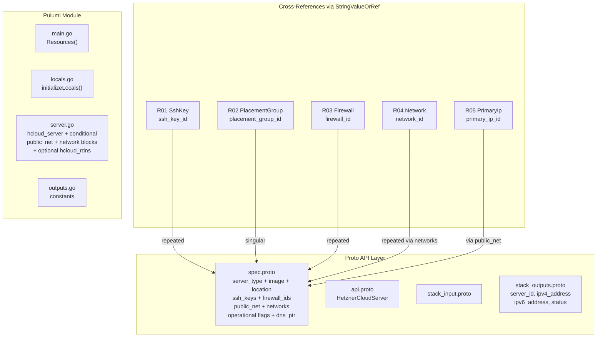

# HetznerCloudServer: Core Compute with Full Cross-Component Wiring

**Date**: February 19, 2026
**Type**: Feature
**Components**: API Definitions, Pulumi CLI Integration, Terraform Module

## Summary

Added the `HetznerCloudServer` deployment component (R07, enum 3520, id_prefix: `hcsrv`) to OpenMCF. This is the most interconnected Hetzner Cloud component, bundling `hcloud_server` with optional `hcloud_rdns` and cross-referencing five foundation components (SshKey, PlacementGroup, Firewall, Network, PrimaryIp) via `StringValueOrRef`. It is the first component to use `repeated StringValueOrRef` for multi-value references (ssh_keys, firewall_ids) and nested messages with `optional bool` defaults for the PublicNet configuration.

## Problem Statement / Motivation

Hetzner Cloud servers are the core compute primitive. Every infra chart in the Hetzner Cloud catalog (server-environment, load-balanced-app, ha-server-cluster) requires servers as the central resource. Until now, we had no way to declaratively provision servers wired to the foundation components (SSH keys, firewalls, networks, placement groups, primary IPs) already implemented in R01-R06.

### Pain Points

- No way to manage Hetzner Cloud servers through OpenMCF
- No established pattern for `repeated StringValueOrRef` (multi-value cross-references)
- Server public networking defaults (IPv4+IPv6 auto-assigned) needed careful proto3 bool handling
- Inline network attachments required the alias_ips Terraform bridge bug workaround

## Solution / What's New

### Design Decisions

**D1: Inline network blocks over separate hcloud_server_network resource.** The server "owns" its network attachments. Splitting into a separate resource would fragment the component's self-contained nature. Network attachment keying uses `network_id` as the natural key (CG02 pattern), with `for_each` in Terraform and direct iteration in Pulumi.

**D2: `optional bool` with default annotation for PublicNet.** Proto3 bools default to false, so an empty PublicNet message would unintentionally disable both IPv4 and IPv6. Using `optional bool` with `(org.openmcf.shared.options.default) = "true"` ensures the IaC modules treat unset bools as `true`, matching the provider's default behavior.

**D3: rDNS scoped to auto-assigned IPv4 only.** The `dns_ptr` field creates an `hcloud_rdns` record for the server's computed IPv4 address. If users attach Primary IPs via `public_net.ipv4`, they should manage rDNS on the HetznerCloudPrimaryIp component instead to avoid conflicting rDNS management on the same IP.

**D4: Excluded operational fields.** `iso`, `rescue`, `allow_deprecated_images`, `ignore_remote_firewall_ids`, `datacenter` (deprecated), and `backup_window` (deprecated) are excluded as they are operational/runtime actions or deprecated fields, not declarative infrastructure configuration.

### Component Architecture

## Implementation Details

### Proto Schema

- **Spec**: 15 fields organized into core config (server_type, image, location), cross-references (ssh_keys, user_data, placement_group_id, firewall_ids), networking (public_net, networks), operational (backups, keep_disk, delete_protection, rebuild_protection, shutdown_before_deletion), and rDNS (dns_ptr)
- **PublicNet**: Nested message with `optional bool ipv4_enabled` (default true), `optional bool ipv6_enabled` (default true), `StringValueOrRef ipv4`, `StringValueOrRef ipv6`
- **NetworkAttachment**: Nested message with required `StringValueOrRef network_id`, optional `ip`, optional `repeated string alias_ips`
- **Outputs**: `server_id`, `ipv4_address`, `ipv6_address`, `status`
- **First use of**: `repeated StringValueOrRef`, nested messages with `optional bool` defaults, `default_kind` field options on StringValueOrRef fields

### Pulumi Module

- `server.go` handles all StringValueOrRef -> int conversions (6 conversion points: placement_group_id, firewall_ids[], public_net.ipv4, public_net.ipv6, networks[].network_id, plus rDNS server_id via ApplyT)
- Public net block conditionally built only when `spec.PublicNet != nil` to preserve auto-assigned IP default
- Network attachments always pass `AliasIps` (even empty) to avoid Terraform bridge bug #650
- Helper functions `buildPublicNet()`, `buildNetworkAttachments()`, `toIntInputArray()` keep the main function clean

### Terraform Module

- `dynamic "public_net"` block renders only when `var.spec.public_net != null`
- `dynamic "network"` block uses `for_each` keyed on `network_id`
- All ID references use `tonumber()` for string-to-int conversion
- Conditional `hcloud_rdns` via `count`

### Validation

- 19/19 Ginkgo spec tests pass (13 valid cases, 6 invalid cases)
- `go build` / `go vet` clean
- `terraform validate` passes
- Kind map generated and compiles

## Benefits

- Enables core compute provisioning as a first-class OpenMCF component
- Establishes `repeated StringValueOrRef` pattern for multi-value references
- Establishes `optional bool` with defaults pattern for nested messages
- Clean composability: all foundation components (R01-R05) can be wired via spec
- Unblocks R08 (Volume), R09 (Snapshot), R11 (LoadBalancer) which reference server_id

## Impact

- **Users**: Can declaratively provision servers with SSH keys, firewalls, networks, placement groups, and primary IPs
- **Future components**: R08 (Volume) and R09 (Snapshot) can reference `server_id` output; R11 (LoadBalancer) can target servers
- **Infra charts**: All three charts (server-environment, load-balanced-app, ha-server-cluster) depend on this component
- **Pattern precedent**: `repeated StringValueOrRef` and nested `optional bool` defaults established for reuse

## Files Changed

| Area | Files | Description |
|------|-------|-------------|
| Proto | 4 | spec (PublicNet + NetworkAttachment nested messages), api, stack_input, stack_outputs |
| Enum | 1 | cloud_resource_kind.proto (added 3520) |
| Tests | 1 | spec_test.go (19 test cases) |
| Pulumi | 5 | module (4 files) + entrypoint |
| Terraform | 5 | provider, variables, locals, main, outputs |
| Hack | 1 | manifest.yaml |
| Generated | 5+ | .pb.go stubs, BUILD.bazel, kind_map_gen.go |

## Related Work

- References: R01 (SshKey), R02 (PlacementGroup), R03 (Firewall), R04 (Network), R05 (PrimaryIp)
- Referenced by: R08 (Volume), R09 (Snapshot), R06 (FloatingIp via assignment), R11 (LoadBalancer via targets)
- Uses CG01 (label handling), CG02 (sub-resource keying and ID conversion)
- Builds on StringValueOrRef pattern established by R06 (FloatingIp)

---

**Status**: Production Ready
**Timeline**: Single session
