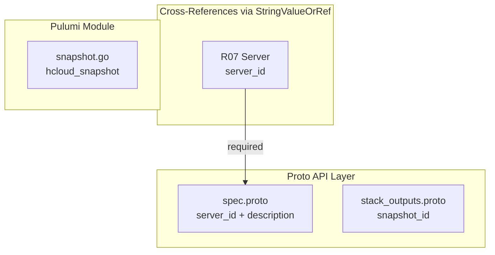

# HetznerCloudSnapshot: Point-in-Time Server Image Capture

**Date**: February 19, 2026
**Type**: Feature
**Components**: API Definitions, Pulumi CLI Integration, Terraform Module

## Summary

Added the `HetznerCloudSnapshot` deployment component (R09, enum 3522, id_prefix: `hcsnp`) to Planton. This is the simplest compute component -- a single `hcloud_snapshot` resource that captures a point-in-time disk image from a server. The snapshot is stored as a Hetzner Cloud Image and can be used to create new servers from the captured state.

## Problem Statement / Motivation

Server snapshots are essential for golden image pipelines, pre-upgrade backups, and server cloning workflows. Until now, Planton had no declarative way to manage Hetzner Cloud snapshots.

### Pain Points

- No way to declaratively capture and manage server snapshots through Planton
- Snapshot creation is inherently imperative ("take a snapshot now"), but IaC semantics make it declarative and idempotent ("ensure this snapshot exists")

## Solution / What's New

A minimal, focused component with only 2 user-facing spec fields:

- `server_id` (required StringValueOrRef) -- the server to snapshot, with cross-reference support to HetznerCloudServer
- `description` (optional string) -- human-readable label for the snapshot

Labels are derived from metadata per CG01. This is the first Hetzner Cloud component with a **required** `StringValueOrRef` field (Volume's `server_id` was optional).

### Component Architecture

## Implementation Details

### Proto Schema

- **Spec**: 2 fields -- `server_id` (required StringValueOrRef, ForceNew), `description` (optional string)
- **Validation**: `(buf.validate.field).required = true` on server_id ensures the message wrapper is non-null
- **Output**: `snapshot_id` -- the Hetzner Cloud image ID, usable as a server's `image` parameter

### Pulumi Module

- `snapshot.go` parses `server_id` string to int via `strconv.Atoi`, conditionally sets `Description`, passes labels from locals
- Exports `snapshot_id` from `createdSnapshot.ID()`
- No sub-resources or conditional logic -- cleanest possible module

### Terraform Module

- Single `hcloud_snapshot` resource with `tonumber()` for server_id conversion
- Standard label merge via locals (CG01)

### Validation

- 3/3 Ginkgo spec tests pass (2 valid cases, 1 invalid case)
- `go build` clean
- Kind map generated and compiles

## Benefits

- Enables declarative snapshot management for golden images and backup workflows
- `snapshot_id` output allows creating new servers from snapshots via cross-reference
- Minimal spec surface -- only 2 fields -- reduces user cognitive load

## Impact

- **Users**: Can declaratively capture server snapshots and reference them in server creation
- **Future components**: Snapshot output can be used as a server `image` parameter
- **Infra charts**: Supports golden image and backup patterns in server-environment chart

## Files Changed

| Area | Files | Description |
|------|-------|-------------|
| Proto | 4 | spec, api, stack_input, stack_outputs |
| Enum | 1 | cloud_resource_kind.proto (added 3522) |
| Tests | 1 | spec_test.go (3 test cases) |
| Pulumi | 5 | module (4 files) + entrypoint |
| Terraform | 5 | provider, variables, locals, main, outputs |
| Hack | 1 | manifest.yaml |
| Generated | 5+ | .pb.go stubs, BUILD.bazel, kind_map_gen.go |

## Related Work

- References: R07 (Server) via StringValueOrRef for server_id
- Referenced by: None directly (snapshots are leaf resources)
- Uses CG01 (label handling), CG02 (Pulumi ID string-to-int conversion)
- Follows Volume (R08) as closest reference, but simpler (no sub-resources, no enum)

---

**Status**: Production Ready
**Timeline**: Single session
