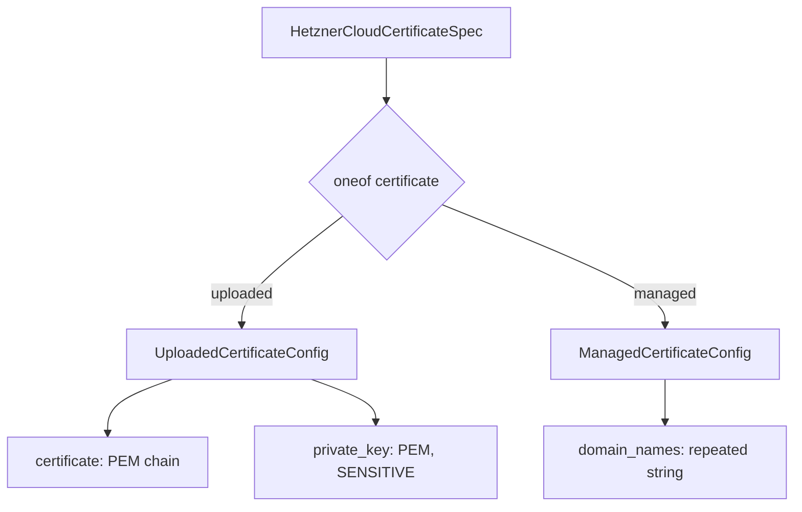
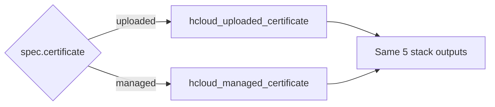

# Hetzner Cloud Certificate Component

**Date**: February 19, 2026
**Type**: Feature
**Components**: API Definitions, Pulumi IaC Module, Terraform IaC Module

## Summary

Added the `HetznerCloudCertificate` deployment component (R10, enum 3530) supporting both uploaded (user-provided) and managed (Let's Encrypt) TLS certificates. Uses a proto `oneof` design that enforces mutual exclusivity at the schema level, with full Pulumi and Terraform IaC modules that conditionally create the appropriate provider resource based on the chosen variant.

## Problem Statement / Motivation

Hetzner Cloud load balancers require TLS certificates for HTTPS services. The platform needed a certificate component that:
- Supports both user-uploaded certificates and Hetzner-managed Let's Encrypt certificates
- Exposes a `certificate_id` output for cross-component wiring with `HetznerCloudLoadBalancer` (R11)
- Makes it structurally impossible to mix fields from both certificate types in a single manifest

### Pain Points

- Without a certificate component, load balancer HTTPS listeners cannot be configured
- The two certificate types have fundamentally different input requirements (PEM content vs domain names)
- Uploaded certificates contain sensitive private key material requiring special handling

## Solution / What's New

### Proto oneof Design

Instead of using a flat spec with a `type` enum field and conditional validation, the component uses a proto `oneof` with typed sub-messages:

This makes invalid combinations structurally impossible -- users choose a variant by setting the corresponding field, and the YAML manifest reads naturally.

### IaC Type-Switch Pattern

Both Pulumi and Terraform modules conditionally create the correct provider resource:

- **Pulumi**: Go type switch on the oneof discriminator, calling `hcloud.NewUploadedCertificate` or `hcloud.NewManagedCertificate`
- **Terraform**: `count`-based conditional with `local.is_uploaded` / `local.is_managed` booleans

## Implementation Details

### Files Created

| Path | Purpose |
|------|---------|
| `hetznercloudcertificate/v1/spec.proto` | Spec with oneof, UploadedCertificateConfig, ManagedCertificateConfig |
| `hetznercloudcertificate/v1/api.proto` | KRM wrapper (apiVersion, kind, metadata, spec, status) |
| `hetznercloudcertificate/v1/stack_input.proto` | Stack input (target + provider config) |
| `hetznercloudcertificate/v1/stack_outputs.proto` | Outputs: certificate_id, type, fingerprint, not_valid_before, not_valid_after |
| `hetznercloudcertificate/v1/spec_test.go` | 9 Ginkgo validation tests covering both variants and edge cases |
| `hetznercloudcertificate/v1/iac/hack/manifest.yaml` | Test manifests for both uploaded and managed variants |
| `hetznercloudcertificate/v1/iac/pulumi/main.go` | Pulumi entrypoint |
| `hetznercloudcertificate/v1/iac/pulumi/Pulumi.yaml` | Pulumi project config |
| `hetznercloudcertificate/v1/iac/pulumi/module/main.go` | Module entry point |
| `hetznercloudcertificate/v1/iac/pulumi/module/locals.go` | Label construction (CG01 pattern) |
| `hetznercloudcertificate/v1/iac/pulumi/module/outputs.go` | Output constants |
| `hetznercloudcertificate/v1/iac/pulumi/module/certificate.go` | Type-switch resource creation |
| `hetznercloudcertificate/v1/iac/tf/provider.tf` | hcloud provider ~> 1.60 |
| `hetznercloudcertificate/v1/iac/tf/variables.tf` | Inputs with oneof validation |
| `hetznercloudcertificate/v1/iac/tf/locals.tf` | Standard labels + type booleans |
| `hetznercloudcertificate/v1/iac/tf/main.tf` | Conditional resources via count |
| `hetznercloudcertificate/v1/iac/tf/outputs.tf` | Conditional outputs |

### Key Design Decisions

1. **oneof over enum**: Proto `oneof` enforces mutual exclusivity at the schema level, eliminating the need for cross-field CEL validation rules
2. **Separate provider resources**: Uses `hcloud_uploaded_certificate` / `hcloud_managed_certificate` (not the deprecated `hcloud_certificate`)
3. **Secret handling**: Private key passed via `pulumi.ToSecret()` in Pulumi; `sensitive = true` on the Terraform variable
4. **Unified outputs**: Both variants export the same 5 outputs, so downstream consumers (R11 LoadBalancer) don't need to care which type was used

## Benefits

- Load balancer HTTPS services can now reference certificate IDs via StringValueOrRef
- Schema-level safety: impossible to create an invalid certificate manifest
- Clean YAML UX: `spec.uploaded:` or `spec.managed:` -- no type enum to remember
- First component to establish the sensitive-field pattern for future reuse

## Impact

- **R11 HetznerCloudLoadBalancer** can now reference `certificate_id` for HTTPS services
- **Infra charts** (hetzner-load-balanced-app) gain TLS capability
- Establishes the oneof type-switch pattern for any future either/or components

## Related Work

- R01-R09: Foundation, networking, compute, and storage components (completed)
- R11 HetznerCloudLoadBalancer: Primary consumer of certificate_id (next in queue)
- CG01: Label handling pattern (reused)

---

**Status**: Production Ready
