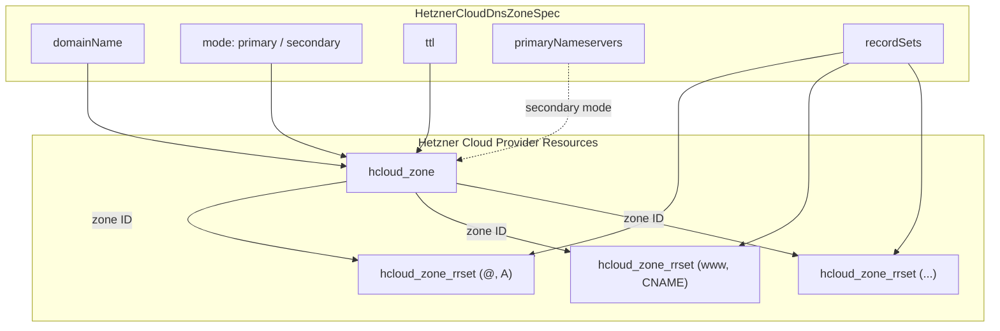

# Hetzner Cloud DNS Zone Component

**Date**: February 19, 2026
**Type**: Feature
**Components**: API Definitions, Pulumi IaC Module, Terraform IaC Module, Provider Framework

## Summary

Added HetznerCloudDnsZone (R12) -- the 12th and final Hetzner Cloud resource kind in Planton. This component bundles `hcloud_zone` with `hcloud_zone_rrset` to manage DNS zones and record sets, supporting both primary (authoritative) and secondary (zone-transfer) operating modes.

## Problem Statement / Motivation

The Hetzner Cloud provider expansion required 12 resource kinds to enable 3 planned infra charts. DNS zone management was the final piece -- without it, the `hetzner-load-balanced-app` infra chart cannot create DNS records pointing to load balancer IPs, and users cannot manage Hetzner Cloud DNS from Planton manifests.

### Pain Points

- No DNS management capability in the Hetzner Cloud provider
- Users must manage DNS outside of Planton even when all other infrastructure is declared as code
- Infra chart composability requires DNS records that can reference other component outputs (server IPs, LB addresses)

## Solution / What's New

A complete HetznerCloudDnsZone deployment component with enum 3540 (id prefix: `hcdns`).

### Key Design Decisions

1. **`hcloud_zone_rrset` over `hcloud_zone_record`**: The Terraform provider docs explicitly recommend `zone_rrset`. It supports in-place value updates (zone_record forces destroy+recreate on any change), supports labels and change_protection, and keys naturally by (name, type) for clean `for_each` / Pulumi naming.

2. **`spec.domain_name` separate from `metadata.name`**: DNS zone names are domain names (e.g., "example.com") containing dots, which don't fit the Kubernetes-style identifier format of `metadata.name`. The spec has an explicit `domain_name` field while `metadata.name` remains the resource identifier.

3. **Both primary and secondary modes**: CEL validations enforce the cross-constraints (primary forbids `primary_nameservers`; secondary requires them and forbids `record_sets`).

4. **`StringValueOrRef` on record values**: Enables infra-chart composability -- an A record can reference a HetznerCloudServer's `ipv4_address` output or a HetznerCloudLoadBalancer's IP.

### Component Architecture

## Implementation Details

### Proto API (4 files)

- `spec.proto`: `HetznerCloudDnsZoneSpec` with mode enum, `PrimaryNameserver`, `RecordSet`, and `RecordValue` messages. Three CEL validations for mode/nameserver/recordset cross-constraints.
- `api.proto`: Standard resource wrapper with `api_version: "hetzner-cloud.planton.dev/v1"`.
- `stack_input.proto`: Stack input with target + provider config.
- `stack_outputs.proto`: `zone_id` (string) + `nameservers` (repeated string -- assigned Hetzner nameservers for registrar configuration).

### Validation Tests (21 tests)

Comprehensive test suite covering valid specs (minimal primary, primary with records, secondary with TSIG, full spec) and invalid specs (cross-mode constraint violations, missing fields, empty records).

### Pulumi Module

- CG01 label handling on the zone resource.
- CG02 natural keying: rrsets keyed by `rrset-{sanitizedName}-{type}` (e.g., `rrset-at-a`, `rrset-www-cname`). Special-case `@` -> `at`, `*` -> `wildcard`.
- No integer ID conversion needed -- `hcloud_zone_rrset.Zone` accepts a string (zone ID or name), so `zone.ID()` passes directly.
- `StringValueOrRef` resolution via `.GetValue()` for record values.

### Terraform Module

- Plugin Framework attributes (not SDKv2 blocks) -- `primary_nameservers` and `records` use assignment syntax, not dynamic blocks.
- `for_each` keyed by `"${rs.name}-${lower(rs.type)}"` per CG02.
- TSIG key fields in `variables.tf` accept sensitive input.

## Benefits

- Completes the 12-resource Hetzner Cloud provider expansion
- Enables the `hetzner-load-balanced-app` infra chart with DNS record management
- Supports both primary zones (direct record management) and secondary zones (zone transfer from external primaries)
- Record values support cross-component references via StringValueOrRef

## Impact

- **Users**: Can now manage DNS zones and records as part of their Planton manifests, with full composability for infra charts.
- **Platform**: All 12 planned Hetzner Cloud resource kinds are now implemented (Start phase complete). Docs and presets remain for some components.
- **Infra Charts**: DNS was the final dependency for the planned `hetzner-load-balanced-app` chart.

## Related Work

- Part of the 20260219.03.sp.hetznercloud-resource-expansion sub-project (12 components)
- Parent project: 20260212.01.planton-cloud-provider-expansion
- Previous component: R11 HetznerCloudLoadBalancer (completed earlier today)
- Coding guidelines: CG01 (label handling), CG02 (sub-resource keying)

---

**Status**: Production Ready
**Timeline**: Single session
