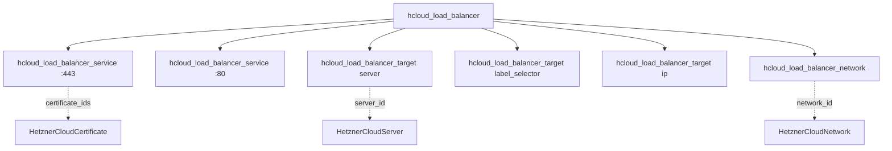

# Hetzner Cloud Load Balancer Component

**Date**: February 19, 2026
**Type**: Feature
**Components**: API Definitions, Pulumi IaC Module, Terraform IaC Module

## Summary

Added the `HetznerCloudLoadBalancer` deployment component (R11, enum 3531) -- the most comprehensive load balancing component in the Hetzner Cloud provider. Bundles `hcloud_load_balancer`, `hcloud_load_balancer_service` (repeated), `hcloud_load_balancer_target` (polymorphic: server, label_selector, ip), and `hcloud_load_balancer_network` (optional). Full Pulumi and Terraform IaC modules with feature parity.

## Problem Statement / Motivation

Production applications on Hetzner Cloud need traffic distribution across multiple backend servers with HTTPS termination, health checking, and private network routing. The platform needed a load balancer component that:
- Bundles the four tightly-coupled LB provider resources into one coherent manifest
- Supports all three target types (server, label selector, IP) for flexible backend configuration
- Integrates with existing components (certificates for HTTPS, networks for private routing, servers as targets)
- Handles protocol-dependent defaults to minimize YAML boilerplate

## Solution / What's New

### Architecture

### Separate Typed Target Lists

Instead of a single polymorphic target list with an inner oneof, the spec uses three separate typed lists: `server_targets`, `label_selector_targets`, and `ip_targets`. This design:
- Makes Terraform `for_each` trivial with natural keys per type
- Produces self-documenting YAML without redundant type discriminators
- Simplifies keying: server_id for servers, selector for labels, ip for IPs

### Protocol-Dependent Defaults

Services automatically default listen_port (80 for HTTP, 443 for HTTPS) and destination_port (matches listen_port). TCP services require explicit ports, enforced via CEL validation. Health checks default protocol, port, interval, timeout, and retries when not specified, enabling minimal overrides.

### Sub-Resource Keying (CG02)

All sub-resources use natural keys for stable identity:
- Services: keyed by listen_port (unique per LB, ForceNew)
- Server targets: keyed by server_id
- Label selector targets: keyed by selector string
- IP targets: keyed by IP address

## Implementation Details

### Files Created

| Path | Purpose |
|------|---------|
| `hetznercloudloadbalancer/v1/spec.proto` | Full spec with 10 nested messages, 2 enums, CEL rules |
| `hetznercloudloadbalancer/v1/api.proto` | KRM wrapper |
| `hetznercloudloadbalancer/v1/stack_input.proto` | Stack input |
| `hetznercloudloadbalancer/v1/stack_outputs.proto` | Outputs: load_balancer_id, ipv4_address, ipv6_address |
| `hetznercloudloadbalancer/v1/spec_test.go` | 25 Ginkgo validation tests |
| `hetznercloudloadbalancer/v1/iac/hack/manifest.yaml` | Test manifest |
| `hetznercloudloadbalancer/v1/iac/pulumi/main.go` | Pulumi entrypoint |
| `hetznercloudloadbalancer/v1/iac/pulumi/Pulumi.yaml` | Pulumi project config |
| `hetznercloudloadbalancer/v1/iac/pulumi/module/main.go` | Module entry point |
| `hetznercloudloadbalancer/v1/iac/pulumi/module/locals.go` | Label construction (CG01) |
| `hetznercloudloadbalancer/v1/iac/pulumi/module/outputs.go` | Output constants |
| `hetznercloudloadbalancer/v1/iac/pulumi/module/load_balancer.go` | All 4 resources with helpers |
| `hetznercloudloadbalancer/v1/iac/tf/provider.tf` | hcloud provider ~> 1.60 |
| `hetznercloudloadbalancer/v1/iac/tf/variables.tf` | Input variables with nested types |
| `hetznercloudloadbalancer/v1/iac/tf/locals.tf` | Labels + service defaults |
| `hetznercloudloadbalancer/v1/iac/tf/main.tf` | All 4 resources with for_each/count |
| `hetznercloudloadbalancer/v1/iac/tf/outputs.tf` | 3 outputs |

### Key Design Decisions

1. **Typed target lists**: Three separate repeated fields instead of polymorphic oneof, optimizing for Terraform for_each and YAML readability
2. **Optional health check fields**: Only port is required when the block is present; interval (15), timeout (10), retries (3) have sensible defaults
3. **Optional bool for enable_public_interface**: Uses proto3 `optional bool` with default=true to avoid the silent footgun where proto3's default false would disable the public interface
4. **Network before targets**: Pulumi module creates the network attachment before targets with use_private_ip, using DependsOn to ensure private IP routing is available
5. **Pulumi SDK type mismatch**: Handles the inconsistency where LoadBalancerService expects StringInput but Target/Network expect IntInput for the LB ID

## Benefits

- Complete LB stack in a single manifest: services, targets, network, health checks
- Cross-component wiring via StringValueOrRef to certificates, servers, and networks
- Minimal YAML for common cases (HTTP/HTTPS services with protocol defaults)
- Stable sub-resource identity prevents cascading replacements on reorder

## Impact

- **Infra chart: hetzner-load-balanced-app** is now unblocked (all required components available)
- **Infra chart: hetzner-ha-server-cluster** is now unblocked
- 11 of 12 Hetzner Cloud resource kinds completed (only R12 DnsZone remaining)

## Related Work

- R10 HetznerCloudCertificate: Provides certificate_ids for HTTPS services
- R07 HetznerCloudServer: Provides server_id for server targets
- R04 HetznerCloudNetwork: Provides network_id for private network attachment
- CG01: Label handling pattern (reused)
- CG02: Sub-resource keying pattern (reused and extended for 4 target types)

---

**Status**: Production Ready
