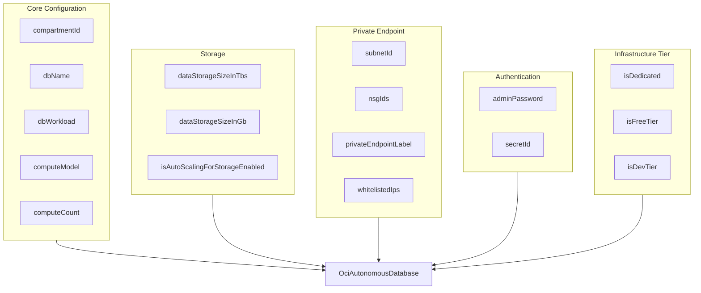

# OCI Autonomous Database Deployment Component

**Date**: February 19, 2026
**Type**: Feature
**Components**: API Definitions, Protobuf Schemas, Pulumi CLI Integration, Provider Framework

## Summary

Implemented the OciAutonomousDatabase deployment component (R15, enum 3330) -- the first database resource in the OCI provider. This is Oracle's flagship fully managed database service supporting five workload types: ATP (OLTP), ADW (DW), AJD (JSON), APEX, and Lakehouse. The component includes a curated 35-field protobuf spec, both Pulumi and Terraform IaC modules, 36 passing validation tests, and 6 stack outputs including connection string extraction.

## Problem Statement / Motivation

The OCI provider in Planton had 14 completed resource kinds covering networking, identity, compute, containers, and advanced networking (load balancers, DRG, public IP). However, zero database resources existed, leaving a critical gap for enterprise OCI deployments where Autonomous Database is the most commonly provisioned managed service.

### Pain Points

- No way to provision Oracle's flagship managed database through Planton
- Enterprise teams deploying on OCI need ATP/ADW databases alongside their OKE clusters and networking infrastructure
- The underlying Terraform resource has 163 attributes -- users need a curated, opinionated interface that covers real-world use cases without overwhelming complexity

## Solution / What's New

A single-resource deployment component that wraps `oci_database_autonomous_database` with a thoughtfully curated specification covering the 90% use case.

### Design Decisions

**DD-R15-01: Curated field scope.** Of 163 Terraform attributes, 35 fields were selected covering core config, modern compute, storage, networking, encryption, infrastructure tiers, backup, Data Guard, and maintenance. Excluded: cloning/source mechanism, cross-region/cross-tenancy DR, multi-cloud encryption keys, resource pools, scheduled operations, transportable tablespaces. These are day-2 operational or ultra-niche enterprise features.

**DD-R15-02: Modern compute only.** Only the recommended `compute_model` (ECPU/OCPU) + `compute_count` (float) approach is exposed. Deprecated `cpu_core_count` and `ocpu_count` fields are omitted, steering users toward Oracle's current recommended model.

**DD-R15-03: Single resource, no bundle.** The plan stub mentioned "wallet management" but investigation revealed the wallet is a data source, not a resource. Connection strings and URLs are output properties of the main resource. This is a clean single-resource component with rich outputs.

### Key Spec Fields

## Implementation Details

### Proto API (4 files)

- **spec.proto**: 35 fields, 5 embedded enums (DbWorkload, ComputeModel, DatabaseEdition, LicenseModel, MaintenanceScheduleType), 1 nested message (CustomerContact), 2 CEL mutual-exclusivity rules (storage size, admin credential)
- **api.proto**: Standard wrapper with `oci.planton.dev/v1` api-version and `OciAutonomousDatabase` kind
- **stack_input.proto**: Target + OciProviderConfig
- **stack_outputs.proto**: 6 outputs (database OCID, 3 connection strings, service console URL, private endpoint)

### CEL Validation Rules

Two mutual-exclusivity rules enforce clean YAML manifests:

1. **Storage size**: `data_storage_size_in_tbs` and `data_storage_size_in_gb` cannot both be set (serverless uses TBs, dedicated uses GBs)
2. **Admin credential**: `admin_password` and `secret_id` cannot both be set (inline password for dev, Vault secret for production)

### Validation Tests (36 tests)

- 24 valid scenarios: minimal config, each of 5 workload types, both compute models, storage in TBs/GBs, admin password, Vault secret, private endpoint, encryption, free tier, dedicated, customer contacts, full config, value_from refs, max NSG IDs, whitelisted IPs
- 12 invalid scenarios: wrong api_version, wrong kind, missing metadata/spec/compartmentId/dbName, db_name validation (starts with number, special chars, exceeds 30 chars), NSG exceeds 5, empty customer contact email, both storage sizes set, both credentials set

### Pulumi Module (4 files)

- `autonomous_database.go`: Creates `database.NewAutonomousDatabase()` with conditional field assignment for all 35 spec fields. Connection strings extracted via `ApplyT` on `AutonomousDatabaseConnectionStringArrayOutput` with nil-safe indexing for `High`, `Medium`, `Low` fields.
- `locals.go`: Locals struct with display_name fallback and freeform_tags construction
- `main.go`: Standard Resources() entry point
- `outputs.go`: 6 output name constants

### Terraform Module (5 files)

- `main.tf`: `oci_database_autonomous_database.this` with conditional null handling for all optional fields, `dynamic "customer_contacts"` block for repeated contacts
- `locals.tf`: 5 enum-to-uppercase maps (db_workload, compute_model, database_edition, license_model, maintenance_schedule_type), freeform_tags, nsg_ids flattening
- `outputs.tf`: 6 outputs with `try()` for safe connection string extraction
- `variables.tf`: Typed metadata + spec objects with optional defaults
- `provider.tf`: oracle/oci >= 5.0

### Kind Registration

Added `OciAutonomousDatabase = 3330` under new "OCI: Databases (3330-3339)" section in `cloud_resource_kind.proto`. Kind map regenerated successfully.

## Benefits

- First database resource in the OCI provider, unlocking the Autonomous Database Stack infra chart
- Curated 35-field spec from 163 Terraform attributes -- opinionated enough to be useful, flexible enough for real workloads
- Support for all 5 ADB workload types (ATP, ADW, AJD, APEX, Lakehouse) in a single component
- Dual authentication paths: inline password for dev, Vault secret for production
- Both serverless (TBs) and dedicated Exadata (GBs) storage models supported
- Modern compute model only (ECPU/OCPU), steering users away from deprecated fields

## Impact

- **Platform users**: Can now provision OCI Autonomous Databases through Planton manifests
- **Infra chart authors**: Foundation for the `oci/autonomous-db-stack` and `oci/data-platform` charts
- **Downstream components**: 6 outputs enable composability via StringValueOrRef for future OCI database-dependent resources

## Related Work

- Phase 3 (Advanced Networking) completed with R11-R14
- This is R15, the first resource of Phase 4 (Databases)
- Next: R16 OciDbSystem (traditional Oracle Database on dedicated infrastructure)

---

**Status**: Production Ready
**Timeline**: Single session implementation
