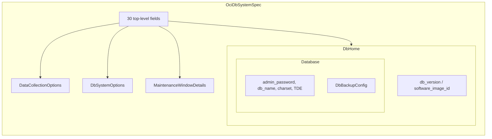

# OCI Database System Deployment Component

**Date**: February 19, 2026
**Type**: Feature
**Components**: API Definitions, Pulumi CLI Integration, Terraform Module, Protobuf Schemas

## Summary

Implemented the OciDbSystem deployment component (CloudResourceKind 3331) -- Oracle's traditional Database System running on Virtual Machine or Bare Metal infrastructure. This is the second database resource in the OCI provider (following OciAutonomousDatabase) and features the deepest nesting in the project: spec > db_home > database > db_backup_config (4 levels). The design curates ~55 fields from the provider's ~120 attributes, covering production use cases while excluding clone/restore scenarios and Exadata-specific features.

## Problem Statement / Motivation

OCI offers two primary managed Oracle Database services: Autonomous Database (self-driving, serverless) and Database System (traditional Oracle on VM/BM with full control over compute, storage, patching, and edition). The Autonomous Database was implemented as R15; this component completes the core database offering by adding the traditional DB System path.

### Pain Points

- Enterprise customers running Oracle Database need fine-grained control over compute shapes, storage layout, disk redundancy, and maintenance windows -- none of which Autonomous Database exposes
- 2-node RAC (Real Application Clusters) for high availability is only available via DB System
- Bare Metal shapes with DenseIO storage provide dedicated NVMe for high-performance OLTP workloads
- Database edition selection (Standard, Enterprise, EE-HP, EE-XP) directly affects licensing cost and feature availability

## Solution / What's New

A complete deployment component with:

1. **Proto API** -- `spec.proto` with 8 nested messages, 7 enums, 2 CEL mutual-exclusivity rules, and ~55 fields across the message hierarchy
2. **Validation Tests** -- 51 Ginkgo/Gomega tests (32 valid, 19 invalid scenarios), all passing
3. **Pulumi Module** -- `database.NewDbSystem()` with 7 builder functions for nested inputs (DbHome, Database, DbBackupConfig, DataCollectionOptions, DbSystemOptions, MaintenanceWindowDetails) across 4 Go files
4. **Terraform Module** -- `oci_database_db_system.this` with nested `db_home > database > db_backup_config` blocks, 3 dynamic blocks (data_collection_options, db_system_options, maintenance_window_details), 7 enum maps, and `lifecycle { ignore_changes }` for admin_password
5. **Kind Registration** -- OciDbSystem=3331 under "Databases" section, kind_map_gen.go regenerated

### Component Architecture



## Implementation Details

### Single Resource, Not a Bundle

Despite the plan stub describing "db_system + db_home + database", the Terraform provider models these as a single resource (`oci_database_db_system`) with required nested blocks. Both the Terraform schema and Pulumi SDK confirm: "The creation of a Database.DbSystem requires exactly one oci_database_db_home." This means one resource call in both IaC implementations -- simpler than OciApplicationLoadBalancer which creates 7 distinct resources.

### Fresh Creation Only (source=NONE)

The `source` field supports 4 modes (NONE, DATABASE, DB_BACKUP, DB_SYSTEM). Each mode requires different fields and represents a different workflow. For v1, we only support NONE (fresh creation) by not exposing the `source` field at all. Clone and restore can be added as v2 or separate components.

### Deprecated `db_workload` Excluded

The `db_workload` field (OLTP, DSS) in the database block was deprecated by Oracle in November 2023. New DB System creations no longer need it, so it is intentionally omitted from the spec.

### Maintenance Window Flattening

The Terraform provider nests months and days_of_week as messages with a `name` field:
```hcl
months { name = "JANUARY" }
days_of_week { name = "MONDAY" }
```

Our proto flattens these to `repeated string months` and `repeated string days_of_week` for cleaner YAML:
```yaml
maintenanceWindowDetails:
  months: ["JANUARY", "APRIL", "JULY", "OCTOBER"]
  daysOfWeek: ["MONDAY"]
```

The Pulumi builder converts back: `DbSystemMaintenanceWindowDetailsMonthArgs{Name: pulumi.String(m)}`.

### Admin Password Sensitivity

The `admin_password` is not returned by the OCI API after creation. The Terraform module uses `lifecycle { ignore_changes = [db_home[0].database[0].admin_password] }` to prevent plan diffs. Unlike Autonomous Database, the DB System API does not support Vault-based password injection -- `vault_id`/`kms_key_id` in the database block are for TDE (Transparent Data Encryption), not the admin password.

### CEL Validations

Two rules enforce version selection discipline:
1. `db_home.db_version` and `db_home.database_software_image_id` are mutually exclusive
2. At least one must be provided (no implicit "latest version" -- ensures reproducible deployments)

## Benefits

- **Full Oracle DB lifecycle** -- Create traditional Oracle Database on VM/BM infrastructure with complete control
- **Production-ready maintenance windows** -- Fine-grained scheduling with months, days, hours, patching mode
- **RAC support** -- 2-node Real Application Clusters via node_count=2 with cluster_name and fault domains
- **Encryption at rest** -- KMS key support at both the DB System level and database TDE level
- **Automatic backups** -- Configurable backup window, retention period, auto-backup toggle
- **Feature parity** -- Identical capabilities in both Pulumi and Terraform modules

## Impact

- Completes the second of six Phase 4 (Databases) resources
- Next component: R17 OciMysqlDbSystem
- 16 of 37 OCI resource kinds now implemented

## Related Work

- R15 OciAutonomousDatabase (2026-02-19) -- sister database component for serverless workloads
- R11 OciApplicationLoadBalancer (2026-02-19) -- similar complexity with nested sub-resources
- R08 OciContainerEngineCluster (2026-02-19) -- similar builder pattern for nested Pulumi inputs

---

**Status**: Production Ready
**Validation**: go build clean, go vet clean, 51/51 tests passed, terraform validate success
