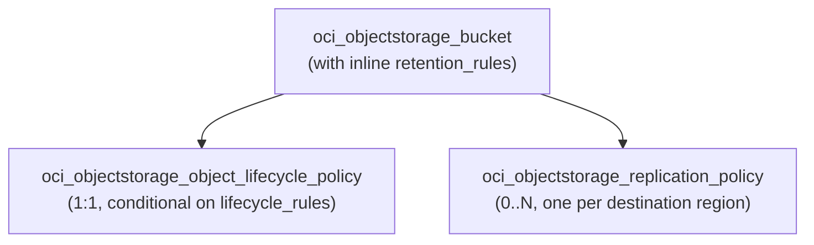

# OCI Object Storage Bucket Deployment Component

**Date**: 2026-02-19
**Type**: New Feature
**Components**: `apis/org/openmcf/provider/oci/ociobjectstoragebucket/v1/`

## Summary

Added the OciObjectStorageBucket deployment component -- OCI's durable, scalable Object Storage bucket with bundled retention rules, lifecycle policies, and cross-region replication. This is the first resource of Phase 5 (Storage) and resource R21 in the OCI provider expansion.

## Problem Statement / Motivation

OpenMCF's OCI provider coverage had zero storage components. Object Storage is OCI's foundational storage service, used for data lakes, backups, log archives, and application assets. Without a bucket component, users could not declaratively manage their most common storage resource.

## Solution / What's New

A complete OciObjectStorageBucket deployment component with both Pulumi (Go) and Terraform (HCL) modules.

### Proto API

- **spec.proto**: 13 top-level fields, 6 nested messages (RetentionRule, Duration, LifecycleRule, ObjectNameFilter, ReplicationPolicy), 6 embedded enums (AccessType, StorageTier, Versioning, AutoTiering, LifecycleAction, TimeUnit)
- **CEL validation**: 2 rules -- abort action requires multipart-uploads target; multipart-uploads target forbids object_name_filter
- **api.proto**: Standard wrapper with const-validated api_version and kind
- **stack_outputs.proto**: 1 output (bucket_id)

### Bundled Resources

1. **Bucket** with inline retention rules (max 100 per bucket)
2. **Object Lifecycle Policy** -- conditional single resource containing all lifecycle rules
3. **Replication Policies** -- one per destination region, all fields immutable

### Pulumi Module (Go)

6 files across the module package:
- `main.go` -- orchestrator calling bucket(), lifecyclePolicy(), replicationPolicies()
- `locals.go` -- Locals struct with freeform tags
- `bucket.go` -- NewBucket with inline retention rules, 4 enum-to-string maps
- `lifecycle_policy.go` -- conditional NewObjectLifecyclePolicy with rules array
- `replication_policy.go` -- loop creating NewReplicationPolicy per destination
- `outputs.go` -- OpBucketId constant

### Terraform Module (HCL)

7 files:
- `main.tf` -- oci_objectstorage_bucket with dynamic retention_rules block
- `lifecycle_policy.tf` -- conditional oci_objectstorage_object_lifecycle_policy with dynamic rules and nested dynamic object_name_filter
- `replication_policy.tf` -- oci_objectstorage_replication_policy with for_each keyed by policy name
- `locals.tf` -- 6 enum conversion maps, freeform tags
- `variables.tf`, `outputs.tf`, `provider.tf`

### Validation Tests

38 Ginkgo/Gomega tests (20 valid, 18 invalid scenarios) covering:
- All optional fields individually
- Retention rules with and without duration
- Lifecycle rules with filters, abort/multipart-uploads constraints
- Replication policy field requirements
- CEL expression enforcement

### Kind Registration

`OciObjectStorageBucket = 3340` under new "Storage" section in CloudResourceKind enum.

## Implementation Details

### Design Decisions

- **Namespace as plain string**: Not an OCID, not a StringValueOrRef. It is a tenancy-level identifier retrieved via `oci os ns get`.
- **Lifecycle target as string**: Values contain hyphens (`multipart-uploads`, `previous-object-versions`) which are invalid in proto enum identifiers. Uses in-list string validation, same pattern as OciPublicIp's `lifetime`.
- **Versioning exposes three states**: `enabled`, `disabled`, `suspended`. The OCI API has nuanced state transitions (Disabled -> Enabled -> Suspended), but the IaC layer passes through the user's value and lets the provider handle it.
- **Lifecycle policy conditional**: Only created when lifecycle_rules is non-empty. Uses `count` in Terraform and an early return in Pulumi.
- **Retention rules inline**: Already managed within the bucket resource by both providers. No separate resource needed.
- **Enum value prefixing**: Several enums required prefixes to avoid protobuf collisions (e.g., `auto_tiering_disabled` vs `disabled` in Versioning, `lifecycle_archive` vs `archive` in StorageTier).

### Excluded

- `defined_tags`, `system_tags` -- platform-managed
- `freeform_tags` -- auto-populated from metadata labels
- Pre-authenticated requests, private endpoints, individual objects -- separate concerns
- `delete_object_in_destination_bucket` on replication -- deprecated

## Benefits

- Declarative Object Storage management with retention compliance, lifecycle automation, and DR replication
- Clean abstraction over 3 separate OCI resource types via a single spec
- Consistent patterns with existing OCI components (enum maps, tag management, DependsOn ordering)

## Impact

- Adds 1 new CloudResourceKind to the OCI provider (R21 of 37)
- Opens Phase 5 (Storage) -- OciFileSystem and OciBlockVolume follow next
- Enables the OCI Serverless Stack and Data Platform infra charts that require object storage

## Related Work

- Phase 4 (Databases) completed: R15-R20
- Next: R22 OciFileSystem (enum 3341)
