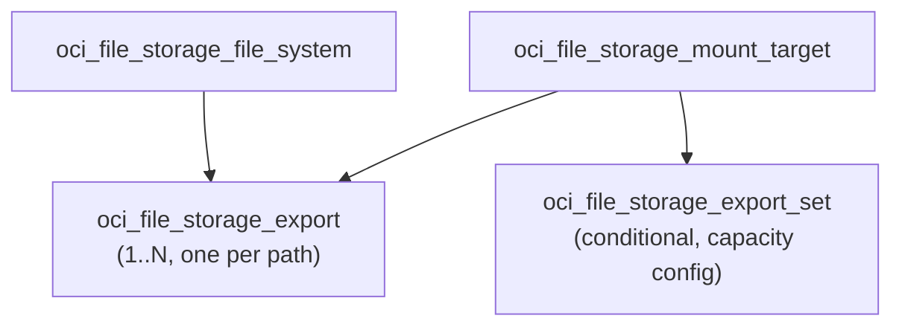

# OCI File System Deployment Component

**Date**: 2026-02-19
**Type**: New Feature
**Components**: `apis/dev/planton/provider/oci/ocifilesystem/v1/`

## Summary

Added the OciFileSystem deployment component -- OCI File Storage's NFS-compatible, fully managed network file system bundled with a dedicated mount target and NFS exports with per-client access control. This is the second resource of Phase 5 (Storage) and resource R22 in the OCI provider expansion.

## Problem Statement / Motivation

Planton's OCI provider had no managed NFS storage component. OCI File Storage is the standard way to provide shared, persistent NFS file systems to compute instances, container workloads, and Kubernetes pods. Without a file system component, users could not declaratively manage network-attached storage.

## Solution / What's New

A complete OciFileSystem deployment component with both Pulumi (Go) and Terraform (HCL) modules.

### Proto API

- **spec.proto**: 7 top-level fields, 3 nested messages (MountTarget, Export, ExportOption), 2 embedded enums (Access, IdentitySquash)
- **CEL validation**: 1 rule -- export path must start with '/'
- **buf.validate**: compartment_id required, availability_domain min_len, mount_target required, exports min_items 1, export path min_len, export_option source min_len
- **api.proto**: Standard wrapper with const-validated api_version and kind
- **stack_outputs.proto**: 4 outputs (file_system_id, mount_target_id, mount_target_ip_address, export_set_id)

### Bundled Resources

1. **File System** -- the NFS-compatible storage volume
2. **Mount Target** -- NFS endpoint in a subnet with an IP address
3. **Export Set** -- conditional capacity configuration on the auto-created export set
4. **Exports** -- one per NFS path, each with optional access control rules

### Pulumi Module (Go)

6 files across the module package:
- `main.go` -- orchestrator calling fileSystem(), mountTarget(), exports() with enum maps
- `locals.go` -- Locals struct with freeform tags and display name
- `file_system.go` -- NewFileSystem with optional KMS and snapshot policy
- `mount_target.go` -- NewMountTarget with optional NSGs, throughput; conditional NewExportSet
- `export.go` -- loop creating NewExport per path with buildExportOptions()
- `outputs.go` -- 4 output constants

### Terraform Module (HCL)

7 files:
- `main.tf` -- oci_file_storage_file_system with optional KMS and snapshot policy
- `mount_target.tf` -- oci_file_storage_mount_target + conditional oci_file_storage_export_set
- `exports.tf` -- oci_file_storage_export with for_each keyed by path + dynamic export_options
- `locals.tf` -- 2 enum conversion maps (access, identity_squash), freeform tags
- `variables.tf`, `outputs.tf`, `provider.tf`

### Validation Tests

28 Ginkgo/Gomega tests (16 valid, 12 invalid scenarios) covering:
- All optional fields individually (display_name, kms_key_id, snapshot_policy, mount target options)
- Multiple exports on same file system
- Export options with access control, identity squashing, anonymous UID/GID
- CEL expression enforcement (path must start with '/')
- Required field validation (compartment, AD, mount_target, subnet, exports, path, source)

### Kind Registration

`OciFileSystem = 3341` under "Storage" section in CloudResourceKind enum.

## Implementation Details

### Design Decisions

- **Single availability_domain**: Shared between file system and mount target (both must be in the same AD). Prevents user error from placing them in different ADs.
- **Mount target always required**: A file system without a mount target is inaccessible. The OCI default limit of 2 mount targets per AD is documented but easily increased via service limit request.
- **Export set conditional**: Only managed when max_fs_stat_bytes or max_fs_stat_files are configured. The export set is auto-created with the mount target; this resource adopts and updates it.
- **Export path as for_each key**: Paths must be unique per export set, making them natural map keys.
- **anonymous_uid/gid as int64**: Stored as Int64 string in OCI API; proto uses int64, IaC modules convert via fmt.Sprintf.
- **Enum value naming**: `no_squash`/`root_squash`/`all_squash` instead of `none`/`root`/`all` for clarity and to avoid potential proto keyword issues.
- **Directory name**: `ocifilesystem` (not `ocifsystem` from plan stub) per WA02 convention.

### Excluded

- `oci_file_storage_snapshot` -- operational concern, independent lifecycle
- `oci_file_storage_replication` -- cross-region, separate lifecycle
- `oci_file_storage_filesystem_snapshot_policy` -- reusable across file systems, referenced via OCID
- `oci_file_storage_file_system_quota_rule` -- advanced admin feature
- `oci_file_storage_outbound_connector` -- specialized LDAP integration
- Kerberos / LDAP ID mapping -- very low adoption enterprise features
- `source_snapshot_id` -- clone/restore scenario
- `defined_tags`, `system_tags`, `freeform_tags`, `locks` -- platform-managed

## Benefits

- Declarative NFS file system management with bundled mount target and access-controlled exports
- Clean abstraction over 4 OCI resource types via a single spec
- Consistent patterns with existing OCI components (enum maps, tag management, conditional sub-resources)

## Impact

- Adds 1 new CloudResourceKind to the OCI provider (R22 of 37)
- Continues Phase 5 (Storage) -- OciBlockVolume follows next
- Enables Kubernetes persistent volumes backed by OCI File Storage
- Supports the OCI Compute Environment and OKE Environment infra charts that need shared storage

## Related Work

- R21 OciObjectStorageBucket completed (Phase 5 first resource)
- Next: R23 OciBlockVolume (enum 3342)
