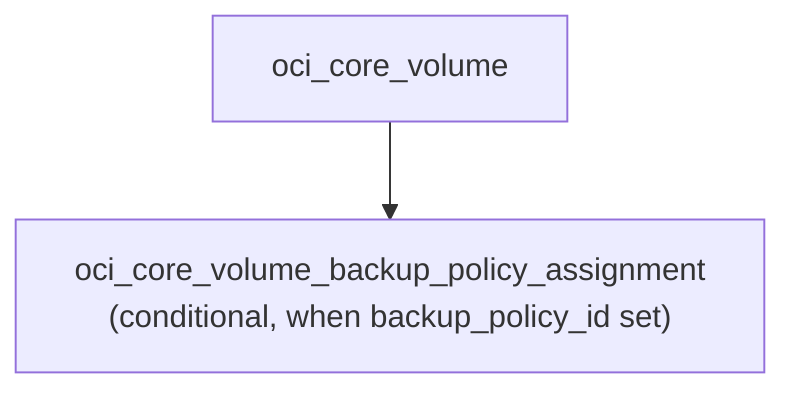

# OCI Block Volume Deployment Component

**Date**: 2026-02-20
**Type**: New Feature
**Components**: `apis/dev/planton/provider/oci/ociblockvolume/v1/`

## Summary

Added the OciBlockVolume deployment component -- OCI's high-performance block storage with configurable performance tiers (VPUs/GB), automatic performance tuning policies, cross-region replication for disaster recovery, and bundled backup policy assignment for scheduled backups. This is the third and final resource of Phase 5 (Storage), completing the phase. Resource R23 in the OCI provider expansion.

## Problem Statement / Motivation

Planton's OCI provider had no block storage component. OCI Block Volumes are the fundamental persistent storage mechanism for compute instances -- every VM, bare-metal server, and container workload needs attached block storage for data, boot volumes, and application state. Without a declarative block volume component, users could not manage storage independently of compute instances.

## Solution / What's New

A complete OciBlockVolume deployment component with both Pulumi (Go) and Terraform (HCL) modules.

### Proto API

- **spec.proto**: 11 top-level fields, 2 nested messages (AutotunePolicy, BlockVolumeReplica), 1 embedded enum (AutotuneType)
- **CEL validations**: 2 rules -- size_in_gbs >= 50 (prevents accidental 1 TB default), performance_based autotune requires max_vpus_per_gb > 0
- **buf.validate**: compartment_id required, availability_domain min_len, autotune_type defined_only + not_in [0], replica availability_domain min_len
- **`optional int32 vpus_per_gb`**: Proto3 optional for tri-state semantics (nil = OCI default 10/Balanced, 0 = Lower Cost, 10+ = explicit)
- **api.proto**: Standard wrapper with const-validated api_version and kind
- **stack_outputs.proto**: 1 output (volume_id)

### Bundled Resources

1. **Volume** -- the block storage device with performance tiers, autotune policies, and cross-region replicas
2. **Backup Policy Assignment** -- conditional sub-resource linking the volume to an OCI backup policy (Gold/Silver/Bronze or custom)

### Pulumi Module (Go)

6 files across the module package:
- `main.go` -- orchestrator calling volume() then backupPolicyAssignment() with autotune_type enum map
- `locals.go` -- Locals struct with freeform tags and display name
- `volume.go` -- core.NewVolume with buildAutotunePolicies() and buildBlockVolumeReplicas(), int32-to-string conversion for size_in_gbs and vpus_per_gb
- `backup_policy_assignment.go` -- conditional core.NewVolumeBackupPolicyAssignment when backup_policy_id is set
- `outputs.go` -- 1 output constant

### Terraform Module (HCL)

7 files:
- `main.tf` -- oci_core_volume.this with dynamic autotune_policies and block_volume_replicas blocks, block_volume_replicas_deletion flag for TF provider quirk
- `backup_policy_assignment.tf` -- conditional oci_core_volume_backup_policy_assignment.this with count
- `locals.tf` -- 1 enum conversion map (autotune_type), freeform tags
- `variables.tf`, `outputs.tf`, `provider.tf`

### Validation Tests

27 Ginkgo/Gomega tests (16 valid, 11 invalid scenarios) covering:
- All optional fields individually (display_name, vpus_per_gb at 0/10/20, kms_key_id, is_reservations_enabled)
- Size boundaries (50 GB minimum, 32768 GB maximum)
- Autotune policies (detached_volume, performance_based with max_vpus_per_gb)
- Block volume replicas with cross-region AD
- Backup policy and cross-region backup encryption key
- ValueFrom reference for compartment_id
- Full configuration with all fields set
- Required field validation (compartment, AD, size_in_gbs minimum)
- CEL enforcement (performance_based autotune requires max_vpus_per_gb > 0, autotune_type not unspecified)

### Kind Registration

`OciBlockVolume = 3342` under "Storage" section in CloudResourceKind enum.

## Implementation Details

### Design Decisions

- **`optional int32 vpus_per_gb`**: Proto3 optional for tri-state semantics. OCI defaults to 10 (Balanced) when unspecified, but 0 (Lower Cost) is a valid meaningful value. In Go: `*int32`, in IaC: converted to string or null.
- **`size_in_gbs` required via CEL >= 50**: Prevents users from accidentally creating OCI's default 1 TB volume. 50 GB is the OCI floor.
- **Numeric-to-string conversions**: Both size_in_gbs and vpus_per_gb are stored as Int64 strings in TF/Pulumi providers. IaC modules convert int32 to string via fmt.Sprintf (Go) and tostring() (HCL).
- **Backup policy as sub-resource**: Uses oci_core_volume_backup_policy_assignment (recommended) instead of the deprecated backup_policy_id attribute on the volume resource itself.
- **block_volume_replicas_deletion TF quirk**: The Terraform provider requires an explicit boolean to remove all replicas. The TF module sets `block_volume_replicas_deletion = length(var.spec.block_volume_replicas) == 0`.
- **No source_details**: Clone/restore scenarios excluded for v1, consistent with R15 (AutonomousDatabase), R16 (DbSystem), and other DB/storage resources.
- **Directory name**: `ociblockvolume` (per WA02 -- lowercased kind name, not id_prefix `ocibvol`).

### Excluded

- `source_details` -- clone/restore from volume, backup, or replica (v1 = fresh creation)
- `backup_policy_id` on volume resource -- deprecated, using assignment resource instead
- `size_in_mbs` -- deprecated, use size_in_gbs
- `volume_backup_id` -- deprecated
- `is_auto_tune_enabled` -- deprecated, use autotune_policies
- `cluster_placement_group_id` -- very niche placement constraint
- `defined_tags`, `system_tags` -- managed by platform
- `freeform_tags` -- auto-populated from metadata labels
- `block_volume_replicas_deletion` -- operational TF flag, handled internally

## Benefits

- Declarative block storage management with configurable performance tiers and DR replicas
- Clean abstraction over 2 OCI resource types via a single spec
- Tri-state vpus_per_gb handling distinguishes "use OCI default" from "explicitly set to 0 (Lower Cost)"
- Consistent patterns with existing OCI components (enum maps, tag management, conditional sub-resources)

## Impact

- Adds 1 new CloudResourceKind to the OCI provider (R23 of 37)
- **Completes Phase 5 (Storage)** -- all 3 storage resources done (OciObjectStorageBucket, OciFileSystem, OciBlockVolume)
- Enables the OCI Compute Environment infra chart that needs attached block volumes
- Supports persistent volumes for OKE workloads

## Related Work

- R22 OciFileSystem completed (Phase 5 second resource)
- Phase 5 (Storage) now 100% complete
- Next: R24 OciKmsVault (enum 3350, Phase 6: Security and Secrets)
