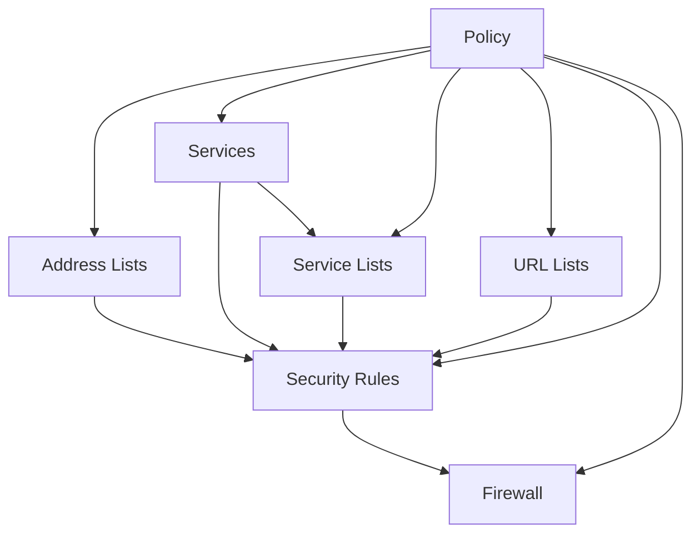

# OCI Network Firewall Deployment Component

**Date**: February 21, 2026
**Type**: Feature
**Components**: API Definitions, Pulumi IaC Module, Terraform IaC Module, Resource Management

## Summary

Implemented the OciNetworkFirewall deployment component -- OCI's next-generation firewall service bundling the firewall appliance with an inline policy and 5 core policy sub-resource types (address lists, services, service lists, URL lists, security rules). This enables declarative L3/L4 network filtering and L7 URL inspection in a single YAML manifest. The component bundles 7 OCI resource types with a dependency-ordered creation chain.

## Problem Statement / Motivation

OCI Network Firewall provides enterprise-grade traffic inspection, but the underlying provider decomposes the service into 14 separate resources (1 firewall, 1 policy, 12 policy sub-resources). Managing these individually is operationally complex and error-prone. Users need a single abstraction that creates a functional firewall with rules, not an empty appliance.

### Pain Points

- Creating a firewall requires coordinating 7+ resources with correct dependency ordering
- Policy sub-resources reference each other by name, requiring careful orchestration
- Security rule priority must be explicitly managed
- No single-manifest deployment path for a fully configured firewall

## Solution / What's New

A single `OciNetworkFirewall` resource kind (enum 3395) that bundles:

1. **Firewall** -- the appliance deployed in a subnet
2. **Policy** -- the rule container
3. **Address Lists** -- IP/FQDN collections referenced in rules
4. **Services** -- TCP/UDP port definitions
5. **Service Lists** -- service groupings for rule reuse
6. **URL Lists** -- URL patterns for L7 HTTP(S) inspection
7. **Security Rules** -- the allow/drop/reject/inspect rules

### Resource Creation Order

## Implementation Details

### Proto API

- **spec.proto**: 10 top-level spec fields, 10 nested messages, 4 enums, 2 CEL validation rules
- **Messages**: OciNetworkFirewallSpec, NatConfiguration, Policy, AddressList, Service, PortRange, ServiceList, UrlList, UrlPattern, SecurityRule, SecurityRuleCondition
- **Enums**: AddressListType (ip/fqdn), ServiceType (tcp_service/udp_service), Action (allow/drop/reject/inspect), Inspection (intrusion_detection/intrusion_prevention)
- **CEL rules**: `inspect_requires_inspection_type` (inspect action requires inspection enum), `maximum_port_gte_minimum` (port range ordering)
- **Validation tests**: 50 Ginkgo/Gomega tests (27 valid, 23 invalid scenarios)

### Key Design Decisions

- **Security rule ordering from list position**: `priority_order` is derived from array index (1-based), so users control priority by YAML list order. No explicit priority field needed.
- **Sub-resources reference by name**: Address lists, services, and URL lists are referenced by display name in security rule conditions. This mirrors the OCI API and keeps YAML self-contained.
- **Policy always inline**: No external policy reference. The policy is always created as part of this component.
- **URL type hardcoded to "SIMPLE"**: OCI only supports one URL pattern type today. Hardcoded in IaC, not exposed in proto.
- **Enum zero-value prefixing**: Used `action_unspecified`, `service_type_unspecified`, `inspection_unspecified` to avoid C++ protobuf scoping collisions across multiple embedded enums.

### Excluded from v1

- Applications / Application Groups (ICMP type/code matching -- niche)
- Decryption Profiles / Rules / Mapped Secrets (TLS inspection -- complex advanced use case)
- NAT Rules (specialized NAT handling)
- Tunnel Inspection Rules (VXLAN -- very specialized)

### Pulumi Module

- 8 Go files in `iac/pulumi/module/`: main.go, locals.go, outputs.go, policy.go, address_list.go, service.go, url_list.go, security_rule.go, firewall.go
- DependsOn chain ensures correct creation ordering
- 4 enum maps for type conversion

### Terraform Module

- 9 HCL files in `iac/tf/`: main.tf, policy.tf, address_list.tf, service.tf, url_list.tf, security_rule.tf, locals.tf, variables.tf, outputs.tf, provider.tf
- `for_each` on all sub-resources keyed by name
- Explicit `depends_on` for creation ordering (TF can't infer from name-string references)

### Kind Registration

- OciNetworkFirewall = 3395 under "Additional Services" section
- kind_map_gen.go regenerated

## Benefits

- **Single manifest**: Users deploy a fully functional firewall with one YAML file
- **Declarative rule ordering**: List position = priority, no manual numbering
- **Name-based references**: Sub-resources reference each other by name, not OCID
- **Full attribute coverage**: All provider fields for the 7 bundled resource types
- **L3/L4 + L7**: Covers both network-layer and URL-based traffic inspection

## Impact

- **Users**: Can deploy production-grade network firewalls with security rules in a single Planton manifest
- **Platform**: OCI provider now has 36 of 37 planned resource kinds (97% complete)
- **Infra Charts**: Enables firewall integration in future OCI infra charts

## Related Work

- R11 OciApplicationLoadBalancer: Same 7-resource bundling pattern precedent
- R13 OciDynamicRoutingGateway: Complex sub-resource orchestration with name-based references

---

**Status**: Production Ready
**Validation**: go build clean, go vet clean, 50/50 tests passed, terraform validate success
