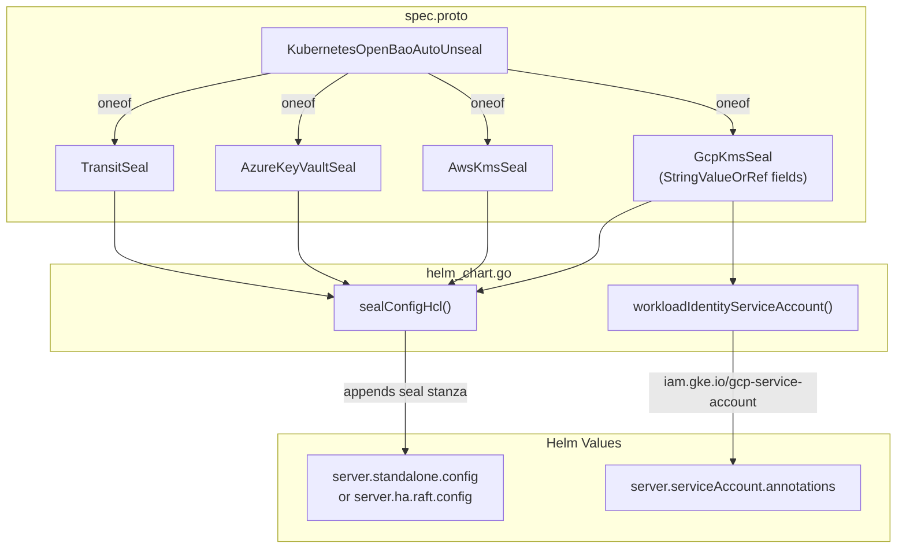

# KubernetesOpenBao Auto-Unseal Support

**Date**: February 28, 2026
**Type**: Feature
**Components**: API Definitions, Kubernetes Provider, Pulumi CLI Integration

## Summary

Added auto-unseal configuration to the `KubernetesOpenBao` component, enabling automatic master key decryption via external KMS providers on pod startup. Supports GCP Cloud KMS, AWS KMS, Azure Key Vault, and Transit seal types with a `oneof`-based proto design. GCP KMS fields use `StringValueOrRef` for infra-chart composability with existing `GcpProject`, `GcpKmsKeyRing`, `GcpKmsKey`, and `GcpServiceAccount` resource kinds.

## Problem Statement / Motivation

OpenBAO (and HashiCorp Vault) seals itself on every pod restart -- node failures, rolling updates, OOM kills all result in a sealed server that cannot serve any API requests until someone manually provides the unseal key. For production deployments, this creates an availability gap bounded by human response time.

### Pain Points

- Every pod restart requires manual `bao operator unseal` intervention
- No way to express auto-unseal configuration in the `KubernetesOpenBao` resource spec
- The Helm chart's server config was hardcoded with no extension point for seal stanzas
- No service account annotation support for GKE Workload Identity

## Solution / What's New

A new `auto_unseal` field on `KubernetesOpenBaoSpec` with a `oneof` seal type that generates the appropriate HCL seal stanza and injects it into the Helm chart's server configuration.



### GCP KMS with StringValueOrRef

The GCP KMS seal fields (`project`, `key_ring`, `crypto_key`, `workload_identity_service_account`) use `StringValueOrRef` with `default_kind` and `default_kind_field_path` annotations. This follows the infra-chart composability rule -- an infra chart can wire a `GcpKmsKey` output directly into the OpenBao seal config using `valueFrom` references.

```yaml
# Standalone use (literal values)
autoUnseal:
  gcpKms:
    project:
      value: my-gcp-project
    keyRing:
      value: openbao-unseal
    cryptoKey:
      value: openbao-auto-unseal-key

# Infra chart use (cross-resource references)
autoUnseal:
  gcpKms:
    cryptoKey:
      valueFrom:
        kind: GcpKmsKey
        name: "{{ values.env }}-unseal-key"
        fieldPath: status.outputs.key_name
```

## Implementation Details

### Proto Changes (`spec.proto`)

- Added `KubernetesOpenBaoAutoUnseal` message with `oneof seal` for 4 seal types
- `KubernetesOpenBaoGcpKmsSeal`: 5 fields, 4 using `StringValueOrRef` with `default_kind` annotations referencing `GcpProject`, `GcpKmsKeyRing`, `GcpKmsKey`, `GcpServiceAccount`
- `KubernetesOpenBaoAwsKmsSeal`: 3 fields (region, kms_key_id, optional credentials_secret_name)
- `KubernetesOpenBaoAzureKeyVaultSeal`: 4 fields (vault_name, key_name, tenant_id, optional credentials_secret_name)
- `KubernetesOpenBaoTransitSeal`: 4 fields (address, key_name, mount_path, token_secret_name)
- `buf.validate` constraints on all required fields

### Pulumi Module Changes (`helm_chart.go`)

- `sealConfigHcl()`: Type-switches on the `oneof` seal and returns the matching HCL `seal` stanza. Uses `GetValue()` on `StringValueOrRef` fields. Returns empty string when auto-unseal is not configured.
- `workloadIdentityServiceAccount()`: Extracts the GCP service account email from the GCP KMS config for the `iam.gke.io/gcp-service-account` annotation on the Helm service account.
- Seal stanza is appended to the existing server config string (both standalone and HA modes).
- Service account annotation is injected into Helm values when Workload Identity is configured.

### Files Changed

| File | Lines | Description |
|------|-------|-------------|
| `spec.proto` | +126 | 6 new messages, 1 new field on KubernetesOpenBaoSpec |
| `spec.pb.go` | +546 | Regenerated Go protobuf code |
| `helm_chart.go` | +87/-26 | sealConfigHcl(), workloadIdentityServiceAccount(), SA annotation injection |
| `stack-input.yaml` | +11 | Updated stack input schema |

## Benefits

- **Zero-downtime recovery**: Pod restarts auto-unseal via KMS -- no human intervention
- **Multi-cloud support**: GCP, AWS, Azure, and Transit seal types from day one
- **Infra-chart composable**: GCP KMS fields use `StringValueOrRef` for dependency-aware deployment in infra charts
- **GKE-native auth**: Workload Identity annotation eliminates credential file management
- **Backward compatible**: `auto_unseal` is optional -- existing deployments without it continue to work with manual unseal

## Impact

- **OpenMCF users**: Can configure auto-unseal declaratively in their `KubernetesOpenBao` YAML manifests
- **Infra chart authors**: Can compose KMS resources with OpenBao using `valueFrom` references
- **Planton platform**: Production OpenBAO can migrate from manual unseal to GCP KMS auto-unseal

## Related Work

- Planton Config Manager implementation (`_projects/20260116.01.config-manager-implementation`) -- OpenBAO is the platform default secrets backend
- OpenBAO Gateway API ingress (PR #422 era) -- external access to the OpenBAO instance
- OpenBAO unseal documentation (`backend/libs/java/infra/vault-commons/docs/openbao/unseal.md`)

---

**Status**: Production Ready
**Timeline**: Single session
