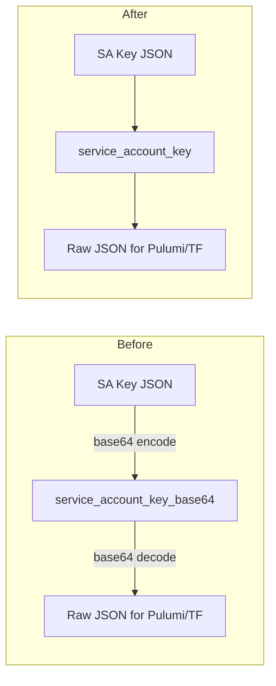

# Remove Base64 Encoding from GCP Service Account Key

**Date**: March 3, 2026
**Type**: Breaking Change
**Components**: API Definitions, Provider Framework, IAC Stack Runner, CLI Commands

## Summary

Removed the unnecessary base64 encoding layer from GCP service account key handling across the entire codebase. The `GcpProviderConfig.service_account_key_base64` proto field is renamed to `service_account_key` and now accepts raw JSON directly. All base64 encode/decode operations on GCP SA keys have been eliminated from Pulumi modules, Terraform modules, the backend credential service, and the CLI.

## Problem Statement / Motivation

The GCP service account key was being stored and transmitted as a base64-encoded string throughout the platform. This encoding was a transport artifact from an era when SA keys were stored inline in proto fields, and base64 provided safe encoding for multi-line JSON within a single string field.

### Pain Points

- **Unnecessary complexity**: Every consumer had to base64-decode before use, and every producer had to base64-encode before storage
- **Integration friction**: When Planton's Connection system resolved secrets from config-manager (which stores raw JSON), the raw JSON was placed into the `service_account_key_base64` field, causing `illegal base64 data at input byte 0` errors in IaC modules
- **Poor developer experience**: Users creating credentials via the CLI had to provide base64-encoded SA keys instead of simply pasting the raw JSON from GCP Console
- **No actual benefit**: Both the Pulumi GCP provider (`gcp.ProviderArgs.Credentials`) and the Terraform `google` provider (`credentials`) accept raw JSON -- base64 was never required by the underlying tools

## Solution / What's New

Established a clean design principle: **provider config fields carry values in their native format, not transport-encoded**. The GCP SA key is a JSON document; the field now carries raw JSON.

### Key Changes

- **Proto rename**: `service_account_key_base64` → `service_account_key` in both `GcpProviderConfig` and `KubernetesProviderConfigGcpGke`
- **Pulumi provider**: Removed `base64.StdEncoding.DecodeString()`, passes JSON directly to `gcp.ProviderArgs.Credentials`
- **Terraform modules**: Removed `base64decode()` HCL function calls from all 21 GCP provider.tf files
- **Backend service**: Accepts raw JSON on create/update, stores raw JSON in MongoDB, returns raw JSON on get
- **CLI**: Reads SA key files as raw JSON, no longer base64-encodes before sending to backend

## Implementation Details

### Proto Layer

Renamed field 1 in two proto messages:

- `org.openmcf.provider.gcp.GcpProviderConfig.service_account_key` -- authentication for all GCP IaC modules
- `org.openmcf.provider.kubernetes.KubernetesProviderConfigGcpGke.service_account_key` -- authentication for GKE cluster access

### IaC Module Consumers

**Pulumi** (`pulumigoogleprovider/provider.go`): Removed base64 decode step. JSON validation and required-field checks retained. Private key PEM format validation retained.

**Terraform** (21 modules): Changed from `base64decode(var.provider_config.service_account_key_base64)` to `var.provider_config.service_account_key` in `provider.tf`. Renamed variable in `variables.tf`.

**Kubernetes provider consumers** (2 files): Updated field references in both the Pulumi and env-var Kubernetes provider setup paths.

### Backend CRUD

- `credential_service.go`: Removed `encoding/base64` import, all `base64.StdEncoding.DecodeString/EncodeString` calls, and the decode-on-read/encode-on-write cycle
- `credential_repo.go`: MongoDB field renamed from `service_account_key_base64` to `service_account_key`
- `credential.go`: Model struct field renamed with updated BSON/JSON tags

### Deliberately Untouched

- `gcpartifactregistryrepo` outputs (`ReaderServiceAccountKeyBase64`, `WriterServiceAccountKeyBase64`) -- these are GCP API outputs from `google_service_account_key.private_key` which IS genuinely base64-encoded by GCP
- `KubernetesProviderConfigGcpGke.cluster_ca_data` -- Kubernetes CA data is conventionally base64-encoded (matches kubeconfig format)

## Benefits

- **Eliminates integration errors**: Raw JSON from secret stores flows through without encoding mismatches
- **Simpler code**: ~100 lines of base64 encode/decode logic removed across 7 Go files
- **Better UX**: CLI users provide raw JSON SA key files directly
- **Consistent principle**: All provider config fields carry values in their native format

## Impact

- **All GCP IaC modules** (Pulumi and Terraform) consume the new field name
- **OpenMCF backend** stores raw JSON instead of base64 in MongoDB
- **OpenMCF CLI** sends raw JSON on credential create/update
- **Planton integration**: Planton's `GcpProviderConfigMapper` can now pass resolved secrets (raw JSON from config-manager) directly without encoding

## Breaking Changes

- Proto field renamed: `service_account_key_base64` → `service_account_key` (affects wire format)
- MongoDB document field renamed: `service_account_key_base64` → `service_account_key` (existing GCP credentials in MongoDB need field rename)
- CLI input format changed: SA key file content is sent as raw JSON (previously was base64-encoded)

## Related Work

- Planton credential-to-connection migration (project 20260224.05) -- the Connection system stores secrets as raw values in config-manager, which was the direct trigger for this change
- Planton runner-service-account-identity (project 20260301.01) -- runner calls config-manager to resolve secrets at runtime

---

**Status**: Production Ready
**Timeline**: 1 session
