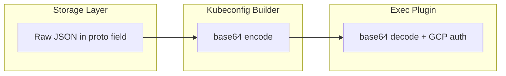

# Fix GKE Kubeconfig Service Account Key YAML Parsing

**Date**: March 6, 2026
**Type**: Bug Fix
**Components**: Kubernetes Provider, IAC Stack Runner

## Summary

Fixed a kubeconfig YAML parsing error introduced by the base64 removal change (2026-03-03). Raw JSON service account keys were being interpolated directly into the kubeconfig YAML template, causing YAML to misparse `{...}` as a mapping object instead of a string. The fix base64-encodes the key at the kubeconfig builder boundary -- a transport encoding localized to the exec plugin contract.

## Problem Statement / Motivation

After `service_account_key_base64` was renamed to `service_account_key` and base64 encoding was removed from the storage and API layers, the field began carrying raw JSON. Two kubeconfig builder functions (`gcpGke()` and `buildGcpGkeKubeConfig()`) use `fmt.Sprintf` to interpolate this value into a YAML template:

```yaml
users:
- name: kube-user
  user:
    exec:
      args:
        - {"type":"service_account","project_id":"..."}
```

YAML interprets `{...}` as a mapping, not a string. The Kubernetes client-go kubeconfig parser then fails:

```
json: cannot unmarshal object into Go struct field ExecConfig.users.user.exec.args of type string
```

### Pain Points

- All GKE-based KubernetesDeployment Pulumi updates fail with exit code 255
- All Terraform modules using the GKE kubeconfig env-var path are similarly broken
- The error message is misleading -- it points at kubeconfig parsing, not at the SA key format

## Solution / What's New

Base64-encode the service account key at the kubeconfig builder boundary, right before interpolating into the YAML template. This is a **transport encoding** for the exec plugin CLI argument, distinct from the **storage encoding** that was correctly removed.



This keeps both kubeconfig construction paths consistent:

| Path | SA Key Format | Status |
|------|--------------|--------|
| `GetWithCreatedGkeClusterAndCreatedGsaKey` | Base64 (GCP native `privateKey` output) | Already correct |
| `gcpGke()` (pre-existing credentials) | Raw JSON -> **now base64-encoded** | Fixed |
| `buildGcpGkeKubeConfig()` (Terraform env vars) | Raw JSON -> **now base64-encoded** | Fixed |

## Implementation Details

Two functions changed, one line each:

**Pulumi provider path** (`pkg/iac/pulumi/pulumimodule/provider/kubernetes/pulumikubernetesprovider/provider.go`):

```go
base64.StdEncoding.EncodeToString([]byte(c.ServiceAccountKey))
```

**Terraform env-var path** (`pkg/iac/stackinput/providerenvvars/kubernetes.go`):

```go
base64.StdEncoding.EncodeToString([]byte(c.ServiceAccountKey))
```

Both functions added `"encoding/base64"` to their import block. No other files changed.

## Benefits

- Restores GKE-based KubernetesDeployment provisioning for both Pulumi and Terraform paths
- Maintains the base64 removal from storage/API boundaries (the design principle from the 2026-03-03 change)
- Keeps the exec plugin contract unchanged -- no plugin binary updates needed
- Both kubeconfig construction paths now produce identical format for the exec plugin

## Impact

- **All GKE Pulumi modules** that receive `KubernetesProviderConfig` with pre-resolved SA keys (the Planton Connection flow)
- **All Terraform modules** using the env-var kubeconfig builder for GKE
- No impact on the `GetWithCreatedGkeClusterAndCreatedGsaKey` path (was already correct)
- No impact on non-GKE providers (AWS EKS, Azure AKS, DigitalOcean DOKS)

## Related Work

- [Remove Base64 Encoding from GCP Service Account Key](2026-03-03-195722-remove-base64-encoding-from-gcp-service-account-key.md) -- the change that introduced this regression
- Planton credential-to-connection migration (project 20260224.05) -- the Connection system stores secrets as raw values in config-manager, which feeds into this path

---

**Status**: Production Ready
**Timeline**: 1 session
