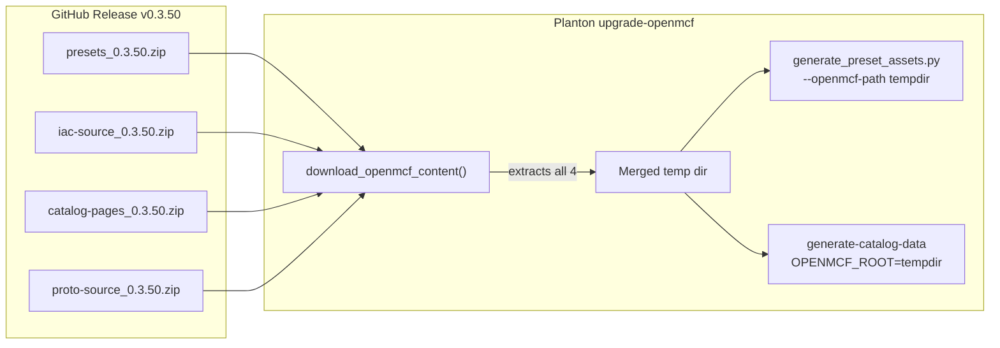
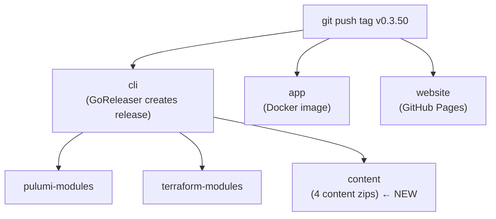

# Content Distribution via Release Artifacts

**Date**: March 10, 2026
**Type**: Feature
**Components**: Build System, Release Workflow, Presets

## Summary

OpenMCF releases now package four versioned content zips as GitHub Release artifacts: presets, IaC source, catalog pages, and proto source. This decouples the Planton upgrade-openmcf workflow from requiring a local OpenMCF checkout, enabling CI/CD automation and removing the developer-machine filesystem dependency. Additionally, 18 preset files across 6 components were renamed to follow the `{rank}-{description}` naming convention.

## Problem Statement / Motivation

The Planton monorepo's `make upgrade-openmcf` reads five categories of content directly from a local OpenMCF checkout at `~/scm/github.com/plantonhq/openmcf`. This architecture has two problems:

### Pain Points

- **CI/CD incompatible**: Automated upgrade workflows cannot run because no local checkout exists in CI runners
- **Developer coupling**: Every developer must have the OpenMCF repo cloned at a specific path before running the upgrade
- **Version mismatch risk**: The local checkout may be at a different version than the target upgrade version, producing silently incorrect output
- **Preset naming violations**: 18 preset files across 6 newer components (alicloud, GCP Cloud Armor, Cloud Scheduler, Cloud Tasks, Vertex AI) were missing the required `{rank}-` numeric prefix, causing them to be silently skipped during CloudObjectPreset asset generation

## Solution / What's New

### Content Distribution Packaging

A single packaging script creates four versioned zip files, each scoped to one concern:

| Zip | Contents | Size | Files |
|-----|----------|------|-------|
| `presets_{v}.zip` | Preset YAML + MD, kind enum proto | 1.4 MB | 1,562 |
| `iac-source_{v}.zip` | IaC source (.go, .tf, .md, .yaml) | 5.1 MB | 5,468 |
| `catalog-pages_{v}.zip` | Per-component catalog-page.md | 1.1 MB | 362 |
| `proto-source_{v}.zip` | Raw proto source (spec, api, stack_input, stack_outputs) | 1.7 MB | 1,457 |

All zips preserve repo-relative paths (`apis/org/openmcf/provider/...`). When extracted into a single directory, they overlay into a virtual OpenMCF root that downstream tools use without modification.

### Preset Filename Fixes

18 preset files across 6 components renamed to add the required `{rank}-` prefix:

| Component | Renames |
|-----------|---------|
| `alicloudcontainerregistry` | basic-dev → 01-basic-dev, standard-production → 02-standard-production, advanced-enterprise → 03-advanced-enterprise |
| `gcpcloudarmorpolicy` | basic-ip-allowlist → 01-basic-ip-allowlist, rate-limiting-api → 02-rate-limiting-api, waf-owasp-protection → 03-waf-owasp-protection |
| `gcpcloudschedulerjob` | basic-http-job → 01-basic-http-job, pubsub-publisher → 02-pubsub-publisher, secure-cloud-run-trigger → 03-secure-cloud-run-trigger |
| `gcpcloudtasksqueue` | basic-queue → 01-basic-queue, rate-limited-processing → 02-rate-limited-processing, secure-cloud-run-target → 03-secure-cloud-run-target |
| `gcpvertexaiendpoint` | basic-public → 01-basic-public, private-vpc-peered → 02-private-vpc-peered, private-psc → 03-private-psc |
| `gcpvertexainotebook` | basic-notebook → 01-basic-notebook, gpu-ml-notebook → 02-gpu-ml-notebook, secure-private-notebook → 03-secure-private-notebook |

## Implementation Details

### New Files

- **`tools/ci/release/package_content.sh`**: Shell script that creates all four zips. Uses `find` + `zip -@` with file-extension filters matching the downstream consumers exactly (e.g., `.go`, `.tf`, `.md`, `.yaml` for IaC source matches `ALLOWED_EXTENSIONS` in `iac-bundler.ts`). Supports `--dry-run` mode for local testing.

- **`.github/workflows/release.content.yaml`**: Reusable workflow called after GoReleaser creates the GitHub Release. Runs the packaging script and uploads all four zips via `gh release upload --clobber`.

### Modified Files

- **`.github/workflows/release.yaml`**: Added `content` job (`needs: cli`) to the release orchestrator, alongside existing `pulumi-modules` and `terraform-modules`.

- **`Makefile`**: Added `package-content` target for local testing.

### Release Workflow DAG

## Benefits

- **CI/CD ready**: The Planton upgrade workflow can run without a local OpenMCF checkout
- **Version-correct**: Content always matches the exact release version being upgraded to
- **Zero skips**: Preset asset generation now processes 788 presets with 0 skips (was 770 generated / 18 skipped)
- **Incremental downloads**: Each concern is independently downloadable -- a consumer that only needs presets doesn't download IaC source
- **Backward compatible**: Falls back to local checkout when content zips are not available (pre-existing releases)

## Impact

- **Release pipeline**: Every future OpenMCF release automatically includes four content zips
- **Planton upgrade**: `upgrade_openmcf.py` downloads content from the release instead of reading from local checkout
- **Preset coverage**: All 788 presets across 14 providers now generate CloudObjectPreset assets

## Related Work

- OpenMCF Presets project (T01-T09): Created the original 375 presets across 213 components
- Planton `upgrade_openmcf.py`: Consumer that downloads and uses the content zips
- Planton `generate_preset_assets.py`: Added `--version` flag for standalone remote download

---

**Status**: Production Ready
**Timeline**: Single session
