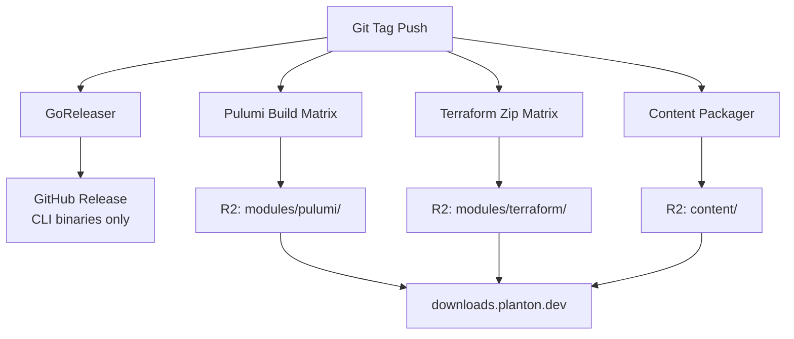

# Migrate Release Artifacts from GitHub Releases to Cloudflare R2

**Date**: March 10, 2026
**Type**: Feature
**Components**: CI/CD Pipelines, Release Infrastructure, Content Distribution

## Summary

Migrated all non-CLI release artifacts (Pulumi binaries, Terraform module zips, content distribution zips) from GitHub Releases to a Cloudflare R2 bucket at `downloads.planton.dev`. This removes the 1,000-file GitHub release limit that was blocking the addition of new providers. CLI binaries remain on GitHub Releases via GoReleaser.

## Problem Statement / Motivation

Planton's release pipeline attaches pre-built Pulumi binaries, Terraform module zips, and content distribution zips to each GitHub Release. With 17 providers and growing, a single semver release produces:

- **362 Pulumi components x 4 platforms = 1,448 binaries**
- **358 Terraform module zips**
- **4 content distribution zips**
- **Total: 1,810 artifacts per release**

GitHub Releases enforce a hard limit of **1,000 files per release**, meaning the platform could not release with all providers enabled.

### Pain Points

- New providers (scaleway, hetzner, oci, alibaba, openstack) were commented out in workflow matrices
- Semver releases would fail once the artifact count exceeded the limit
- No path forward for continued provider expansion under the GitHub Releases model

## Solution / What's New

All non-CLI artifacts are now uploaded to Cloudflare R2 at `downloads.planton.dev` using the AWS CLI's S3-compatible API. The R2 bucket (`downloads-dot-planton-dot-dev-bucket`) is configured with a custom domain and public read access.

### URL Structure

```
downloads.planton.dev/
  releases/{tag}/
    modules/
      pulumi/{component}_{platform}.gz
      terraform/{component}.zip
    content/
      presets.zip
      iac-source.zip
      catalog-pages.zip
      proto-source.zip
```

### What Stays on GitHub Releases

CLI binaries continue to be published via GoReleaser. The GitHub Release is still created for every tag and serves as the changelog/tracking record, but large binary artifacts are no longer attached.



## Implementation Details

### Workflow Changes (8 files)

**Semver release pipeline** (`release.yaml` orchestrator):
- Added R2 secret passthrough (`CLOUDFLARE_R2_ACCESS_KEY_ID`, `CLOUDFLARE_R2_SECRET_ACCESS_KEY`, `CLOUDFLARE_R2_ENDPOINT`) to called workflows
- Updated header comments with new artifact hosting breakdown

**`release.pulumi-modules.yaml`**:
- Replaced `gh release upload` with `aws s3 cp` to R2
- Enabled all 17 providers in the matrix (previously only 10)
- Dropped `pulumi-` prefix from artifact filenames (redundant with directory path)
- Narrowed permissions from `contents: write` to `contents: read`

**`release.terraform-modules.yaml`**:
- Same R2 migration pattern
- Enabled all 17 providers

**`release.content.yaml`**:
- R2 migration for content zips
- Zip filenames no longer carry version suffixes (version is in the R2 path)

**`auto-release.pulumi-modules.yaml` and `auto-release.terraform-modules.yaml`**:
- R2 upload via repo secrets (not workflow_call secrets)
- GitHub releases still created for tracking, release notes link to R2 URLs

**`.goreleaser.yaml`**:
- Footer updated to reference `downloads.planton.dev` for Pulumi and Terraform sections
- CLI download URLs unchanged (still GitHub Releases)

### Packaging Script

**`tools/ci/release/package_content.sh`**:
- Output filenames changed from `presets_${V}.zip` to `presets.zip` (version-free)
- Version tag still accepted for logging but not embedded in filenames

### R2 Path Design

Paths follow a consistent hierarchical structure:
- `modules/` groups both IaC module types together
- `content/` holds distribution zips for downstream consumers
- No redundant type prefixes in filenames (directory conveys the type)

## Benefits

- **Unlimited artifacts per release**: No more GitHub 1,000-file ceiling
- **All 17 providers enabled**: alicloud, atlas, auth0, aws, azure, civo, cloudflare, confluent, digitalocean, gcp, hetznercloud, kubernetes, oci, openfga, openstack, scaleway, snowflake
- **Faster downloads**: Cloudflare's edge network vs GitHub's release CDN
- **Clean URL structure**: Consistent, hierarchical, no redundant prefixes
- **Future-proof**: Adding providers no longer requires any workflow matrix changes if using dynamic discovery

## Impact

- **Release pipeline**: All semver and auto-release workflows now upload to R2
- **Downstream consumers**: The planton monorepo's iac-runner and upgrade scripts need corresponding URL updates (separate PR)
- **GitHub Release page**: Will be lighter (only CLI binaries attached), with links to R2 for modules

## Related Work

- Planton monorepo `download.go`, `upgrade_planton.py`, and `generate_preset_assets.py` require matching URL updates
- R2 bucket `downloads-dot-planton-dot-dev-bucket` provisioned via `r2-bucket.downloads-dot-planton-dot-dev-bucket.yaml`
- GitHub repo secrets (`CLOUDFLARE_R2_*`) must be configured before the first R2-based release

---

**Status**: Production Ready (pending R2 secrets configuration on GitHub)
**Timeline**: Single session
