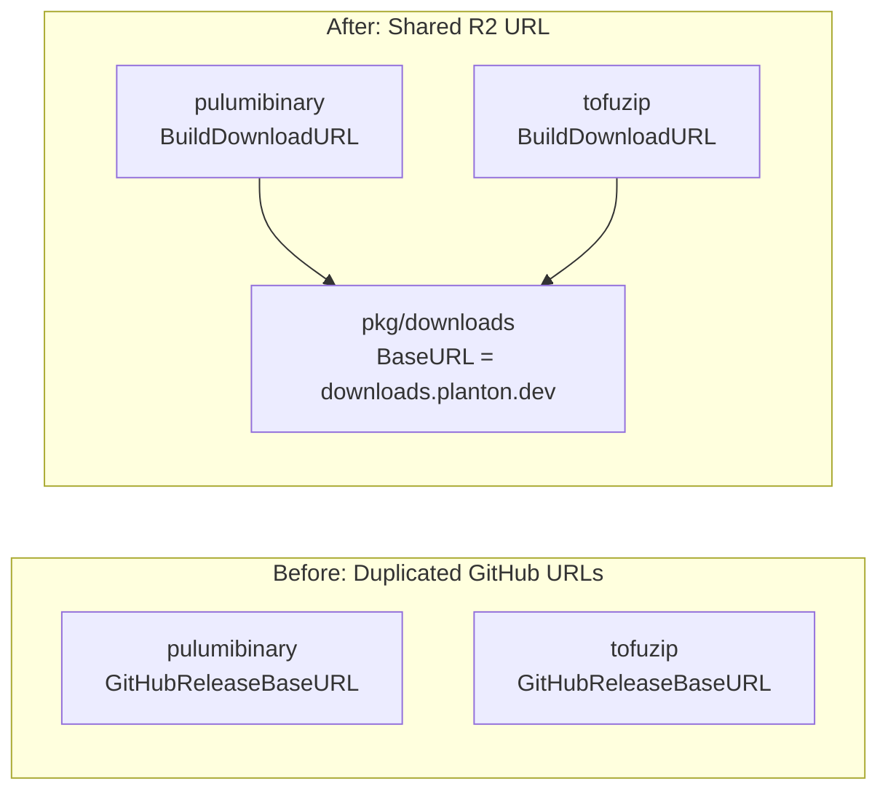

# Migrate CLI Module Downloads to R2 and Disable Webapp Build

**Date**: March 10, 2026
**Type**: Feature
**Components**: CLI Module Downloads, Build System, CI/CD Pipelines

## Summary

The Planton CLI's Pulumi binary and Terraform module download logic has been migrated from GitHub Release URLs to Cloudflare R2 (`downloads.planton.dev`), matching the artifact hosting changes made in the R2 migration. Additionally, the webapp build has been removed from `make build` and all associated GitHub workflows have been disabled.

## Problem Statement / Motivation

### CLI Download URLs Broken

The R2 migration (see `2026-03-10-063513`) moved all non-CLI release artifacts to Cloudflare R2, but the CLI's Go code still constructed download URLs pointing at GitHub Releases. Two packages were affected:

- `pkg/iac/pulumi/pulumibinary/binary.go` built URLs like `github.com/.../download/{tag}/pulumi-{comp}_{plat}.gz`
- `pkg/iac/tofu/tofuzip/zip.go` built URLs like `github.com/.../download/{tag}/terraform-{comp}.zip`

The actual artifacts now live at:
- `downloads.planton.dev/releases/{tag}/modules/pulumi/{comp}_{plat}.gz`
- `downloads.planton.dev/releases/{tag}/modules/terraform/{comp}.zip`

Two mismatches per package: (1) wrong base URL, (2) redundant `pulumi-`/`terraform-` filename prefix no longer present on R2.

### Webapp No Longer Needed

The self-hosted webapp is no longer part of the Planton distribution. Building it in `make build` added unnecessary time and complexity, and the Docker image release pipeline consumed CI minutes for an artifact that was not shipped.

## Solution / What's New

### Shared Downloads Package

A new `pkg/downloads` package provides the single source of truth for the R2 base URL and URL builder functions:

Both `pulumibinary` and `tofuzip` delegate to `downloads.BuildPulumiDownloadURL` and `downloads.BuildTerraformDownloadURL` respectively. Local cache naming (the `pulumi-` prefix on disk) is unchanged since it's internal to the CLI.

### Webapp Disabled

The webapp has been removed from the build and release pipeline without deleting the workflow files, preserving them as reference.

## Implementation Details

### New File

- **`pkg/downloads/downloads.go`**: Exports `BaseURL` constant and two URL builder functions. Matches the URL convention already used by the Planton monorepo's `download.go`.

### Modified Files (R2 Migration)

- **`pkg/iac/pulumi/pulumibinary/binary.go`**: Removed `GitHubReleaseBaseURL` constant. `BuildDownloadURL` now delegates to `downloads.BuildPulumiDownloadURL`. `BinaryPrefix` retained for local cache filenames only.

- **`pkg/iac/tofu/tofuzip/zip.go`**: Removed `GitHubReleaseBaseURL`, `ZipPrefix`, and `BuildZipName` (all dead code after the delegation change). `BuildDownloadURL` now delegates to `downloads.BuildTerraformDownloadURL`.

### Modified Files (Webapp Disabled)

- **`Makefile`**: Removed `build-backend` and `build-frontend` from the `build` target. Standalone targets retained for manual use.

- **`.github/workflows/release.yaml`**: Removed the `app` job and `packages: write` permission. Updated header comments.

- **`.github/workflows/auto-tag.yaml`**: Removed `app/**` from trigger paths, `force_app` input, App Tag detection block, "Trigger App release" dispatch step, and app summary output.

- **`.github/workflows/release.app.yaml`**: Marked as `[disabled]` in workflow name and comments.

- **`.github/workflows/auto-release.app.yaml`**: Marked as `[disabled]` with `if: false` on the job so even manual dispatch is a no-op.

## Benefits

- **CLI downloads work**: Pulumi and Terraform module downloads from the CLI will resolve correctly against R2 for all future releases
- **Single source of truth**: The R2 base URL lives in one place (`pkg/downloads`), consistent with the Planton monorepo's approach
- **Faster builds**: `make build` no longer builds the webapp frontend and backend
- **Cleaner CI**: No Docker image builds or GHCR pushes on semver releases or auto-releases

## Impact

- **CLI users**: Module downloads (Pulumi binary and Terraform zip) will use R2 URLs starting with the next release
- **Developers**: `make build` is faster (no webapp compilation)
- **Release pipeline**: Semver releases and auto-tag workflows no longer trigger Docker image builds

## Related Work

- **R2 migration** (`2026-03-10-063513`): Moved release artifacts from GitHub Releases to Cloudflare R2
- **Content distribution** (`2026-03-10-052906`): Added content zip packaging to the release pipeline
- **Planton `download.go`**: The monorepo's runner already uses the same R2 URL convention

---

**Status**: Production Ready
**Timeline**: Single session
