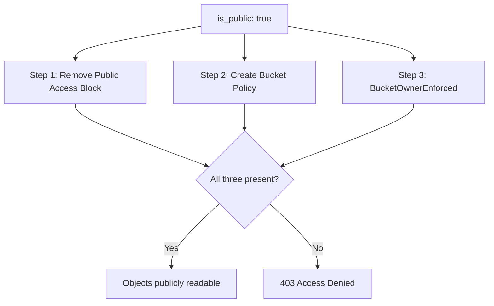

# AwsS3Bucket: Add Public Read Bucket Policy When `is_public` Is True

**Date**: March 11, 2026
**Type**: Bug Fix
**Components**: AWS Provider, Pulumi CLI Integration, Resource Management

## Summary

Fixed the `is_public` flag on `AwsS3Bucket` to actually grant public read access. Both the Pulumi and Terraform IaC modules correctly removed the S3 Public Access Block when `is_public: true`, but neither created a bucket policy granting `s3:GetObject`. With `BucketOwnerEnforced` ownership disabling ACLs, the bucket policy is the only mechanism for public access -- making this a silent no-op bug.

## Problem Statement / Motivation

The `AwsS3BucketSpec.is_public` field (field 2) promises public access:

> When set to `true`, the bucket will be publicly accessible over the internet.

In practice, setting `is_public: true` had no effect on object accessibility. Objects returned HTTP 403 Access Denied even though the manifest explicitly requested public access.

### Pain Points

- **Silent failure**: No error during provisioning -- the bucket appears to deploy successfully, but objects are not publicly readable.
- **Three-layer S3 public access model not fully addressed**: AWS requires (1) Public Access Block removed, (2) a bucket policy granting access, and (3) compatible ownership controls. The modules implemented steps 1 and 3 but missed step 2.
- **Real-world impact**: A CloudFormation template hosted in a "public" S3 bucket was returning 403, breaking a CloudFormation Quick Create integration that requires the template to be publicly accessible via HTTPS.

## Solution / What's New

Added a conditional `BucketPolicy` resource to both the Pulumi and Terraform modules that grants `s3:GetObject` to all principals (`*`) when `is_public` is true.

### How S3 Public Access Actually Works



Before this fix, only steps 1 and 3 were implemented. Step 2 was missing in both modules.

## Implementation Details

### Pulumi Module (`module/main.go`)

Captured the previously-discarded `publicAccessBlock` resource reference and added a conditional `s3.NewBucketPolicy`:

```go
if spec.IsPublic {
    policyJSON := bucket.Arn.ApplyT(func(arn string) (string, error) {
        policy := map[string]interface{}{
            "Version": "2012-10-17",
            "Statement": []map[string]interface{}{
                {
                    "Sid":       "PublicReadGetObject",
                    "Effect":    "Allow",
                    "Principal": "*",
                    "Action":    "s3:GetObject",
                    "Resource":  arn + "/*",
                },
            },
        }
        b, err := json.Marshal(policy)
        return string(b), err
    }).(pulumi.StringOutput)

    _, err = s3.NewBucketPolicy(ctx, "public-read-policy", &s3.BucketPolicyArgs{
        Bucket: bucket.ID(),
        Policy: policyJSON,
    }, pulumi.Provider(provider), pulumi.DependsOn([]pulumi.Resource{publicAccessBlock}))
}
```

Key details:
- Uses `bucket.Arn` output to construct the resource ARN dynamically (no hardcoded bucket names)
- `DependsOn(publicAccessBlock)` ensures AWS accepts the policy (AWS rejects bucket policies while the Public Access Block is still active)
- `encoding/json` added to imports for proper JSON serialization

### Terraform Module (`main.tf`)

Added a conditional `aws_s3_bucket_policy` resource:

```hcl
resource "aws_s3_bucket_policy" "public_read" {
  count  = local.is_public ? 1 : 0
  bucket = aws_s3_bucket.this.id

  policy = jsonencode({
    Version = "2012-10-17"
    Statement = [{
      Sid       = "PublicReadGetObject"
      Effect    = "Allow"
      Principal = "*"
      Action    = "s3:GetObject"
      Resource  = "${aws_s3_bucket.this.arn}/*"
    }]
  })

  depends_on = [aws_s3_bucket_public_access_block.this]
}
```

Same dependency ordering as the Pulumi module -- the public access block must be applied before the bucket policy.

### Files Changed

**Modified (2):**
- `apis/dev/planton/provider/aws/awss3bucket/v1/iac/pulumi/module/main.go` -- added `encoding/json` import, captured `publicAccessBlock` variable, added conditional `s3.NewBucketPolicy`
- `apis/dev/planton/provider/aws/awss3bucket/v1/iac/tf/main.tf` -- added conditional `aws_s3_bucket_policy.public_read` resource

## Benefits

- **`is_public: true` now works as documented** -- objects in public buckets are actually publicly readable
- **No change to the spec or API** -- the fix is entirely in the IaC modules; existing manifests work without modification
- **Both provisioners stay in parity** -- Pulumi and Terraform modules produce identical infrastructure
- **Dependency ordering prevents race conditions** -- `DependsOn` / `depends_on` ensures the policy is only applied after the Public Access Block is removed

## Impact

- **Existing public buckets**: Re-applying stacks with `is_public: true` will add the missing bucket policy, making objects publicly accessible. This is the intended behavior that was previously broken.
- **Private buckets**: No change. The policy resource is conditional and only created when `is_public` is true.
- **No breaking changes**: This is purely additive -- the bucket policy resource is new and does not modify any existing resources.

## Related Work

- Discovered while debugging a CloudFormation Quick Create integration in the Planton platform where the S3-hosted CloudFormation template returned 403 despite the bucket being configured with `is_public: true`.

---

**Status**: Production Ready
**Timeline**: ~30 minutes (root cause analysis + fix in both modules + build verification)
