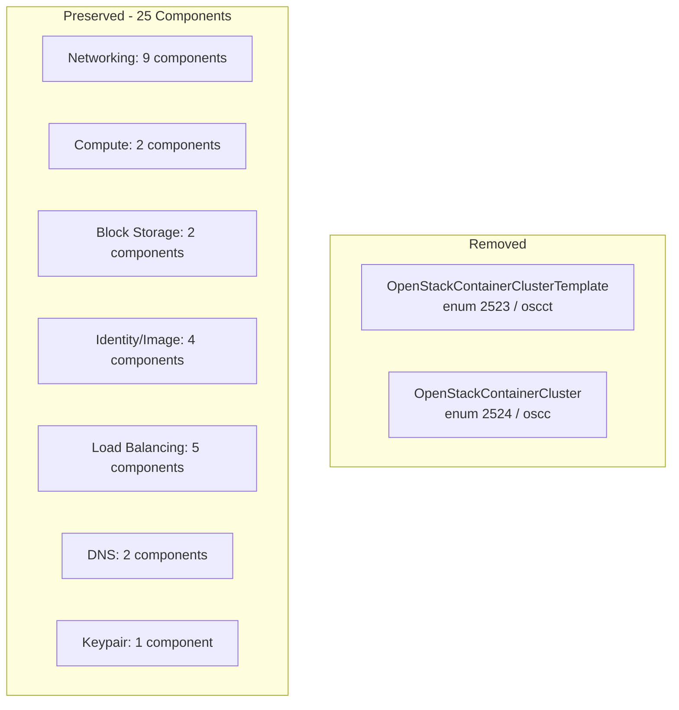

# Remove OpenStack Magnum Components (ContainerClusterTemplate + ContainerCluster)

**Date**: March 15, 2026
**Type**: Breaking Change
**Components**: API Definitions, Provider Framework, Resource Management, Build System

## Summary

Removed OpenStackContainerClusterTemplate (enum 2523) and OpenStackContainerCluster (enum 2524) from the OpenMCF catalog. OpenStack Magnum uses legacy Heat templating for Kubernetes cluster provisioning, and the community is migrating to Ansible-driven Kubernetes deployments. Keeping these components would misalign the platform with industry direction.

## Problem Statement / Motivation

OpenStack Magnum's `containerinfra` API provisions Kubernetes clusters through Heat orchestration templates. This approach has two fundamental problems:

1. **Legacy architecture**: Heat-based templating is being deprecated across the OpenStack ecosystem in favor of Ansible-driven workflows
2. **Community direction**: Major OpenStack deployments (including ARM, our design partner) are adopting Ansible-based Kubernetes provisioning rather than Magnum

### Pain Points

- Maintaining IaC modules (Pulumi Go + Terraform HCL) for a deprecated API creates technical debt
- Users deploying Magnum clusters through Planton would face upstream deprecation risks
- The two components add catalog surface area without providing long-term value

## Solution / What's New

Complete removal of both Magnum components across the full stack:



## Implementation Details

### Proto Enum Handling

Enum values 2523 and 2524 marked as `reserved` to prevent accidental reuse (standard protobuf wire-compatibility practice):

```protobuf
reserved 2523, 2524;
reserved "OpenStackContainerClusterTemplate", "OpenStackContainerCluster";
```

### Files Removed

- **Component directory trees**: `openstackcontainerclustertemplate/v1/` and `openstackcontainercluster/v1/` — proto sources, Pulumi Go modules, Terraform HCL, spec tests, documentation, presets, hack manifests, Bazel BUILD files
- **Generated stubs**: Go `.pb.go` files, TypeScript `_pb.ts` files
- **Site catalog**: `container-cluster-template/` and `container-cluster/` directories under `site/public/docs/catalog/openstack/`
- **crkreflect**: Import statements and map entries removed from `kind_map_gen.go`

### Files Updated

- `cloud_resource_kind.proto` — enum entries replaced with `reserved` markers
- `openstacknetwork/v1/stack_outputs.proto` — removed FK comment referencing ContainerClusterTemplate
- `openstacksubnet/v1/stack_outputs.proto` — removed FK comment referencing ContainerClusterTemplate
- `openstackimage/v1/stack_outputs.proto` — removed FK comment referencing ContainerClusterTemplate
- `openstacksubnet/v1/catalog-page.md` — removed cross-reference link
- `openstacknetwork/v1/docs/README.md` — removed FK documentation lines
- `openstacksubnet/v1/docs/README.md` — removed FK documentation line

### Site Catalog Regeneration

After deleting source component directories, the site build pipeline was re-run:
- `yarn copy-docs` regenerated `openstack/index.md` (provider index) — confirmed "OPENSTACK: Found 25 components"
- `yarn generate-structure` regenerated `docs-structure.json` (sidebar tree) without the deleted entries

## Benefits

- **Aligned with industry direction**: Platform does not expose deprecated infrastructure APIs
- **Reduced maintenance surface**: ~100 files removed across protos, IaC modules, tests, and documentation
- **Clean catalog**: Users see only actively maintained OpenStack components
- **Wire-safe removal**: Reserved enum values prevent future accidental reuse

## Impact

- **OpenStack component count**: 27 → 25
- **Files removed**: 101 files, ~6,100 lines deleted
- **No downstream breakage**: `make protos`, `make build`, and `make test` all pass
- **Site catalog**: Automatically regenerated without the removed components

## Related Work

- Part of the OpenStack OpenMCF Components project (20260209.01)
- Components were originally created in Session 14 (Phase 6c/6d, 2026-02-09)
- The `openstack/kubernetes-environment` InfraChart in the infra-charts repo was also deleted (it depended entirely on these Magnum components)

---

**Status**: ✅ Production Ready
