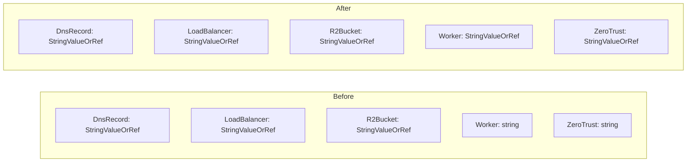

# Cloudflare zone_id Migration to StringValueOrRef

**Date**: March 15, 2026
**Type**: Enhancement
**Components**: API Definitions, Pulumi CLI Integration, Provider Framework

## Summary

Migrated the `zone_id` field from plain `string` to `StringValueOrRef` in two Cloudflare components -- CloudflareWorker (`dns.zone_id`) and CloudflareZeroTrustAccessApplication (`zone_id`). This brings all five Cloudflare components that reference a zone ID to a consistent type, enabling users to either provide a literal zone ID or reference an existing CloudflareDnsZone resource.

## Problem Statement / Motivation

Cloudflare's `zone_id` is a 32-character hexadecimal identifier that scopes most Cloudflare operations. Five OpenMCF components use it, but they were inconsistent in how they modeled it.

### Pain Points

- **Inconsistent schema**: DnsRecord, LoadBalancer, and R2Bucket used `StringValueOrRef` for `zone_id`, while Worker and ZeroTrustAccessApplication used plain `string`
- **No cross-resource referencing**: Worker and ZeroTrust users had to manually copy zone IDs instead of referencing an existing CloudflareDnsZone resource
- **Wizard integration blocked**: The Planton wizard's CloudOps-powered `CloudflareZoneSelector` (which produces `StringValueOrRef` values) could not be wired to these two resources because the proto field was a plain string

## Solution / What's New

Changed the `zone_id` field type from `string` to `org.openmcf.shared.foreignkey.v1.StringValueOrRef` in both components, propagated the change through all six layers (proto, Pulumi IaC, Terraform IaC, tests, presets, documentation), and validated with full build and test suite.

### Consistency Achieved



### Usage Modes

Users can now provide `zone_id` in two ways across all Cloudflare components:

```yaml
# Literal value
zoneId:
  value: "a1b2c3d4e5f6a1b2c3d4e5f6a1b2c3d4"

# Reference to a CloudflareDnsZone resource
zoneId:
  valueFrom:
    kind: CloudflareDnsZone
    name: "my-zone"
    fieldPath: "status.outputs.zone_id"
```

## Implementation Details

### Proto Schema Changes

**CloudflareWorker** (`CloudflareWorkerDns` message):
```protobuf
// Before
string zone_id = 2 [(buf.validate.field).string.min_len = 1];

// After
org.openmcf.shared.foreignkey.v1.StringValueOrRef zone_id = 2 [
  (org.openmcf.shared.foreignkey.v1.default_kind) = CloudflareDnsZone,
  (org.openmcf.shared.foreignkey.v1.default_kind_field_path) = "status.outputs.zone_id"
];
```

**CloudflareZeroTrustAccessApplication** (`CloudflareZeroTrustAccessApplicationSpec` message):
```protobuf
// Before
string zone_id = 2 [
  (buf.validate.field).required = true,
  (org.openmcf.shared.foreignkey.v1.default_kind) = CloudflareDnsZone,
  (org.openmcf.shared.foreignkey.v1.default_kind_field_path) = "status.outputs.zone_id"
];

// After
org.openmcf.shared.foreignkey.v1.StringValueOrRef zone_id = 2 [
  (buf.validate.field).required = true,
  (org.openmcf.shared.foreignkey.v1.default_kind) = CloudflareDnsZone,
  (org.openmcf.shared.foreignkey.v1.default_kind_field_path) = "status.outputs.zone_id"
];
```

### Pulumi IaC Changes

Both modules now use the `GetValue()` pattern established by DnsRecord and R2Bucket:

```go
// Before (Worker route.go)
zoneId := pulumi.String(dns.ZoneId).ToStringOutput()

// After
zoneId := ""
if dns.ZoneId != nil {
    zoneId = dns.ZoneId.GetValue()
}
```

### Terraform IaC Changes

Both modules updated from plain string to object type:

```hcl
# Before (Worker variables.tf)
zone_id = optional(string, "")

# After
zone_id = optional(object({
  value = optional(string, "")
}))
```

### Test Updates

Both `spec_test.go` files updated to construct `StringValueOrRef` structs instead of assigning plain strings.

### Preset and Documentation Updates

- 3 preset YAML files updated to `zoneId: { value: ... }` wrapper
- Worker `examples.md` (8 zone_id references) and `README.md` (6 references) updated
- ZeroTrust `examples.md` (14 zone_id references) updated
- `valueFrom` reference pattern documented in examples

## Benefits

- **Schema consistency**: All 5 Cloudflare components now use `StringValueOrRef` for `zone_id`
- **Cross-resource referencing**: Users can reference an existing `CloudflareDnsZone` resource instead of manually copying zone IDs
- **Wizard integration unblocked**: Planton's `CloudflareZoneSelector` (CloudOps-powered dropdown) can now be wired to Worker and ZeroTrust wizard steps
- **Reduced copy-paste errors**: Zone IDs are 32-character hex strings prone to transcription errors

## Impact

- **2 components updated**: CloudflareWorker, CloudflareZeroTrustAccessApplication
- **Breaking change for YAML manifests**: Existing manifests using `zoneId: "..."` must be updated to `zoneId: { value: "..." }` for both components
- **No IaC behavioral changes**: The resolved zone ID value is identical; only the schema wrapper changes
- **Downstream**: Planton wizard can now upgrade Worker `dns.zoneId` and ZeroTrust `zone_id` from `WizardTextField` to `CloudflareZoneSelector`

## Related Work

- Cloudflare CloudOps integration (Account, Zone, KvNamespace, R2Bucket operations)
- Cloud Resource Creation Wizard project (`20260217.01`)
- StringValueOrRef pattern established by CloudflareDnsRecord and CloudflareR2Bucket components

---

**Status**: ✅ Production Ready
**Timeline**: Single session
