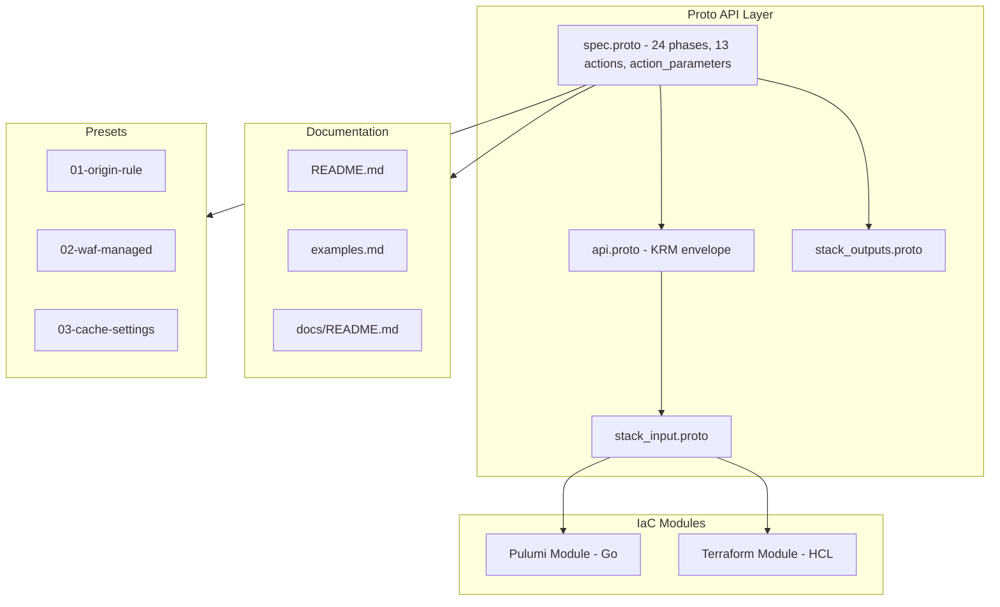

# Forge CloudflareRuleset Deployment Component

**Date**: March 25, 2026
**Type**: Feature
**Components**: API Definitions, Provider Framework, Pulumi CLI Integration, Build System

## Summary

Created a complete `CloudflareRuleset` deployment component (enum 1808, id_prefix `cfrs`) that models the `cloudflare_ruleset` Terraform/Pulumi resource. The component supports all 24 Cloudflare request processing phases and 13 action types, with an 80/20 selection of action parameters covering Origin Rules, WAF, Cache, Redirects, Rewrites, and managed ruleset execution. This is a prerequisite for the planton.ai unified domain migration, where a Cloudflare Origin Rule will split traffic between GitHub Pages and Kubernetes.

## Problem Statement / Motivation

Planton's unified domain migration project (`planton.ai` consolidation) requires a Cloudflare Origin Rule to route non-marketing paths to Kubernetes while letting GitHub Pages serve static content. Rather than creating ad-hoc Terraform, the Origin Rule should be managed as a proper Planton deployment component through Planton's InfraHub — consistent with how all other infrastructure is managed.

No `CloudflareRuleset` component existed in Planton. The `cloudflare_ruleset` resource is one of the most complex in the Cloudflare provider, with 60+ action parameter fields across all action types.

### Pain Points

- No way to manage Cloudflare Rulesets through Planton's unified IaC workflow
- The `cloudflare_ruleset` resource is too complex to model in full — requires careful 80/20 scoping
- Origin Rules, WAF Custom Rules, Cache Rules, Redirect Rules, and Transform Rules all use the same underlying Ruleset API but with different phases and actions

## Solution / What's New

A full Planton deployment component following the 20-step forge workflow, producing 36 files across proto definitions, IaC modules (Pulumi + Terraform), documentation, and presets.

### Architecture

### Key Design Decisions

1. **80/20 action_parameters**: Modeled Origin, Block, Rewrite, Redirect, Skip, Execute, and Cache parameters. Excluded niche settings (autominify, polish, rocket loader, etc.) that serve <10% of use cases.

2. **Flat action_parameters structure**: Mirrors the Cloudflare API's flat design rather than using proto `oneof` per action type. This keeps IaC modules simple (direct field mapping) and forward-compatible.

3. **`ruleset_kind` naming**: Cloudflare's `kind` field (`zone`, `custom`, `managed`, `root`) conflicts with KRM's `kind` (`CloudflareRuleset`). Resolved by naming the spec field `ruleset_kind`.

4. **`zone_id` as `StringValueOrRef`**: Enables DAG wiring from `CloudflareDnsZone` outputs, consistent with `CloudflareDnsRecord`.

5. **`enabled` default `true`**: Rules default to active via `optional bool` with `(dev.planton.shared.options.default) = "true"`, matching Cloudflare API behavior.

## Implementation Details

### Proto API (4 files)

- **`spec.proto`** (456 lines) — `CloudflareRulesetSpec` with nested `Phase` enum (24 values), `RulesetKind` enum (4 values), `CloudflareRulesetRule` with nested `Action` enum (13 values), and `CloudflareRulesetActionParameters` with 15 sub-messages
- **`api.proto`** — Standard KRM envelope with `api_version = "cloudflare.planton.dev/v1"`, `kind = "CloudflareRuleset"`
- **`stack_outputs.proto`** — `ruleset_id`, `version`, `zone_id`, `phase`
- **`stack_input.proto`** — `target` + `CloudflareProviderConfig`

### Validations

- CEL: exactly one of `zone_id` / `account_id` must be set
- Field: `phase` required and not unspecified, `name` min_len 1, `rules` min_items 1
- Rule: `expression` min_len 1, `action` required and not unspecified, `ruleset_kind` defined_only

### Tests (13 specs)

6 positive cases (origin rule, account_id, block rule, multiple rules, skip rule, no action_parameters) and 7 negative cases (no zone/account, both zone+account, unspecified phase, empty name, empty rules, empty expression, unspecified action).

### Pulumi Module

`module/ruleset.go` is the most complex file — maps proto `CloudflareRulesetRule` to Pulumi `cloudflare.RulesetRuleArgs` including all action parameter sub-types (origin, response, uri, headers map, from_value, overrides with categories/rules, edge_ttl with status_code_ttls, browser_ttl, serve_stale).

### Terraform Module

`main.tf` uses Terraform dynamic blocks extensively — each optional action parameter type is wrapped in a `dynamic` block that only renders when non-null.

### Registry

`CloudflareRuleset = 1808` in `cloud_resource_kind.proto` with `provider: cloudflare, version: v1, id_prefix: "cfrs"`.

## Benefits

- **Unified IaC**: Cloudflare Rulesets managed through the same `planton apply` workflow as all other Planton resources
- **Type-safe**: Proto validations catch configuration errors before deployment
- **Composable**: `zone_id` as `StringValueOrRef` enables infra-chart DAG wiring from `CloudflareDnsZone`
- **Multi-purpose**: Single component covers Origin Rules, WAF, Cache, Redirects, Transforms — 5+ Cloudflare features in one
- **Production-ready**: 96% ideal-state compliance per audit (13/13 tests pass)

## Impact

- **Platform**: Enables the planton.ai unified domain migration (T02)
- **Users**: Can now manage Cloudflare Rulesets via `planton apply` with YAML manifests
- **Developers**: 3 presets provide copy-paste starting points for common patterns

## Related Work

- **Unified domain migration project**: `planton/_projects/20260314.01.unified-domain-migration/`
- **CloudflareDnsRecord component**: Pattern reference for this forge
- **CloudflareDnsZone component**: `zone_id` reference target via `StringValueOrRef`

---

**Status**: ✅ Production Ready
**Timeline**: Single session (~3 hours)
**Audit Score**: 96% ideal-state compliance
