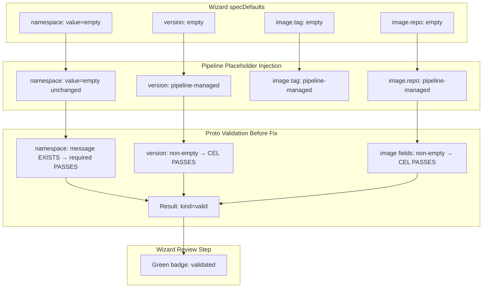
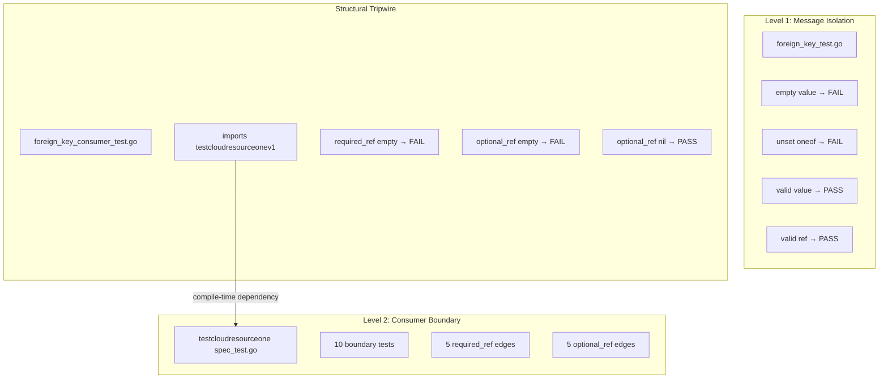

# StringValueOrRef Message-Level CEL Validation Rule

**Date**: March 28, 2026
**Type**: Bug Fix
**Components**: API Definitions, Protobuf Schemas, Testing Framework

## Summary

Added a message-level CEL rule to `StringValueOrRef` that rejects empty literal values and unset oneofs. This fixes a proto validation false-positive where `required = true` on consumer fields only checked message presence -- not whether the inner oneof carried meaningful content. The fix closes a gap that allowed the Planton service wizard to show a green "validated" badge when required fields like Kubernetes namespace were actually empty.

## Problem Statement / Motivation

Client-side proto validation was introduced in the Planton service wizard to catch configuration errors before submission. However, it was reporting "Environment configuration validated" even when the user hadn't filled in critical fields like namespace, cluster ARN, or project ID.

### Pain Points

- **False-positive validation**: Wizard review step showed a green badge when required StringValueOrRef fields were empty
- **`required = true` blind spot**: buf.validate's `required` on a message-type field only checks "is the message present?" -- it does NOT verify the oneof has content
- **Data flow that triggered it**: wizard specDefaults created `namespace: { value: "" }` (message present, oneof set to empty string), pipeline placeholder injection filled image/version fields, and the entire spec passed validation without any user input
- **No test coverage for the gap**: all 342 spec_test.go files started from fully valid specs in BeforeEach -- no test ever validated `StringValueOrRef{Value: ""}`

### The False-Positive Data Flow



## Solution / What's New

A single message-level CEL rule on `StringValueOrRef` in `foreign_key.proto`:

```protobuf
option (buf.validate.message).cel = {
  id: "string_value_or_ref.non_empty"
  message: "a non-empty value or a resource reference must be provided"
  expression: "(has(this.value) && this.value != '') || has(this.value_from)"
};
```

The rule fires on **any instance** of `StringValueOrRef` regardless of the consumer field's annotations. For optional fields, the only way to bypass validation is to leave the field nil (absent). If the message is present, it must have content.

### Blast Radius

`StringValueOrRef` is used across 20+ proto files in Kubernetes, Cloudflare, GCP, OCI, AWS, AliCloud, OpenStack, and Civo providers. Two usage categories:

- **Singular required fields** (namespace, cluster_arn, project_id, resource_group, etc.) -- the false-positive source, now fixed
- **Map values** (`map<string, StringValueOrRef> variables` in 5 Kubernetes `*ContainerAppEnv` messages) -- env var maps where `value: ""` is now correctly rejected

## Implementation Details

### Durability-First Test Strategy

Boundary tests are anchored on the **permanent test resource** (`_test/testcloudresourceone`), not on production resources that may be removed. Two `StringValueOrRef` fields were added to `TestCloudResourceOneSpec`:

- `required_ref` (with `required = true`) -- mirrors production usage like `KubernetesDeploymentSpec.namespace`
- `optional_ref` (without `required`) -- proves the CEL rule fires on message presence, not field annotation



The cross-cutting test in `foreign_key_consumer_test.go` uses Go's external test package (`package foreignkeyv1_test`) to avoid the import cycle `foreignkeyv1 → testcloudresourceonev1 → foreignkeyv1`. The import creates a compile-time tripwire: if `TestCloudResourceOne` is ever removed, this file fails to compile -- flagging the loss of coverage.

### Production Test Breakage Fixes

Two existing tests documented the old blind spot as expected behavior and were inverted:

- `gcpsecretsmanager/v1/spec_test.go` -- `ProjectId: &StringValueOrRef{}` now expected to fail
- `gcpcloudsql/v1/spec_test.go` -- `strVal("")` on `ProjectId` now expected to fail

### Files Changed

| File | Change |
|------|--------|
| `shared/foreignkey/v1/foreign_key.proto` | CEL rule + documentation |
| `shared/foreignkey/v1/foreign_key_test.go` | Rewrote: 5 message-level tests, removed dead Int32ValueOrRef tests |
| `shared/foreignkey/v1/foreign_key_consumer_test.go` | NEW: 4 cross-cutting tests with structural tripwire |
| `_test/testcloudresourceone/v1/spec.proto` | Added `required_ref` and `optional_ref` fields |
| `_test/testcloudresourceone/v1/spec_test.go` | NEW: 10 comprehensive boundary tests |
| `gcp/gcpsecretsmanager/v1/spec_test.go` | Inverted assertion |
| `gcp/gcpcloudsql/v1/spec_test.go` | Inverted assertion |

## Benefits

- **Fixes the false-positive** for all current and future `StringValueOrRef` fields across the entire OpenMCF schema
- **One rule, universal coverage**: Single message-level CEL expression instead of per-field or per-kind rules (~60+ consumer fields)
- **Durable test infrastructure**: Boundary tests survive regardless of which production resources come and go
- **Cross-implementation safe**: The CEL expression handles both Go and JS proto3 oneof behaviors
- **Not a wire-format breaking change**: Behavioral change only (empty values now rejected at validation time)

## Impact

- **Planton service wizard**: Client-side proto validation will now correctly reject empty required fields, showing violations instead of a false green badge
- **All OpenMCF consumers**: Any system using `protovalidate` against OpenMCF schemas (CLI, backend services, CI pipelines) will now catch empty `StringValueOrRef` fields
- **New kind authors**: The rule is universal -- any new cloud resource kind that uses `StringValueOrRef` automatically benefits without additional annotation

## Related Work

- [Cloudflare zone_id StringValueOrRef Migration](2026-03-15-195622-cloudflare-zone-id-stringvalueorref-migration.md) -- expanded `StringValueOrRef` usage across Cloudflare components
- Planton service wizard project: client-side proto validation Phase 3 identified this gap; wizard specDefaults cleanup follows after this OpenMCF release

---

**Status**: Production Ready
**Timeline**: Single session (March 28, 2026)
