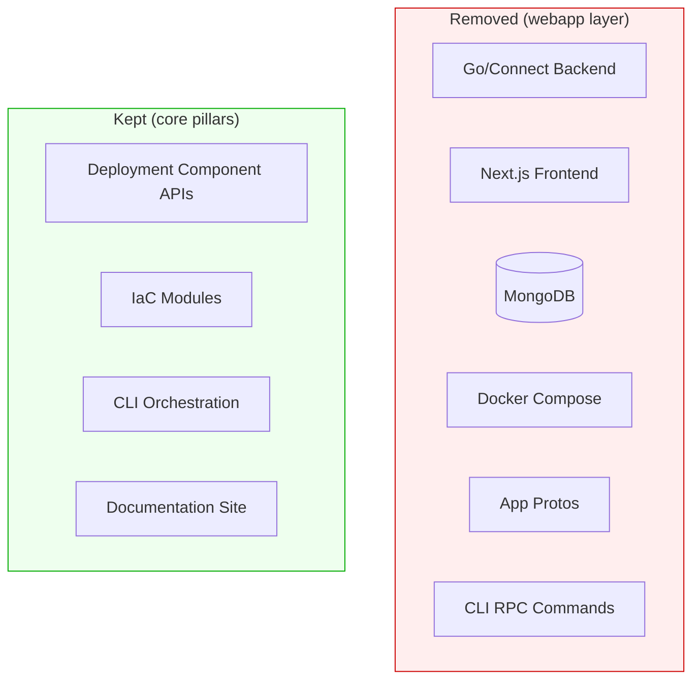

# Remove Planton Web Application Layer

**Date**: March 31, 2026
**Type**: Refactoring
**Components**: CLI Commands, API Definitions, Build System, CI/CD

## Summary

Completely removed the self-hosted web application layer from Planton — the Go/Connect backend, Next.js frontend, Docker infrastructure, app-layer protobufs, and all CLI commands that acted as RPC clients to the webapp backend. Planton now ships as the three pillars it was always meant to be: standardized APIs, IaC modules, and the CLI.

## Problem Statement / Motivation

Planton experimented with an optional self-hosted web application (backend + frontend + MongoDB, shipped as a unified Docker container) that provided a local UI for managing cloud resources, credentials, and stack updates. After evaluation, the decision was made to not pursue this direction:

### Pain Points

- The webapp duplicated functionality better served by the Planton SaaS platform (the commercial layer above Planton)
- Maintaining a Go/Connect backend, Next.js frontend, MongoDB database, and Docker orchestration added significant surface area to an open-source project whose core value is API standardization and CLI-driven IaC
- The webapp's CI/CD pipelines were already disabled (`release.app.yaml` and `auto-release.app.yaml` both had `if: false` guards)
- CLI commands like `cloud-resource:create`, `credential:list`, and `stack-update:stream-output` only worked when the webapp backend was running, creating a confusing two-tier experience

## Solution / What's New

Removed all webapp-related code, configuration, and infrastructure, leaving a clean codebase focused on Planton's three core pillars.

## Implementation Details

### Deleted Directories

| Directory | Contents |
|-----------|----------|
| `app/` | Go backend (Connect server + MongoDB repos), Next.js frontend, Dockerfile.unified, supervisord |
| `apis/dev/planton/app/` | App-layer protos: cloudresource/v1, credential/v1, stackupdate/v1, commons — plus all generated Go, gRPC, and Connect stubs |
| `cmd/planton/root/webapp/` | `planton webapp init\|start\|stop\|status\|logs\|restart\|uninstall` subcommand tree |
| `docker/` | MongoDB init script for the webapp |

### Deleted Files (19 individual files)

- **12 CLI command files** — `cloud_resource_{apply,create,delete,get,list,update}.go`, `credential_{create,delete,get,list,update}.go`, `stack_update_stream_output.go` — all Connect-RPC clients to the webapp backend
- **`config.go`** — all three config keys (`backend-url`, `webapp-container-id`, `webapp-version`) existed solely for the webapp
- **`docker-compose.yml`** — unified webapp service definition
- **`docs/CORS.md`** — webapp CORS documentation
- **`.github/workflows/release.app.yaml`** and **`auto-release.app.yaml`** — already-disabled app CI/CD
- **`.prettierrc`** — app/frontend JS/TS formatting (site/ has its own config)
- **`.dockerignore`** — no root-level Dockerfiles remain
- **`_rules/local-server-startup.md`** — webapp local dev startup guide

### Edited Files

| File | Change |
|------|--------|
| `cmd/planton/root.go` | Removed `webapp` import and 14 app-related command registrations |
| `go.work` | Removed `./app/backend` workspace member |
| `go.mod` | Removed `replace` directive for `app/backend`; `go mod tidy` pruned `connectrpc.com/connect` |
| `Makefile` | Removed `build-backend`, `build-frontend`, all Docker targets, `app/backend` from `vet` |
| `.goreleaser.yaml` | Removed Docker Images from release header and footer |
| `MODULE.bazel` | Removed `com_connectrpc_connect` from `use_repo`; ran `bazel mod tidy` to clean indirect deps |

## Benefits

- **206,489 lines removed** across 1,515 files — massive reduction in maintenance surface
- **Cleaner dependency graph** — `connectrpc.com/connect` and transitive MongoDB driver dependencies no longer in `go.mod`
- **Simpler mental model** — Planton is APIs + IaC modules + CLI, nothing else
- **No dead code** — removed CI/CD pipelines that were already disabled, config keys that pointed nowhere, and CLI commands that required a running backend
- **Consistent Bazel build** — `MODULE.bazel` cleaned of stale `com_connectrpc_connect` reference that was causing `bazel mod tidy` failures

## Impact

- **CLI users**: The commands `cloud-resource:*`, `credential:*`, `stack-update:stream-output`, `webapp *`, and `config` are no longer available. These were only usable with a running webapp backend, which was never part of the standard installation path.
- **Developers**: `go.work` no longer includes `./app/backend`; no need to deal with the separate backend Go module.
- **CI/CD**: The `release.app.yaml` and `auto-release.app.yaml` workflows no longer exist (they were already disabled).
- **Documentation site (`site/`)**: Untouched — continues to work as before.

## Verification

Full `make build` pipeline passed after all changes:
1. Proto generation (`buf lint`, `buf format`, `buf generate`)
2. Java stub compilation verification (Bazel)
3. Gazelle BUILD.bazel regeneration (Bazel)
4. `bazel mod tidy` + `bazel build //:planton`
5. `go fmt`, `go mod tidy`, `go vet` on `./cmd/...`, `./internal/...`, `./pkg/...`
6. CLI binary builds for darwin-amd64, darwin-arm64, and linux-amd64

## Related Work

- `_changelog/2026-03/2026-03-10-074841-migrate-cli-downloads-to-r2-and-disable-webapp.md` — the earlier change that disabled webapp CI/CD and migrated CLI downloads to Cloudflare R2, which set the stage for this full removal

---

**Status**: ✅ Production Ready
