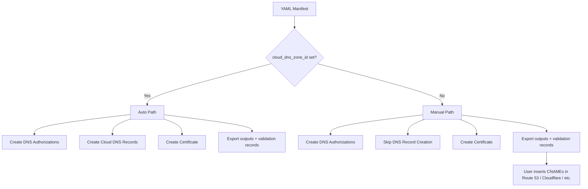

# GcpCertManagerCert: Make Cloud DNS Zone Optional for External DNS Providers

**Date**: April 20, 2026
**Type**: Enhancement
**Components**: API Definitions, Pulumi CLI Integration, Kubernetes Provider, Protobuf Schemas

## Summary

Made `cloud_dns_zone_id` optional in the GcpCertManagerCert component so users whose DNS zones are hosted outside GCP (e.g. AWS Route 53, Cloudflare) can still provision GCP Certificate Manager certificates. When the zone ID is omitted, the module creates DNS authorizations but exports the required validation CNAME records as stack outputs for manual insertion into any DNS provider.

## Problem Statement / Motivation

The GcpCertManagerCert component was tightly coupled to GCP Cloud DNS — the `cloud_dns_zone_id` field was required, and the IaC modules unconditionally created `dns.RecordSet` / `google_dns_record_set` resources in a Cloud DNS managed zone. This made the component unusable in a common real-world scenario: the domain's authoritative DNS is hosted outside GCP.

### Pain Points

- Users with DNS zones in AWS Route 53, Cloudflare, or Azure DNS could not use this component at all
- The only workaround was bypassing the module entirely and using `gcloud` CLI or raw Pulumi directly
- No mechanism existed to surface the DNS validation records for manual insertion
- The component's `required` constraint on `cloud_dns_zone_id` rejected manifests that omitted it

## Solution / What's New

The solution decouples certificate provisioning from DNS record insertion while keeping the fully-automated Cloud DNS path as the default experience when a zone ID is provided.

### Architecture Change



### Key Changes

1. **Proto schema** — Removed `(buf.validate.field).required = true` from `cloud_dns_zone_id`; added `DnsValidationRecord` message and `dns_validation_records` repeated field to stack outputs
2. **Pulumi module** — Guarded `dns.NewRecordSet` behind a nil-check on zone ID; always exports validation records as JSON via `dns-validation-records` output
3. **Terraform module** — Made `cloud_dns_zone_id` optional (default `null`); guarded `google_dns_record_set` behind `local.has_dns_zone`; added `dns-validation-records` output
4. **Tests** — Updated spec tests so missing zone ID is valid; added coverage for `DnsValidationRecords` in status structure test
5. **Preset** — Added `03-external-dns` preset for the external DNS use case

## Implementation Details

### Proto Changes

**`spec.proto`** — Removed the required constraint and updated the field comment to describe both behaviors:

```protobuf
dev.planton.shared.foreignkey.v1.StringValueOrRef cloud_dns_zone_id = 4 [
    (dev.planton.shared.foreignkey.v1.default_kind) = GcpDnsZone,
    (dev.planton.shared.foreignkey.v1.default_kind_field_path) = "status.outputs.zone_name"
];
```

**`stack_outputs.proto`** — Added a new message and field:

```protobuf
message DnsValidationRecord {
  string record_name = 1;
  string record_type = 2;
  string record_data = 3;
  string domain = 4;
}
```

### Pulumi Module (`cert_manager_cert.go`)

The `createManagedCertificate` function now:

1. Checks `hasDnsZone := spec.CloudDnsZoneId != nil && spec.CloudDnsZoneId.GetValue() != ""`
2. Always creates `certificatemanager.DnsAuthorization` resources (these are GCP-only and produce the validation records)
3. Only creates `dns.NewRecordSet` when `hasDnsZone` is true
4. Always calls `exportDnsValidationRecords()` which collects each authorization's `DnsResourceRecords` output and marshals them to JSON

### Terraform Module

- `variables.tf`: `cloud_dns_zone_id` changed to `optional(object({value = string}), null)`
- `main.tf`: Added `has_dns_zone` local; `google_dns_record_set.validation_records` `for_each` now requires `local.is_managed && local.has_dns_zone`
- `outputs.tf`: New `dns-validation-records` output iterates over all DNS authorizations

### Test Changes

- Renamed "missing cloud dns zone id" test case to "valid spec without cloud dns zone id (external DNS)" with `wantErr: false`
- Removed `CloudDnsZoneId != nil` assertion from the valid-spec path since it is now optional
- Added `DnsValidationRecords` field to the status structure test

## Benefits

- **Multi-cloud DNS support** — Users with DNS in AWS Route 53, Cloudflare, Azure DNS, or any other provider can now use GcpCertManagerCert
- **Zero breaking changes** — Existing manifests with `cloudDnsZoneId` set continue to work identically
- **Validation record visibility** — Even when using Cloud DNS, the validation records are now exported for observability
- **New preset** — The `03-external-dns` preset provides a ready-to-use template for the external DNS workflow

## Impact

- **Users with external DNS**: Can now provision GCP certificates without Cloud DNS, reading validation records from stack outputs
- **Existing users**: No changes required — existing manifests with `cloudDnsZoneId` work exactly as before
- **Both Pulumi and Terraform**: Feature parity maintained across both IaC implementations

## Files Changed

| File | Change |
|------|--------|
| `v1/spec.proto` | Removed `required` from `cloud_dns_zone_id`, updated comment |
| `v1/stack_outputs.proto` | Added `DnsValidationRecord` message and repeated field |
| `v1/spec.pb.go` | Regenerated |
| `v1/stack_outputs.pb.go` | Regenerated |
| `v1/spec_test.go` | Updated tests for optional zone ID |
| `v1/iac/pulumi/module/cert_manager_cert.go` | Conditional DNS records, validation record export |
| `v1/iac/pulumi/module/outputs.go` | Added `OpDnsValidationRecords` constant |
| `v1/iac/tf/variables.tf` | Made `cloud_dns_zone_id` optional |
| `v1/iac/tf/main.tf` | Added `has_dns_zone` guard |
| `v1/iac/tf/outputs.tf` | Added `dns-validation-records` output |
| `v1/presets/03-external-dns.yaml` | New preset (no zone ID) |
| `v1/presets/03-external-dns.md` | New preset documentation |
| `v1/examples.md` | Added external DNS example |
| `v1/iac/pulumi/examples.md` | Added external DNS Pulumi example |
| `v1/iac/pulumi/overview.md` | Updated architecture docs |

## Related Work

- Initial GcpCertManagerCert component forge
- Audit report: `v1/docs/audit/2025-11-14-052934.md`

---

**Status**: ✅ Production Ready
**Timeline**: Single session
