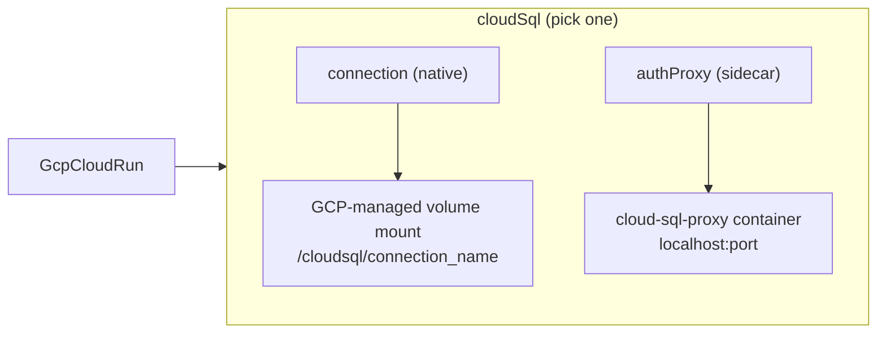

# GCP Cloud SQL Connectivity for Cloud Run + Module Bug Fixes

**Date**: April 23, 2026
**Type**: Feature
**Components**: API Definitions, GCP Provider, Pulumi Modules, Terraform Modules, Documentation

## Summary

Added Cloud SQL connectivity options (native volume mount and Auth Proxy sidecar) to the GcpCloudRun component, fixed three behavioral bugs in GcpCloudSql (disk_auto_resize, deletion_protection, ipv4_enabled were hardcoded/ignored), added missing FK-enabling stack outputs to GcpVpc and GcpSubnetwork, created comprehensive validation tests for GcpCloudRun, and brought all presets/manifests to consistent camelCase convention. Deleted all legacy examples.md files from the provider tree.

## Problem Statement / Motivation

Odwen, a customer running Cloud Run + Cloud SQL on GCP, had critical security and connectivity gaps:

1. Cloud SQL was open to the internet (`0.0.0.0/0` in authorized_networks)
2. Cloud Run connected to Cloud SQL over public internet via hardcoded IP
3. No `sslmode` on database connections
4. The openmcf GcpCloudRun component had no way to declare Cloud SQL connectivity

Additionally, during analysis, three Pulumi module bugs were discovered that would block any private networking configuration, and FK resolution between Cloud Run, VPC, and Subnetwork was broken due to missing stack outputs.

### Pain Points

- `GcpCloudSqlSpec.disk_auto_resize` was defined in proto but never wired to Pulumi's `DiskAutoresize`
- `deletion_protection` was hardcoded to `false` regardless of spec value
- `ipv4_enabled` was hardcoded to `false` when private IP was enabled, killing the "Smart Hybrid" pattern
- GcpVpc lacked `network_name` and `network_id` outputs required by Cloud Run and Cloud SQL FKs
- GcpSubnetwork lacked `subnetwork_name` output required by Cloud Run FK
- No Cloud SQL connectivity mechanism in GcpCloudRun spec

## Solution / What's New

### Cloud SQL Connectivity for Cloud Run

Two mutually exclusive options added to `GcpCloudRunSpec.cloud_sql`:

- **Native connection**: GCP manages the proxy internally. Creates Unix socket at `/cloudsql/<connection_name>`. No VPC or sidecar needed.
- **Auth Proxy sidecar**: Adds a `cloud-sql-proxy` container. Provides TCP at `localhost:<port>`. Supports `--private-ip` for VPC routing.

CEL validation enforces mutual exclusion: exactly one of `connection` or `auth_proxy` must be set.

### GcpCloudSql Bug Fixes

| Bug | Before | After |
|-----|--------|-------|
| `disk_auto_resize` | Not wired to Pulumi | `DiskAutoresize: pulumi.BoolPtr(spec.DiskAutoResize)` |
| `deletion_protection` | Hardcoded `false` | `pulumi.Bool(spec.DeletionProtection)` |
| `ipv4_enabled` | Hardcoded `false` when private IP enabled | Reads `spec.Network.Ipv4Enabled` (Smart Hybrid pattern) |

Same three fixes applied to the Terraform module (`variables.tf` + `main.tf`).

### New Stack Outputs for FK Resolution

| Component | New Outputs | Consumer |
|-----------|-------------|----------|
| GcpVpc | `network_name`, `network_id` | Cloud Run `vpcAccess.network`, Cloud SQL `network.vpcId` |
| GcpSubnetwork | `subnetwork_name` | Cloud Run `vpcAccess.subnet` |

### Additional Quality Improvements

- **NPE fix**: `toEnvArray` in Cloud Run `service.go` now nil-checks `container.env` before accessing `.Variables`/`.Secrets`
- **spec_test.go**: Created 51-test validation suite for GcpCloudRun covering all CEL rules, field constraints, and Cloud SQL mutual exclusion
- **Proto rename**: `disk_autoresize` renamed to `disk_auto_resize` for consistency
- **camelCase convention**: All Odwen manifests and presets converted from snake_case to camelCase
- **New preset**: `03-cloud-sql-connected` for GcpCloudRun (native Cloud SQL connection pattern)
- **README rewrite**: GcpCloudRun README updated from "partial implementation" to reflect full feature set
- **Deleted all examples.md**: 555 legacy examples.md files removed from provider tree

## Implementation Details

### Proto Changes

**GcpCloudRun spec.proto** -- new messages:
- `GcpCloudRunCloudSqlConnection` (wrapper with mutual exclusion CEL)
- `GcpCloudRunCloudSqlDirectConnection` (native: `instances` as `StringValueOrRef[]`)
- `GcpCloudRunCloudSqlAuthProxy` (sidecar: `instances`, `port`, `use_private_ip`)

**GcpVpc stack_outputs.proto** -- fields 4-5: `network_name`, `network_id`

**GcpSubnetwork stack_outputs.proto** -- field 5: `subnetwork_name`

**GcpCloudSql spec.proto** -- renamed field 7: `disk_autoresize` to `disk_auto_resize`

### Pulumi Changes

- `gcpcloudrun/service.go`: Native connection (volume + mount) and Auth Proxy sidecar (second container with `DependsOns`)
- `gcpcloudsql/database.go`: Three bug fixes (disk_auto_resize, deletion_protection, ipv4_enabled)
- `gcpvpc/vpc.go` + `outputs.go`: Export `network_name` and `network_id`
- `gcpsubnetwork/subnetwork.go` + `outputs.go`: Export `subnetwork_name`

### Terraform Changes

- `gcpcloudsql/iac/tf/variables.tf`: Added `disk_auto_resize`, `deletion_protection`, `ipv4_enabled`
- `gcpcloudsql/iac/tf/main.tf`: Wired all three to `google_sql_database_instance`

## Benefits

- **Secure Cloud SQL connectivity** without VPC complexity (native connection)
- **Smart Hybrid pattern** now works: private IP for services + public IP with restricted access for developers
- **FK resolution** between Cloud Run, VPC, Subnetwork, and Cloud SQL now functional
- **51 new validation tests** catch schema violations before deployment
- **Consistent camelCase** across all manifests and presets

## Impact

- **Odwen**: Can now deploy secure Cloud Run -> Cloud SQL connectivity via native connection
- **All GcpCloudSql users**: `disk_auto_resize` and `deletion_protection` are now respected (previously silently ignored)
- **All GcpCloudRun users**: New `cloudSql` spec field available for database connectivity
- **Platform**: FK cross-references between VPC/Subnet/CloudRun/CloudSql now resolve correctly

## Related Work

- Follows from Session 1 analysis and code implementation (committed on `feat/gcp/cloud-run/support-auth-proxy-for-cloud-sql`)
- Part of project `20260423.01.odwen-vpc-security-posture`

---

**Status**: Production Ready
**Timeline**: 2 sessions (analysis + implementation, then proto gen + docs + validation)
