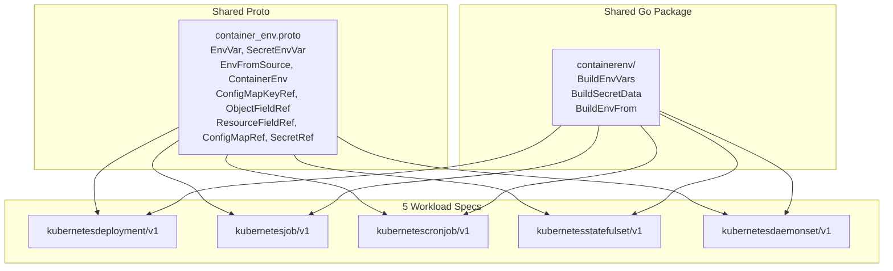

# Kubernetes Container Env Refactor: List-Based Structure with Full K8s Parity

**Date**: May 13, 2026
**Type**: Refactoring | Feature
**Components**: API Definitions, Protobuf Schemas, Kubernetes Provider, IAC Stack Runner, Provider Framework

## Summary

Replaced the map-based environment variable and secret structure across all 5 Kubernetes workload types (Deployment, Job, CronJob, StatefulSet, DaemonSet) with a Kubernetes-aligned list-based structure. Introduced a shared `ContainerEnv` proto message and shared Go IaC package, adding support for all native Kubernetes `EnvVar` sources (configMapKeyRef, fieldRef, resourceFieldRef) and bulk `envFrom` imports that were previously unavailable.

## Problem Statement / Motivation

The original env modeling used `map<string, T>` for both variables and secrets. This approach had several architectural limitations that would compound as the platform scales.

### Pain Points

- **Divergence from Kubernetes semantics**: K8s models env vars as `[]EnvVar` (ordered list), not a map. The map structure lost user-defined ordering and required sorting hacks in every IaC module for deterministic output.
- **Missing K8s-native value sources**: No support for `configMapKeyRef`, `fieldRef`, `resourceFieldRef`, or `envFrom`. Users couldn't reference ConfigMap keys, pod fields, or container resource limits as env var values.
- **Code duplication**: Each workload type defined its own identical `ContainerAppEnv` message (5 copies) and duplicated ~60 lines of sort-and-iterate Go code in each IaC module.
- **Inconsistent behavior**: The Deployment Pulumi module always emitted `GetValue()` without an empty-check, while Job/CronJob/StatefulSet/DaemonSet correctly skipped empty values.

## Solution / What's New

A single shared `ContainerEnv` proto message replaces all 5 per-workload env messages. Environment variables use a list structure that mirrors Kubernetes `EnvVar` semantics while maintaining Planton's separation of variables (non-sensitive) and secrets (sensitive).

### Value Source Matrix

| Source Type | Variables | Secrets |
|---|---|---|
| Direct literal value | `value` | `value` (auto-creates K8s Secret) |
| Planton cross-resource ref | `valueFrom` | `valueFrom` |
| ConfigMap key | `configMapKeyRef` | -- |
| Pod field | `fieldRef` | -- |
| Container resource | `resourceFieldRef` | -- |
| Existing K8s Secret key | -- | `secretRef` |
| Bulk ConfigMap import | `envFrom.configMapRef` | -- |
| Bulk Secret import | `envFrom.secretRef` | -- |

### Architecture

## Implementation Details

### New Proto: `container_env.proto`

Defines `EnvVar` (with oneof for value, valueFrom, configMapKeyRef, fieldRef, resourceFieldRef), `SecretEnvVar` (with oneof for value, secretRef, valueFrom), `EnvFromSource` (with configMapRef or secretRef + optional prefix), and the wrapper `ContainerEnv`. CEL validation enforces C_IDENTIFIER format on env var names.

### Shared IaC Package: `pkg/iac/pulumi/.../containerenv/`

Three files (`envvars.go`, `secrets.go`, `envfrom.go`) replace ~300 lines of duplicated Go code. `BuildEnvVars` handles all source types via type-switch on the oneof, prepends pod-identity vars (HOSTNAME, K8S_POD_ID), and preserves list ordering. `BuildSecretData` collects literal secret values for auto-created K8s Secrets. `BuildEnvFrom` maps bulk imports to Pulumi `EnvFromSource` inputs.

### Terraform Modules

All 5 workload TF modules updated with list-based `dynamic "env"` blocks for each source type, plus a new `dynamic "env_from"` block. Variable type definitions changed from `map(string)` / `map(object)` to `list(object({name, value, ...}))`.

### `KubernetesSecretKeyRef` Enhancement

Added `optional` field (field 4) to allow graceful handling when the referenced Secret or key does not exist, matching K8s `SecretKeySelector.optional`.

## Benefits

- **Full K8s parity**: Every native `EnvVarSource` type now supported, plus `envFrom` bulk imports
- **User-defined ordering**: List structure preserves the order authors write; no more non-deterministic map iteration
- **Single source of truth**: One `ContainerEnv` message used by all 5 workload types
- **Code reduction**: Net -388 lines across 63 files; duplicated env logic eliminated
- **Consistent behavior**: Shared package fixes the Deployment empty-value bug
- **CEL validation**: Env var names validated at proto level (C_IDENTIFIER format)
- **Cleaner YAML authoring**: List syntax aligns with Kubernetes conventions that operators already know

## Impact

- **API consumers**: All downstream consumers of `spec.container.app.env` (Deployment, StatefulSet, DaemonSet) and `spec.env` (Job, CronJob) receive the new list-based structure. Planton's Java code (`KubernetesDeploymentStackInputCustomizer`, `CloudResourceEnvVarExtractor`) will need corresponding updates when consuming the new stubs.
- **YAML authors**: Manifests, presets, and e2e scenarios updated to list format. All documentation rewritten for the list structure.
- **IaC modules**: Both Pulumi (Go) and Terraform implementations updated across all 5 kinds.

## Code Metrics

| Metric | Value |
|---|---|
| Files changed | 63 |
| Lines added | 1,818 |
| Lines removed | 2,206 |
| Net change | -388 lines |
| Proto messages removed | 5 (per-workload ContainerAppEnv) |
| Proto messages added | 9 (shared in container_env.proto) |
| Shared Go package files | 3 (envvars.go, secrets.go, envfrom.go) |
| Test suites passing | 5/5 |

## Related Work

- Downstream Planton monorepo Java consumers will need updating in a follow-on task
- The existing sidecar `Container.env` in `kubernetes.proto` already used `repeated ContainerEnvVar` (simple name+value list), validating this design direction

---

**Status**: Production Ready
**Timeline**: Single session
