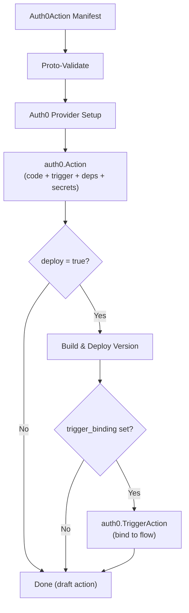

# Auth0Action Deployment Component

**Date**: May 13, 2026
**Type**: Feature
**Components**: API Definitions, Pulumi CLI Integration, Provider Framework, Protobuf Schemas

## Summary

Added `Auth0Action` as the fifth Auth0 deployment component in Planton, covering the full forge lifecycle: protobuf API definitions with CEL validations, dual IaC modules (Pulumi Go + Terraform HCL) with optional trigger binding, comprehensive documentation, 3 ready-to-deploy presets, and 22 passing validation tests. Registered as `CloudResourceKind = 2104` with prefix `a0act`.

## Problem Statement / Motivation

Auth0 Actions are the primary extensibility mechanism for customizing Auth0 authentication pipelines — token enrichment, registration gating, MFA enforcement, custom providers. Planton already supported 4 Auth0 resource types (`Auth0Client`, `Auth0Connection`, `Auth0EventStream`, `Auth0ResourceServer`) but had no way to manage Actions as infrastructure.

### Pain Points

- Teams managing Auth0 Actions manually through the dashboard or ad-hoc Terraform lose reproducibility and auditability
- No unified manifest format for declaring an action's code, trigger, dependencies, secrets, and binding in one place
- The Terraform provider models action creation and trigger binding as separate resources, requiring two resource blocks for the most common use case

## Solution / What's New

A complete `Auth0Action` deployment component following the Planton forge pattern — same structure, same workflow, any Auth0 tenant.

### Resource Creation Flow



### Key Design Decision: Inline Trigger Binding

The Terraform provider models `auth0_action` and `auth0_trigger_action` as separate resources. The Planton spec embeds an optional `trigger_binding` field inline — matching the `Auth0Client.api_grants` pattern — because:

1. Auth0 limits actions to exactly one trigger (no fan-out)
2. The 80/20 case is always "create + deploy + bind" in one manifest
3. Users who need external binding management simply omit the field

## Implementation Details

### Protobuf API (4 files)

- **`spec.proto`** — 10 trigger types as an enum (`post-login`, `credentials-exchange`, `pre-user-registration`, `post-user-registration`, `post-change-password`, `send-phone-message`, `password-reset-post-challenge`, `custom-email-provider`, `custom-phone-provider`, `custom-token-exchange`), runtime enum (`node18`, `node22`), CEL validation ensuring `trigger_binding` requires `deploy=true`, empathetic messages on dependency/secret validation
- **`api.proto`** — KRM wrapper with inline YAML examples
- **`stack_outputs.proto`** — id, name, version_id, runtime
- **`stack_input.proto`** — target + Auth0ProviderConfig

### Validation Tests (22 specs)

| Category | Count | Covers |
|----------|-------|--------|
| Valid inputs | 8 | Post-login, deps+secrets, trigger binding, node18, unbound, custom-token-exchange, send-phone-message |
| Invalid inputs | 14 | Missing metadata/spec/code/trigger, invalid trigger id, empty dep name/version, empty secret name/value, trigger_binding+deploy=false |

### Pulumi Module (Go)

| File | Responsibility |
|------|---------------|
| `module/main.go` | Provider setup → action → binding → outputs |
| `module/action.go` | `auth0.NewAction` with all config |
| `module/trigger_binding.go` | Conditional `auth0.NewTriggerAction` with `DependsOn` |
| `module/locals.go` | Spec field extraction |
| `module/outputs.go` | Export id, name, version_id, runtime |

### Terraform Module (HCL)

| File | Responsibility |
|------|---------------|
| `main.tf` | `auth0_action` + conditional `auth0_trigger_action` with `count` |
| `variables.tf` | Full spec mapping with optional fields |
| `locals.tf` | Computed values including display_name fallback |
| `outputs.tf` | Matches `Auth0ActionStackOutputs` |
| `provider.tf` | Standard Auth0 provider config |

### Presets (3)

1. **Post-Login Custom Claims** — Enrich tokens with roles, email, org context
2. **Pre-Registration Domain Allowlist** — Gate registration by email domain
3. **Credentials-Exchange Audit Log** — Log M2M exchanges to external endpoint

## Benefits

- **Single manifest** for action code + trigger + secrets + binding — no two-resource dance
- **22 validation tests** catch misconfiguration before any cloud API call
- **Dual IaC** — Pulumi and Terraform with feature parity
- **3 production-ready presets** covering the most common Auth0 Action patterns
- **Consistent with existing Auth0 components** — same structure, same conventions

## Impact

- Planton Auth0 provider grows from 4 → 5 kinds
- `CloudResourceKind` enum: `Auth0Action = 2104`, prefix `a0act`
- Planton users gain declarative Auth0 Action management through the same Cloud Object workflow
- Standalone CLI users get `planton apply -f action.yaml` for Actions

## Files Changed

```
apis/dev/planton/provider/auth0/auth0action/v1/    (new — 40 files)
  spec.proto, api.proto, stack_outputs.proto, stack_input.proto
  spec_test.go, *.pb.go (generated), BUILD.bazel (generated)
  README.md, examples.md, catalog-page.md, docs/README.md
  iac/hack/manifest.yaml
  iac/pulumi/{main.go, Pulumi.yaml, Makefile, debug.sh, overview.md, README.md}
  iac/pulumi/module/{main.go, locals.go, action.go, trigger_binding.go, outputs.go}
  iac/tf/{provider.tf, variables.tf, locals.tf, main.tf, outputs.tf, README.md}
  presets/{01-*.yaml, 01-*.md, 02-*.yaml, 02-*.md, 03-*.yaml, 03-*.md}

apis/dev/planton/shared/cloudresourcekind/cloud_resource_kind.proto  (modified — +4 lines)
```

## Related Work

- Sibling Auth0 components: `auth0client`, `auth0connection`, `auth0eventstream`, `auth0resourceserver`
- Forge rule: `_rules/deployment-component/forge/forge-planton-component.mdc`
- Reference implementation studied: `terraform-provider-auth0/internal/auth0/action/`

---

**Status**: ✅ Production Ready
**Timeline**: Single session
