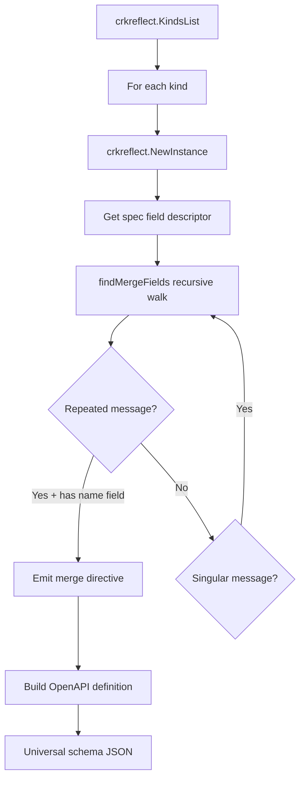

# Kustomize OpenAPI Schema Generation CLI

**Date**: May 15, 2026
**Type**: Feature
**Components**: CLI Commands, Kustomize Integration, Proto Reflection, Documentation

## Summary

Added native kustomize OpenAPI schema generation to the OpenMCF CLI. A new `openmcf kustomize` command group uses proto reflection to discover all cloud resource kinds with list fields that need merge-by-name behavior, generates a universal schema JSON, and can initialize `_kustomize/` directories with the schema and `openapi:` references in overlay kustomization.yaml files.

## Problem Statement / Motivation

Kustomize uses strategic merge patch for overlays. For built-in Kubernetes types, it knows to merge list fields (like `env`, `ports`) by key. For OpenMCF custom resource types (`KubernetesDeployment`, `KubernetesCronJob`, etc.), kustomize has no schema and falls back to JSON merge patch, which **replaces lists entirely**.

### Pain Points

- Overlay env variables/secrets replace the entire list from the base instead of merging
- 48 out of 58 overlay service.yaml files across 29 Planton services were affected after the env-list refactor
- Manual schema creation and distribution across service directories is fragile and non-portable
- No automated way to keep schemas in sync with proto field changes

## Solution / What's New

### `openmcf kustomize schema`

Generates a single universal OpenAPI schema covering all 360+ cloud resource kinds. Only kinds with merge-worthy fields (repeated message fields with a `name` merge key) produce entries. Zero arguments -- one command, one file.

```bash
openmcf kustomize schema                    # stdout
openmcf kustomize schema -o schema.json     # file
```

### `openmcf kustomize init`

Writes the schema into `_kustomize/` directories and adds the `openapi:` reference to overlay kustomization.yaml files.

```bash
openmcf kustomize init --dir ./_kustomize           # single dir
openmcf kustomize init --scan ./product              # scan tree
```

### Proto Reflection Architecture



The generator walks proto message descriptors recursively, skips map fields, and uses `FieldDescriptor.JSONName()` for correct camelCase property names. Cyclic message references are prevented via a visited set.

## Implementation Details

### New packages

| Package | Purpose |
|---------|---------|
| `pkg/kustomize/schema/` | Core schema generation via proto reflection |
| `pkg/kustomize/initializer/` | Directory initialization, schema writing, kustomization.yaml updating |
| `cmd/openmcf/root/kustomize/` | CLI command wrappers (schema + init) |

### Schema output

The generator produces 87 definition entries across all providers. Key Kubernetes workload entries:

| Kind | Merge field paths |
|------|------------------|
| KubernetesDeployment | `container.app.env.variables`, `.secrets`, `.ports`, `.volumeMounts`, `container.sidecars` |
| KubernetesCronJob | `env.variables`, `env.secrets`, `volumeMounts` |
| KubernetesJob | `env.variables`, `env.secrets`, `volumeMounts` |
| KubernetesStatefulSet | `container.app.env.variables`, `.secrets`, `.ports`, `.volumeMounts`, `container.sidecars` |
| KubernetesDaemonSet | Same as Deployment |

Non-Kubernetes kinds with merge fields are also included (e.g., AliCloud server groups, OCI security lists, Hetzner Cloud firewall rules).

### Design decisions

- **Dynamic proto reflection** over static Go strings: proto descriptors are the source of truth, zero maintenance when fields change
- **One universal schema** covering all kinds: no `--kind` flags, no kind detection in overlays, new kinds automatically covered on regeneration
- **Only kinds with merge fields** produce entries: kinds without mergeable lists (e.g., `AwsVpc`) are naturally excluded
- **Idempotent init**: schema always regenerated fresh, kustomization.yaml `openapi:` block only added once
- **`//go:build !codegen` tag** on generator since it uses `crkreflect.NewInstance()` which depends on the generated `kind_map_gen.go`

### Tests

8 tests covering:
- Valid JSON output with correct structure
- KubernetesDeployment merge keys at expected paths
- KubernetesCronJob and KubernetesJob merge keys
- Exclusion of kinds without merge fields (AwsVpc)
- GVK metadata correctness
- Map field exclusion (configMaps)
- envFrom exclusion (EnvFromSource has no `name` field)

## Benefits

- **Zero-argument schema generation**: `openmcf kustomize schema` -- no flags, no configuration
- **One command fixes all overlays**: `openmcf kustomize init --scan ./product` initialized 29 services in 3 seconds
- **Future-proof**: new cloud resource kinds automatically covered on regeneration
- **Embeddable**: `pkg/kustomize/schema` and `pkg/kustomize/initializer` are importable Go packages (used by Planton CLI's `planton service kustomize patch-schema`)
- **Self-documenting**: schema generated from the same proto descriptors the CLI validates against

## Impact

- **OpenMCF CLI users**: new `kustomize` command group for managing overlay merge behavior
- **Planton platform**: fixes the env-list merge regression across 48 overlay files in 29 services
- **Any OpenMCF adopter using kustomize**: one-time setup, automatic merge for env vars, secrets, ports, volume mounts, sidecars

## Related Work

- OpenMCF env-list refactor (`container_env.proto`) -- the prerequisite change that exposed the kustomize merge gap
- Planton CLI integration: `planton service kustomize patch-schema` embeds the same packages
- Kustomize documentation updated at `site/public/docs/guides/kustomize.md`

---

**Status**: Production Ready
**Files created**: 10 (3 Go source + 1 test + 3 BUILD.bazel + 2 CLI commands + 1 parent command)
**Files modified**: 2 (`root.go`, `kustomize.md`)
