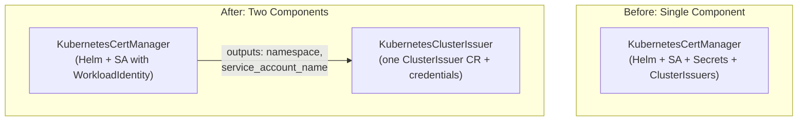

# Decouple KubernetesClusterIssuer from KubernetesCertManager

**Date**: May 20, 2026
**Type**: Feature | Refactoring
**Components**: API Definitions, Provider Framework, Pulumi CLI Integration, Terraform Module, Presets, Documentation

## Summary

Decoupled ClusterIssuer lifecycle management from the cert-manager controller installation by creating a new `KubernetesClusterIssuer` component (enum 851) and simplifying `KubernetesCertManager` (enum 821) to focus solely on Helm-based controller installation with optional workload identity. Also removed the deprecated `examples.md` artifact from the forge/update workflow, consolidating all usage examples into presets.

## Problem Statement / Motivation

`KubernetesCertManager` conflated two independent lifecycle concerns:
1. **Installing cert-manager** -- Helm chart, CRDs, controller ServiceAccount, DNS resolver config
2. **Creating ClusterIssuers** -- ACME registration, DNS-01 solver config, Cloudflare secrets, per-domain ClusterIssuer CRs

### Pain Points

- Adding a new DNS domain required redeploying the entire cert-manager controller
- A misconfigured DNS provider could roll back the controller, affecting all existing issuers
- Different teams managing different domains had to coordinate on a single resource
- `spec.kubernetes_cert_manager_version` and `spec.skip_install_self_signed_issuer` were defined but never wired in IaC
- `stack_outputs.proto` declared fields that IaC didn't export (`solver_identity`) and IaC exported fields not in proto (`cluster_issuer_names`)
- Proto comments said "single ClusterIssuer" while IaC created one per domain

## Solution / What's New



### KubernetesClusterIssuer (new, enum 851)

- Creates one ClusterIssuer per DNS domain using ACME DNS-01 challenges
- ClusterIssuer k8s name = `spec.dns_domain` (preserves consumer convention)
- Supports Cloudflare (API token secret), GCP Cloud DNS, AWS Route53, Azure DNS
- `cert_manager_namespace` field uses `StringValueOrRef` with foreign key to `KubernetesCertManager`

### KubernetesCertManager (simplified)

- Removed: `AcmeConfig`, `DnsProviderConfig`, all DNS provider messages, ClusterIssuer creation
- Added: `WorkloadIdentityConfig` (oneof: GKE/EKS/AKS) for controller SA annotations
- Wired previously unused fields: `kubernetes_cert_manager_version` (image tag), `skip_install_self_signed_issuer` (startup API check)
- Cleaned up `stack_outputs.proto`: replaced stale `solver_identity`/`cloudflare_secret_name` with `service_account_name`

### examples.md Removal

- Removed `examples.md` as a required component artifact across the entire forge/update workflow
- Updated all 3 Python helper scripts, 8 workflow rules, 3 architecture docs, and 3 `.cursor/info` files
- Usage examples now live exclusively in presets (`v1/presets/`)

## Implementation Details

### New Component: 27 files created

```
apis/dev/planton/provider/kubernetes/kubernetesclusterissuer/v1/
├── spec.proto, api.proto, stack_input.proto, stack_outputs.proto
├── spec.pb.go, api.pb.go, stack_input.pb.go, stack_outputs.pb.go
├── spec_test.go (17 tests -- 6 valid, 11 invalid)
├── README.md, catalog-page.md, docs/README.md
├── e2e/profile.yaml
├── presets/ (01-cloudflare, 02-gcp-cloud-dns, 03-aws-route53)
├── iac/hack/manifest.yaml
├── iac/pulumi/ (main.go, module/{main,locals,outputs}.go, Pulumi.yaml, Makefile, debug.sh, README.md, overview.md)
└── iac/tf/ (provider.tf, variables.tf, locals.tf, main.tf, outputs.tf, README.md)
```

### Updated Component: 15 files modified, 9 deleted

- Spec reduced from 127 lines (8 messages) to 75 lines (4 messages)
- Pulumi module reduced from 251 lines to 113 lines
- Terraform main.tf reduced from 148 lines to 63 lines
- 4 DNS-provider presets replaced with 3 installation presets (basic, GKE, EKS)

### Consumer Impact: Zero

15 ingress-enabled components derive ClusterIssuer names via `extractDomainFromHostname(hostname)`. The new component creates ClusterIssuers with `name = spec.dns_domain`, preserving the invariant:

```
KubernetesClusterIssuer.spec.dns_domain == extractDomainFromHostname(consumer.spec.ingress.hostname)
```

## Benefits

- **Independent lifecycle**: Add/remove DNS domains without touching the cert-manager controller
- **Reduced blast radius**: ClusterIssuer misconfiguration doesn't affect the controller
- **Multi-team support**: Different teams own their domains independently
- **Bug fixes**: Wired `kubernetes_cert_manager_version` and `skip_install_self_signed_issuer`
- **Proto/IaC alignment**: `stack_outputs.proto` now matches what IaC actually exports
- **Workflow simplification**: Removed `examples.md` as a required artifact (presets serve this role better)

## Impact

- **Component authors**: New forge workflow no longer generates `examples.md`; presets are the primary usage documentation
- **Platform users**: Deploy cert-manager and ClusterIssuers as separate resources; existing ingress components work unchanged
- **No breaking changes for consumers**: All 15 ingress-enabled components continue to work without modification

## Related Work

- `2025-11-02-100616-cert-manager-multi-provider-redesign.md` -- Previous redesign that introduced per-domain issuers
- `2025-11-22-194743-eliminate-shared-ingress-spec-kubernetes-components.md` -- Introduced `extractDomainFromHostname` convention

---

**Status**: ✅ Production Ready
**Validation**: `go build` and `go test` pass for both components (29 total tests, 0 failures). `make protos` succeeded. `make generate-cloud-resource-kind-map` regenerated `kind_map_gen.go` with `KubernetesClusterIssuer`.
