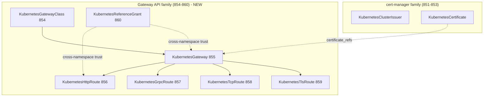
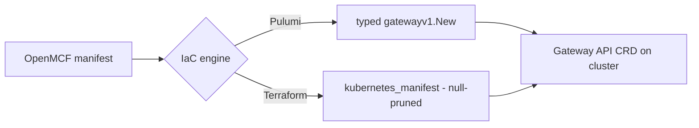
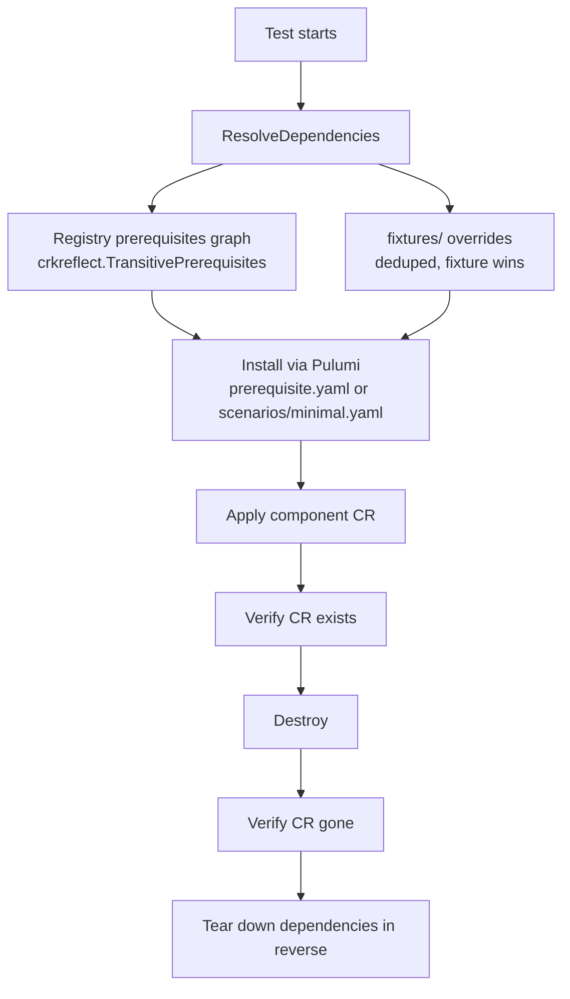

# Kubernetes Gateway API Deployment Components (854–860)

**Date**: May 30, 2026
**Type**: Feature
**Components**: API Definitions, Kubernetes Provider, Pulumi CLI Integration, Provider Framework, Testing Framework

## Summary

Added the complete Kubernetes Gateway API family as seven new OpenMCF deployment
components (`CloudResourceKind` 854–860), translated field-by-field from upstream
Gateway API **v1.5.1** at 100% standard-channel fidelity. This delivers a
first-class, declarative ingress layer — `GatewayClass`, `Gateway`, and the five
route kinds (`HTTPRoute`, `GRPCRoute`, `TCPRoute`, `TLSRoute`, `ReferenceGrant`) —
that, combined with the existing cert-manager family (851–853), gives customers a
full declarative ingress infrastructure stack. The work also hardened the shared
reference types to uniform upstream fidelity and taught the E2E harness to
provision registry-declared prerequisites, flipping all seven components to a
live-validated `green` state.

## Problem Statement / Motivation

OpenMCF could provision Kubernetes clusters and the cert-manager family, but had
no first-class way to declare the ingress topology that sits on top: the Gateway
API is the upstream-standard, vendor-neutral successor to Ingress, and customers
building real-world ingress (the leftbin ingress infrastructure project being the
driving use case) needed to express `GatewayClass` → `Gateway` → route attachment
as managed OpenMCF resources rather than raw manifests.

### Pain Points

- No managed Gateway API resources: users had to hand-write and apply raw CRDs,
  losing OpenMCF's typed spec, validation, FK wiring, and IaC execution.
- The Gateway API is large and nuanced (87 upstream structs, 50 enums across 9
  type files) with channel splits (standard vs experimental) that are easy to get
  wrong — modeling it by hand per project is error-prone and inconsistent.
- The cert-manager family alone is not enough for ingress: certificates need a
  `Gateway` to terminate TLS and routes to attach traffic. The ingress story was
  half-built.
- Composability: every cross-resource reference (namespace, gateway class,
  backend service) has to wire correctly into infra-chart DAGs, and Gateway API's
  plain topology refs (`parent_refs`, `backend_refs`, `certificate_refs`) do not
  fit the single-scalar `StringValueOrRef` model.

## Solution / What's New

Seven deployment components forged end-to-end via the 20-step forge workflow,
each at 100% standard-channel upstream v1.5.1 fidelity:

| # | Kind | Enum | Channel | Spec tests | E2E |
|---|------|------|---------|-----------|-----|
| 1 | KubernetesGatewayClass | 854 | v1 | 14/14 | green |
| 2 | KubernetesGateway | 855 | v1 | 29/29 | green |
| 3 | KubernetesHttpRoute | 856 | v1 | 41/41 | green |
| 4 | KubernetesGrpcRoute | 857 | v1 | 24/24 | green |
| 5 | KubernetesTcpRoute | 858 | v1alpha2 (experimental) | 15/15 | green |
| 6 | KubernetesTlsRoute | 859 | v1 | 16/16 | green |
| 7 | KubernetesReferenceGrant | 860 | v1 (no status) | 17/17 | green |

### The ingress stack it completes



### Component anatomy (uniform across all seven)

Each `<kind>/v1/` directory carries the standard OpenMCF deployment-component
shape:

```
<kind>/v1/
  spec.proto            -- flattened upstream spec + buf.validate (CEL) rules
  stack_outputs.proto   -- identifying coordinates downstream resources need
  api.proto             -- KRM envelope wiring
  stack_input.proto     -- IaC module input
  spec_test.go          -- protovalidate accept/reject specs (Ginkgo/Gomega)
  README.md / docs/     -- usage + "Composing in Infra Charts" section
  catalog-page          -- catalog metadata
  iac/
    pulumi/module/...    -- typed crd2pulumi resource (gatewayv1.New<Kind>)
    tf/...               -- kubernetes_manifest (null-pruned)
  e2e/
    profile.yaml         -- green
    scenarios/minimal.yaml
```

## Implementation Details

### 1. Shared foundations (T01)

- **crd2pulumi regeneration v1.1.0 → v1.5.1** in
  `pkg/kubernetes/kubernetestypes/` (Makefile + regenerated `gatewayapis/`),
  adding `TLSRoute` and `TCPRoute`, fixing a pre-existing missing
  `pulumiTypes.go`, and reconciling the v1alpha2→v1 promotion of GRPCRoute and
  ReferenceGrant. 17 consuming packages verified.
- **Shared `gateway_api.proto`** at the Kubernetes provider root: cross-component
  reference messages (parent/backend/secret/object/parameters refs) translated
  field-by-field. Status types excluded by design (OpenMCF uses
  `stack_outputs.proto`).
- **Registry**: 7 `CloudResourceKind` entries (854–860), each declaring
  `prerequisites: [KubernetesGatewayApiCrds]`.

### 2. Spec modeling decisions

- **Flatten, don't nest** (DD-002): upstream specs are flattened into the OpenMCF
  spec envelope rather than mirrored as deep nested messages.
- **Value fields are `string`, not proto enums** (DD-008): open-set fields use the
  upstream regex; closed enums use a CEL `in [...]` constraint. This avoids the
  proto-enum-vs-string CEL friction and keeps fidelity exact.
- **Plain topology refs stay plain** (DD-009): `parent_refs`, `backend_refs`, and
  `certificate_refs` are NOT `StringValueOrRef` (they are multi-field, not single
  scalars). Composability is achieved via `metadata.relationships`
  (`depends_on`/`uses`), documented inline on every plain ref field and in each
  component's "Composing in Infra Charts" docs section.
- **Channel split is upstream-driven**: TLSRoute graduated to standard `v1`;
  TCPRoute remains experimental `v1alpha2` (and thus carries
  `use_default_gateways` and needs the experimental CRD channel).

### 3. IaC: typed Pulumi + null-pruned Terraform

Every component ships both engines. Pulumi uses the typed crd2pulumi resource
(`gatewayv1.NewGateway`, `gatewayv1.NewHTTPRoute`, …); Terraform uses
`kubernetes_manifest` with a null-pruned manifest so upstream defaults and
server-side CEL still apply.



### 4. Shared-reference hardening (T08 item 1)

All six shared object-reference messages in `gateway_api.proto`
(`ParentReference` (+ `section_name`), `BackendObjectReference`,
`LocalObjectReference`, `SecretObjectReference`, `ObjectReference`,
`ParametersReference`) were brought to full upstream `group`/`kind`/`name`
fidelity, making the entire reference family uniform. Upstream pointer-vs-value
presence was preserved exactly (value-type `kind` → `required`); `namespace`
stays unconstrained by deliberate convention. Zero Go/IaC churn (only
`gateway_api.pb.go` regenerated); all six consumers rebuilt + retested.

### 5. E2E harness: registry-driven prerequisites (T08 item 2)

The harness previously claimed (in proto + test comments) to provision
registry-declared prerequisites but did not. This was made real:



- `e2e/framework/runner/fixtures.go` → `dependencies.go` (unified resolver,
  unit-tested); `FIXTURES-UP/DN` phases renamed `DEPENDENCIES-UP/DOWN`.
- New `kubernetesgatewayapicrds/v1/e2e/prerequisite.yaml` (experimental v1.5.1
  superset — one install covers all 7 kinds incl. TCPRoute `v1alpha2`).
- Real `ResourceExistenceVerifier` dispatch for all 7 kinds (replacing the
  always-pass `GenericVerifier`).
- 14 test funcs + tier list + matrix regenerated; 7 profiles `deferred → green`.

#### Bugs caught by live E2E and fixed

These slipped past `go test` + `terraform validate` but failed against a real API
server:

1. **KubernetesReferenceGrant — empty `group` dropped (both engines).** Upstream
   `ReferenceGrantTo/From.Group` are non-pointer value types; the key must be
   present even when empty (core API group). IaC now always emits `group`.
2. **KubernetesGrpcRoute Terraform — partial `matches[].method` object.**
   `kubernetes_manifest` requires every attribute of a typed object; the module
   now emits `{type, service, method}` in full with nulls (dropped before the API
   call).
3. **Stale `crkreflect` kind map** (`kind_map_gen.go` missing 854–860) →
   regenerated via `make generate-cloud-resource-kind-map`.

## Key Design Decisions

| DD | Decision |
|----|----------|
| DD-001 | 100% upstream spec fidelity (standard channel) |
| DD-002 | Flatten upstream spec into the OpenMCF spec envelope |
| DD-005 | crd2pulumi typed resources for the Pulumi modules |
| DD-007 | All 7 kinds declare the `KubernetesGatewayApiCrds` prerequisite |
| DD-008 | Value fields are `string` (open-set regex / closed-enum CEL `in`), not proto enums |
| DD-009 | Plain topology refs stay plain; composability via `metadata.relationships` |

## Testing Strategy

- **Spec validation**: 156 protovalidate accept/reject specs across the seven
  components (`spec_test.go`, Ginkgo/Gomega), all green.
- **Live E2E**: full 7×2 matrix (Pulumi + Terraform) on a real `kind` cluster =
  **14/14 pass**. Each test installs the experimental v1.5.1 CRDs as a registry
  prerequisite, applies the CR, asserts it exists, destroys, and asserts it is
  gone.
- **Build gates**: `make protos` (buf lint/format/generate + Java compile gate),
  `make generate-cloud-resource-kind-map`, `make e2e-matrix`, family-wide
  `go build` + `go test`, `go vet` — all clean.

## Benefits

- **Complete declarative ingress stack**: combined with cert-manager, OpenMCF now
  covers issuer → certificate → gateway class → gateway → routes end-to-end.
- **Upstream-faithful**: field-by-field v1.5.1 translation with the exact upstream
  validation rules, so behavior matches the Gateway API spec and controllers.
- **Composable**: explicit `metadata.relationships` guidance on every plain ref
  plus per-component "Composing in Infra Charts" docs makes DAG wiring obvious at
  the point of use.
- **Live-validated**: the harness now genuinely provisions prerequisites, so the
  `green` status reflects real apply/destroy cycles against a cluster — and it
  caught real cross-engine bugs.

## Impact

- **CLI users / infra-chart authors**: can declare Gateway API topology as typed,
  validated OpenMCF resources via either Pulumi or Terraform.
- **Developers**: a uniform shared-reference family and a registry-driven E2E
  dependency engine that the existing operator components can now migrate onto.
- **Platform**: closes the ingress gap in the Kubernetes provider's resource
  catalog.

## Known Limitations / Future Enhancements

- E2E is controller-free (it owns the proto→CRD mapping, not the upstream
  controller); full route-attachment status verification (Programmed/Accepted) is
  a separate, heavier effort.
- The 6 existing operator components can migrate off `fixtures/` onto the proven
  registry-driven dependency engine.
- `kubernetesgatewayapicrds/.../outputs.go` lists grpc/tls as experimental-only —
  stale for v1.5.1 (both are standard); left for the CRDs owner.

## Related Work

- Builds on the cert-manager family (851–853) to complete the ingress stack.
- Reuses the `KubernetesGatewayApiCrds` prerequisite component.
- Follows the OpenMCF deployment-component forge workflow and the
  `StringValueOrRef` / `metadata.relationships` composability conventions.

---

**Status**: ✅ Production Ready
**Timeline**: 2026-05-28 → 2026-05-30 (T01–T08, eight execution sessions)
