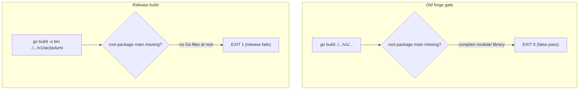

# Pulumi Entrypoint Release-Contract Hardening and Component Remediation

**Date**: June 1, 2026
**Type**: Bug Fix
**Components**: Provider Framework, Build System, CI/CD, Pulumi CLI Integration, Provider Implementations

## Summary

The Pulumi modules release was failing because several deployment components had no
buildable `package main` entrypoint at their `iac/pulumi/` root. The forge quality gate
never caught this: it validated with a recursive `go build ./.../v1/...`, which compiles
whatever packages exist (e.g. the `module/` library) and passes even when the entrypoint is
missing or misplaced — a strictly weaker contract than the release. This change makes forge
validate exactly what the release builds, fixes the stale generation paths and dead
authoring-guide references that let the divergence get authored in the first place, adds a
machine-enforced CI guard, and remediates every divergent component across AWS, Scaleway,
and GCP so the release builds clean.

## Problem Statement / Motivation

The `release.pulumi-modules` workflow builds each component non-recursively:

```bash
go build -o <bin> ./apis/org/openmcf/provider/<provider>/<component>/v1/iac/pulumi
```

That form requires a `package main` at the directory root and fails with
`no Go files in .../iac/pulumi` when it is absent. Forge's build-validation step instead ran
`go build ./apis/.../v1/...`, where the `/...` wildcard recursively compiles sub-packages and
returns success as long as the `module/` library compiles. The result: forge reported green
while the release was structurally guaranteed to fail.

### Pain Points

- Release pulumi-modules legs failed for components with a missing/misplaced entrypoint
  (initially observed on AWS; the new guard also surfaced a broken Scaleway component).
- Forge validation gave false confidence — it tested a weaker contract than production.
- The two Pulumi writer scripts and 7 flow rules still referenced the pre-migration path
  `apis/project/planton/provider/...`, so running them literally wrote files into a dead tree.
- 19 forge-workflow rules referenced `.cursor/info/*.md` authoring guides that had been
  deleted as misleading, leaving agents to improvise the exact details that drift.

## Solution / What's New

Four reinforcing layers plus full remediation.

### Root cause: forge gate vs release contract



### Layer 1 — Validation matches the release contract

- `flow/018-build-validation.mdc` now runs BOTH the recursive build (catches module/proto
  errors) AND the release-equivalent `go build -o /dev/null ./.../v1/iac/pulumi`, plus a
  structural assertion (root `package main`, no `main/` or `entrypoint/` subdir), with inline
  rationale so it is not regressed.
- `_scripts/pulumi_entrypoint_write.py` `run_go_build` now builds the entrypoint
  non-recursively, so `--build` fails on a missing/misplaced root main.
- `forge-openmcf-component.mdc` and `audit/audit-openmcf-component.mdc` enforce the same
  invariant in their success criteria and Category 4.2.

### Layer 2 — Stale generation paths corrected

Replaced `apis/project/planton/provider` with `apis/org/openmcf/provider` in 7 flow rules and
5 writer scripts (`pulumi_entrypoint_write.py`, `pulumi_module_write.py`,
`terraform_module_write.py`, `stack_outputs_reader.py`, `hack_manifest_write.py`).

### Layer 3 — Dead authoring guides repointed

Removed all `.cursor/info/*.md` references across 19 rules. The Validation Message standard is
now homed inline in `002-spec-validate`; other rules cite it. Every authoring rule now points
to live reference components (`awsvpc`, `awsalb`) and the live `architecture/presets.md`.

### Layer 4 — Machine-enforced CI guard

`hack/guards/ensure_pulumi_entrypoints.sh` scans every component and fails if any lacks a root
`package main` or has a non-empty `main/`/`entrypoint/` subdir. It runs as a PR check
(`.github/workflows/lint.iac-entrypoints.yaml`) and as a `preflight` job gating the release
matrix, so a broken entrypoint is rejected in seconds instead of after long matrix builds.

## Implementation Details

### Component remediation (8 components)

Every divergent component was brought to the canonical root-entrypoint layout (modeled on
`aws/awsvpc/v1/iac/pulumi`: `main.go` as `package main` loading `<Kind>StackInput` and calling
`module.Resources`, plus `Pulumi.yaml`, `Makefile`, `debug.sh`).

| Component | Divergence | Remediation |
|-----------|-----------|-------------|
| `aws/awscognitouserpool` | entrypoint in `main/` subdir | relocated to root, normalized Pulumi.yaml, deleted `main/` |
| `aws/awselasticfilesystem` | entrypoint in `main/` subdir | relocated to root, normalized Pulumi.yaml, deleted `main/` |
| `aws/awskinesisfirehose` | entrypoint in `main/` subdir | relocated to root, normalized Pulumi.yaml, deleted `main/` |
| `aws/awsathenaworkgroup` | no root entrypoint | authored `main.go` + project files |
| `aws/awsfsxontapvolume` | no root entrypoint | authored `main.go` + project files |
| `aws/awsgluecatalogdatabase` | no root entrypoint | authored `main.go` + project files |
| `scaleway/scalewayserverlessfunction` | no root entrypoint (found by guard) | authored `main.go` + project files |
| `gcp/gcpcloudcomposerenvironment` | stray `main/Pulumi.yaml` cruft | removed cruft (root main already valid) |

`make gazelle` regenerated `BUILD.bazel` (go_library + go_binary) at all new roots and dropped
the stale `main/` targets.

### Validation

- Guard passes clean; no `main/`/`entrypoint/` subdirs remain repo-wide.
- Release-equivalent build (`go build -o /dev/null ./.../v1/iac/pulumi`) passes for all 8
  components on `linux/amd64`; the 4 authored entrypoints + Scaleway also pass on `darwin/arm64`.
- `go vet` clean across all remediated entrypoints.
- Efficacy proof: on a broken component the OLD recursive build returns exit 0 while the NEW
  non-recursive build fails with `no Go files` — the gate now catches what it previously missed.

## Benefits

- The AWS and Scaleway Pulumi release legs build again.
- This class of failure cannot silently recur: forge, the audit, and CI all enforce the
  release contract, and the guard rejects offenders at PR time.
- Forge generation lands at the correct paths and stops sending agents to deleted guides,
  reducing future drift.

## Impact

- **Release/ops**: pulumi-modules release succeeds; a fast preflight fails early on any future
  regression.
- **Contributors / coding agents**: forge rules are self-contained and point at live ground
  truth; the audit and CI guard give immediate, actionable feedback.
- **Components**: 7 components that could never be released now build; 1 had cruft removed.

## Related Work

- Companion analysis plans: `forge-workflow-hardening` and `aws-pulumi-release-fix`.
- Builds on the migration from `apis/project/planton` to `apis/org/openmcf`.

---

**Status**: ✅ Production Ready
