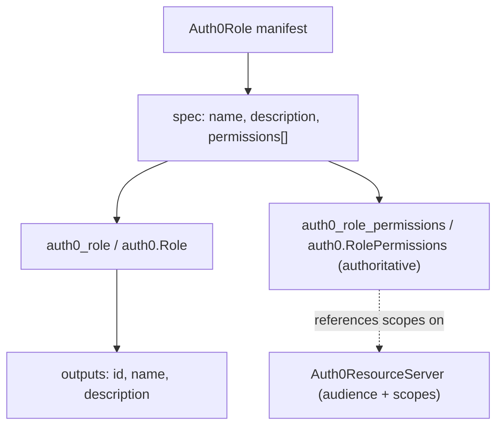

# Auth0Role Deployment Component

**Date**: June 4, 2026
**Type**: Feature
**Components**: API Definitions, Provider Framework, IAC Stack Runner, Testing Framework, Build System

## Summary

Adds `Auth0Role` to the OpenMCF catalog — a deployment component that manages an Auth0 Role and its API permissions (scopes) as code. Permissions are folded into the component so a single manifest creates the role and sets its authoritative permission list across both Pulumi and Terraform. The kind is fully wired into the Auth0 provider plumbing (reflect map + E2E harness) and was validated live against a real Auth0 tenant on both provisioners.

## Problem Statement / Motivation

Auth0's role-based access control (RBAC) has three layers: a resource server defines scopes, a role groups those scopes, and users are assigned roles. OpenMCF already modeled the resource server (`Auth0ResourceServer`) but had no way to declare **roles** — the middle layer that turns raw scopes into reusable access tiers (Administrator, Editor, Viewer).

### Pain Points

- No declarative way to manage Auth0 roles or their permission sets as infrastructure.
- Role-to-permission mappings had to be clicked together in the Auth0 dashboard, with no version history or drift correction.
- The Auth0 provider modeled the role and its permissions as two separate resources (`auth0_role` + `auth0_role_permissions`), so a naive component would leave roles inert (no permissions).

## Solution / What's New

A complete `Auth0Role` component at `apis/org/openmcf/provider/auth0/auth0role/v1/`, modeled on the newest Auth0 exemplar (`auth0action`) and folding the child permission resource into the parent — the same pattern `auth0action` uses for `trigger_binding` and `auth0resourceserver` uses for `scopes`.



### Spec shape

- `name` (optional, defaults to `metadata.name`)
- `description` (optional)
- `permissions[]` — each `{ name, resource_server_identifier }`, validated with message-level CEL and empathetic error messages. The set is authoritative: a permission removed from the spec is removed from the role on the next apply.

## Implementation Details

- **Proto API** (`spec`/`api`/`stack_input`/`stack_outputs` + generated stubs) with a folded `Auth0RolePermission` sub-message; `spec_test.go` ginkgo suite covers every validation rule (valid minimal/named/single/multi-API; invalid missing metadata/spec, wrong api_version/kind, permission missing name or resource_server_identifier).
- **IaC parity**: Pulumi module (`createRole` → conditional `createRolePermissions` with `DependsOn`) and a feature-equal Terraform module (`auth0_role` + conditional `auth0_role_permissions` via `dynamic` block).
- **Registration & dispatch**: `Auth0Role = 2105` (`id_prefix: a0role`) in `cloud_resource_kind.proto`; `pkg/crkreflect/kind_map_gen.go` regenerated via `make generate-cloud-resource-kind-map` so the runner/CLI can instantiate the kind.
- **Provider E2E wiring** (not produced by the generic forge): registered `"auth0role" → "roles/%s"` in `aa_e2e/verify/verifier.go` and added `TestAuth0Role_Pulumi`/`_Terraform` entrypoints in `e2e/auth0/auth0_test.go`.
- **Docs & presets**: user README, catalog page (with reciprocal cross-links from `auth0resourceserver`/`auth0client`), research doc, security/compliance/cost/permissions docs, and three ranked presets (role-with-permissions, admin multi-API, role-without-permissions).
- **Forge rule improvement**: added a "Post-Forge Live E2E Validation" protocol to `forge-openmcf-component.mdc` codifying credential acquisition for live E2E (local `.env.e2e` preferred, CI workflow dispatch fallback), and closed a `.gitignore` gap so `.env.e2e` can never be committed.

## Testing Strategy

- Unit: `go test` validation suite green; recursive `go build` and the release-contract entrypoint build green; `go vet`; Bazel build of all component targets (incl. the Pulumi module against the Auth0 SDK).
- IaC: `terraform validate` green.
- Wiring: `go build -tags e2e ./e2e/auth0/...` compiles the new entrypoints + verifier together.
- **Live E2E** (real Auth0 tenant, via the `e2e-auth0` GitHub Actions workflow): both provisioners green.

```
✓ Auth0Role pulumi minimal (6.21s)
✓ Auth0Role terraform minimal (2.72s)
```

The `minimal` scenario is intentionally permission-free so it is self-contained (no dependency on a pre-existing resource server in the test tenant).

## Benefits

- Auth0 access tiers are now declarative, version-controlled, and drift-corrected.
- A role and its permissions deploy in one manifest, on either Pulumi or Terraform.
- The component is fully dispatchable and live-verifiable like every other Auth0 kind.

## Impact

- **Users**: can model RBAC roles alongside resource servers and clients in OpenMCF.
- **Catalog**: Auth0 provider grows from 5 to 6 components; sibling catalog pages cross-link the new kind.
- **Future forge sessions**: inherit a documented, do-first protocol for running live E2E with provider credentials.

## Related Work

- `Auth0ResourceServer` — defines the scopes that roles grant.
- `Auth0Action` — the newest-exemplar precedent for folding a child resource and message-level CEL.

---

**Status**: ✅ Production Ready
**Timeline**: Single session (forge + provider wiring + live E2E validation)
