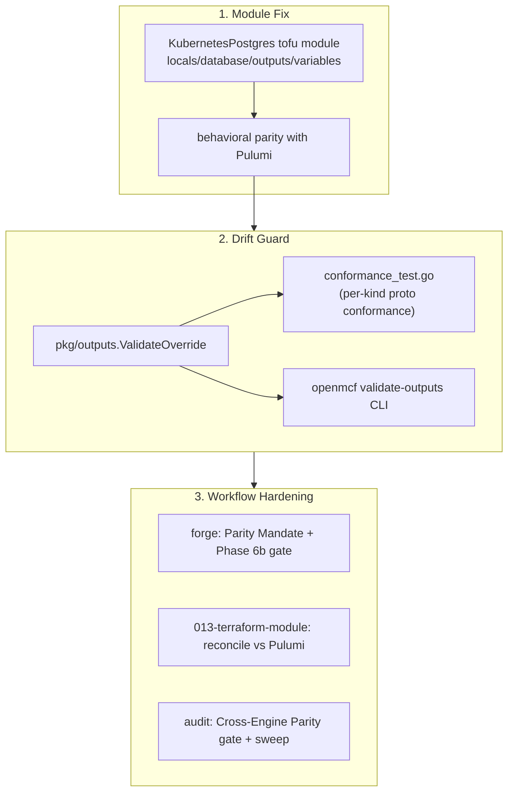
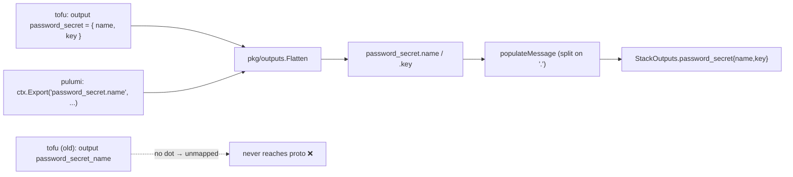

# Tofu↔Pulumi IaC Parity: Postgres Module Fix, Drift Guard, and Workflow Hardening

**Date**: June 4, 2026
**Type**: Bug Fix + Enhancement
**Components**: Kubernetes Provider, IAC Stack Runner, API Definitions, Build System, Provider Framework

## Summary

The `KubernetesPostgres` OpenTofu module had silently diverged from its Pulumi
counterpart in ways that would misdeploy on a real cluster. This change brings the
tofu module to behavioral parity with Pulumi (the source of truth), adds a reusable
drift-detection guard built on the existing `pkg/outputs` framework, and hardens the
deployment-component forge and audit workflows so coding agents now treat 100%
tofu↔pulumi parity as the default — deviating only with a documented technical reason.

## Problem Statement / Motivation

A component ships two IaC implementations of one contract — a Pulumi module
(`iac/pulumi/module/`) and an OpenTofu module (`iac/tf/`). They are supposed to produce
the same cloud objects for the same `stack-input`. Nothing enforced that, so the Postgres
tofu module had drifted from Pulumi across several dimensions, two of them
deploy-breaking. Reading both modules side by side surfaced the gaps.

### Pain Points

- **Wrong namespace (deploy-breaking).** tofu `locals.tf` set `namespace = local.resource_id`;
  Pulumi uses `spec.namespace`. The tofu module would deploy Postgres into a namespace
  named after the resource, not the requested one. (Redis's tofu module correctly uses
  `var.spec.namespace` — Postgres was the outlier.)
- **LoadBalancer selects zero pods (external access dead).** The tofu external LB selector
  used `planton.ai/*` resource-identity labels; Pulumi selects `application: spilo` — the
  label the Zalando/Spilo operator actually puts on Postgres pods.
- **Missing backup + disaster-recovery.** Pulumi emits per-database backup env
  (`WALG_S3_PREFIX` / `BACKUP_SCHEDULE` / `USE_WALG_BACKUP`) and a restore standby block
  (`spec.standby.s3_wal_path` + `STANDBY_AWS_*`); the tofu module implemented neither
  (`variables.tf` had no `backup_config` at all).
- **Stack outputs never populated the proto.** tofu emitted flat `password_secret_name` /
  `password_secret_key`; these flatten to a dotless key and never reach the proto's nested
  `password_secret{name,key}` field, so consumers reading `status.outputs.password_secret.name`
  got nothing. Pulumi emitted `password_secret.name`. (The same flat-output drift exists in
  Redis — i.e. this is a *systemic* class, not a one-off.)
- **Naming basis + labels drift.** tofu keyed the Zalando CR / secret names off `resource_id`
  while Pulumi uses `metadata.name`; labels used ad-hoc keys/values instead of the
  `kuberneteslabelkeys` set.
- **No guardrail.** Neither the forge workflow (which authored the two engines
  independently) nor the audit workflow (which scored them separately on file-presence)
  ever compared the two engines' behavior — so this class of drift was invisible.

## Solution / What's New

Three coordinated changes: fix the module, add a standing guard, and harden the workflows
that produce and review modules.

### 1. Postgres tofu module — now matches Pulumi

All in `apis/org/openmcf/provider/kubernetes/kubernetespostgres/v1/iac/tf/`:

- `locals.tf` — `namespace = var.spec.namespace`; naming basis switched to `metadata.name`;
  LB selector fixed to `{ application = "spilo" }`; labels rebuilt to mirror Pulumi exactly
  (`planton.ai/*` keys, `kind = "KubernetesPostgres"`, `id` only when `metadata.id` is set);
  added the backup/standby env + standby-block derivation.
- `database.tf` — Zalando CR named `db-${var.metadata.name}`, annotation on `metadata.name`,
  and a conditional `standby` block + merged `env` reproducing the Pulumi
  `backup_config.go` / `restore_config.go` behavior (standby env first, then backup).
- `outputs.tf` — nested `password_secret` / `username_secret { name, key }` objects on the
  `metadata.name` basis, so they flatten onto the proto fields.
- `variables.tf` — added the `backup_config` block (incl. `restore` + `r2_config`) in the
  curated `optional()` style.

### 2. Drift detection — reuse the framework, don't reinvent it

The repo already has a generic outputs transformer (`pkg/outputs`) shared by both engines:
raw outputs → `Flatten` (joins nested keys with `.`) → `populateMessage` (sets proto fields).
Both engines feeding the same transformer means **conformance-to-proto is the real
cross-engine parity invariant** — no brittle tofu-vs-pulumi string diffing.

- `pkg/outputs/conformance_test.go` — `TestStackOutputsConformance` (table-driven, seeded
  with `KubernetesPostgres`) asserts a representative output set fully populates the
  `StackOutputs` proto with zero unmapped keys, via the existing `ValidateOverride`
  dry-run. A negative test (`...DetectsFlatSecretDrift`) proves the guard catches the exact
  flat-output regression that started this work.
- `pkg/iac/MODULE_PARITY.md` — the authoritative parity-dimension checklist for the
  hand-written logic no tool can diff (namespace source, naming basis, labels, selectors,
  spec-feature coverage, dependency ordering, outputs shape), plus how to use the automated
  guards and the curated-`variables.tf` convention.

### 3. Forge + Audit workflow hardening

The architecture doc already *declared* "feature parity," but no workflow operationalized
it. That is now fixed:

- `forge-openmcf-component.mdc` — a non-negotiable **Parity Mandate** (Pulumi is the source
  of truth; deviation only via a documented `PARITY-EXCEPTION:` comment in both modules) and
  a **Phase 6b Cross-Engine Parity Gate** that runs after both engines exist and walks the
  dimension checklist before presets/validation.
- `forge/flow/013-terraform-module.mdc` — a mandatory **PARITY WITH PULUMI** section: since
  tofu is authored after Pulumi, the rule now reconciles field-by-field against it, with a
  step-5 verification (`openmcf validate-outputs`) and a parity success criterion.
- `audit/audit-openmcf-component.mdc` — a **Category 5b: Cross-Engine IaC Parity** critical
  gate (caps the Pulumi/Terraform scores on undocumented divergence; ❌ when a divergence
  would misdeploy), a parity verdict in the report + chat summary, a `--parity` invocation,
  and a **"Driving All Components to Parity (one component per session)"** sweep workflow so
  the whole catalog can be retired to parity incrementally with an auditable ledger.

## Implementation Details

### The output flatten/populate contract (why nested objects, not flat names)

Verified against the runner path (`terraformoperation/outputs_extractor.go` →
`pkg/outputs.TransformRaw` → `Flatten` → `populate.go`). Across all 364 tofu modules, **0**
use an output override (`transform-outputs` / `output_transform.yaml`) — the zero-config
generic path is the convention, and many modules already emit nested `value = {...}` objects,
so the nested-object fix is the house style, not a new pattern.

### Deliberate deviation from "just regenerate variables.tf"

`variables.tf` is produced by a generator (`openmcf tofu generate-variables`), but the
generator emits an **all-required** form, whereas 322/377 committed modules (incl. the
canonical `kubernetesnamespace` and `kubernetescronjob`) use a curated `optional()` form.
Committing the raw generator output would break runtime — generated `terraform.tfvars` omit
unset fields, so all-required variables fail with "missing required argument" — and diverge
from the established convention. So `backup_config` was hand-added in the curated style.

## Benefits

- **Correctness on a real cluster.** Postgres on tofu now deploys to the requested
  namespace, its LoadBalancer selects the actual pods, backup/DR works, and consumers can
  read the secret outputs from `status.outputs`.
- **Drift is now catchable in CI.** The conformance guard fails the build if any engine's
  outputs stop populating the proto — the exact bug that started this is now a red test.
- **Parity is the default, not an aspiration.** Forge prevents drift at authoring time;
  audit measures it per component and provides a repeatable sweep to retire existing drift.
- **Zero new framework.** The guard reuses `pkg/outputs.ValidateOverride` / `validate-outputs`
  rather than inventing a parallel mechanism.

## Impact

- **Operators** deploying `KubernetesPostgres` via the tofu provisioner get a correct
  deployment (this was the immediate driver: GoSilver is the first tofu adopter).
- **Coding agents** running forge/audit now have explicit, enforceable parity guidance and a
  one-component-per-session path to bring all existing components to parity.
- **No blast radius:** nothing is live on the tofu Postgres module yet (GoSilver undeployed;
  leftbin runs the pulumi default), so the naming-basis change is safe.

## Testing Strategy

- `tofu validate` + `tofu fmt` clean on the module; `tofu console` confirmed computed
  namespace, labels, standby block, and merged env for a representative input.
- `go test ./pkg/outputs/` passes, including the new conformance test and its negative case;
  `go vet` clean; `bazel build //pkg/outputs:outputs_test` passes (incl. `nogo`).
- `openmcf validate-outputs --kind KubernetesPostgres` reports 7/8 proto fields populated —
  the 8th is the deprecated `internal_hostname`, which Pulumi also omits — with zero unmapped.

## Related Work

- Builds directly on the `pkg/outputs` transformer framework and the tofu generators
  (`pkg/iac/tofu/generators`, the 012 redesign).
- Follow-up sweep: apply `@audit-openmcf-component --parity` across the catalog (Redis's
  flat-output drift is already known) to drive every component to parity.

---

**Status**: ✅ Production Ready
**Timeline**: One session (module fix + drift guard + workflow hardening)
