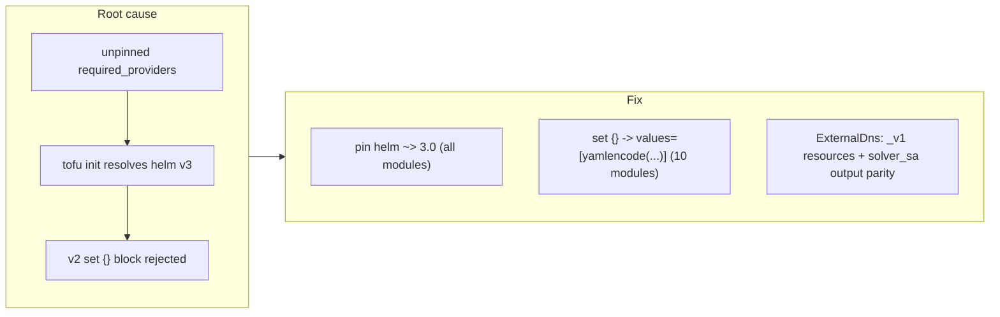

# Helm Provider v3 Migration, ExternalDNS Parity Fix, and Unpinned-Provider Root-Cause Closure

**Date**: June 4, 2026
**Type**: Bug Fix + Enhancement
**Components**: Kubernetes Provider (Terraform modules), Stack-Outputs Conformance

## Summary

A `KubernetesExternalDns` deploy via the tofu provisioner (GoSilver, the first tofu
adopter) failed with `Unsupported block type: Blocks of type "set" are not expected
here`. Root cause: the module declared **no `required_providers` block at all**, so
`tofu init` floated `hashicorp/helm` to v3.x, where the `set { ... }` block was replaced
by a `set = [{ ... }]` list attribute. This change migrates every Kubernetes Terraform
module to the helm v3 provider the parity-correct way, fixes the ExternalDNS module to
full parity with its Pulumi counterpart, and closes the unpinned-provider root cause
across the catalog.

## Problem Statement / Motivation

GoSilver is the first org to deploy Kubernetes add-ons via the **tofu** (not Pulumi)
provisioner, which exposed defects the Pulumi-only path had hidden.

### Pain Points

- **Unpinned helm provider (the defect).** `kubernetesexternaldns` and six other modules
  (`certmanager`, `keycloak`, `neo4j`, `gitlab`, `elasticoperator`, `argocd`) had a bare
  `provider "kubernetes" {}` with no version pin, so the helm major was decided by
  whatever the runner resolved — a latent break that surfaced when helm v3 shipped.
- **Legacy `set {}` syntax.** Ten modules still used helm-v2 `set {}`/`dynamic "set"`
  blocks, which helm v3 rejects. The house idiom for the other ~21 modules is already
  `values = [yamlencode({...})]`.
- **Empty `provider "helm" { kubernetes {} }` blocks.** In helm v3 the `kubernetes` nested
  block became an attribute, so the empty block is itself invalid under v3.
- **ExternalDNS output drift.** The tofu module emitted `service_account_name`, which does
  not flatten onto the `KubernetesExternalDnsStackOutputs.solver_sa` proto field (Pulumi
  already exported `solver_sa`), plus three extra outputs absent from the proto and Pulumi.

## Solution / What's New

The break is a provider-resolution + config-decode problem, so the fix migrates each module
to the helm v3 idiom and pins the major for deterministic resolution.

### 1. Helm v3 migration, the parity-correct way

- **`set {}` -> `values = [yamlencode(...)]` (10 modules):** `kubernetesexternaldns`,
  `altinityoperator`, `temporal`, `zalandopostgresoperator`, `perconapostgresoperator`,
  `grafana`, `perconamysqloperator`, `openbao`, `ingressnginx`, `perconamongooperator`.
  The values maps mirror each module's Pulumi `Values` map (native bool/number types
  instead of `tostring()`-ed `--set` strings; literal annotation/dotted keys instead of
  `--set` escaping; `inherited_labels[N]`/`zoneIdFilters[N]` indices become real lists).
  Conditional fragments use the `merge(concat([...], cond ? [{...}] : [])...)` idiom
  because helm v3 dropped `set {}` and tofu cannot unify bare-object conditional branches.
- **Helm pin `~> 3.0` everywhere.** The major is pinned (not `>= 3.0`) so a future helm v4
  cannot silently reintroduce this exact drift. Added the missing `required_providers`
  block to the seven previously-unpinned modules; normalized `istio` from `>= 3.0`.
- **Dropped the empty `provider "helm" { kubernetes {} }` block** (v3-invalid) in favor of
  bare `provider "helm" {}`, matching the `externalsecrets` reference module.

### 2. KubernetesExternalDns brought to full parity (exemplar)

`apis/org/openmcf/provider/kubernetes/kubernetesexternaldns/v1/iac/tf/`:

- `provider.tf` — added `required_providers` (kubernetes `~> 2.35`, helm `~> 3.0`) and
  `provider "helm" {}`.
- `main.tf` / `locals.tf` — `set`/`dynamic "set"` blocks replaced by
  `values = [yamlencode(local.helm_values)]`, where `local.helm_values` mirrors the Pulumi
  values map; migrated the deprecated `kubernetes_namespace` / `kubernetes_service_account`
  / `kubernetes_secret` (+ existing-namespace data source) to their `_v1` forms (clearing
  the stack job's "Deprecated Resource" warnings, matching the `externalsecrets` sibling).
- `variables.tf` — curated the untyped `spec = object({})` into the `optional()` form per
  `pkg/iac/MODULE_PARITY.md`.
- `outputs.tf` — emits exactly `namespace`, `release_name`, `solver_sa` (renamed from
  `service_account_name`; dropped three non-proto outputs) to match the proto + Pulumi.

### 3. Conformance guard

Added a `KubernetesExternalDns` case to `pkg/outputs/conformance_test.go`
(`TestStackOutputsConformance`): the three outputs fully populate the StackOutputs proto
with zero unmapped, locking in the `solver_sa` rename.

## Implementation Details

- **Conditional values in HCL.** helm v3 dropped `set {}`, and tofu cannot type-unify
  bare-object conditional branches (`cond ? {a=1} : {}` errors). Provider-specific value
  fragments are therefore appended as single-element lists and merged:
  `merge(concat([{base}], cond ? [{frag}] : [])...)` -- lists unify where objects do not.
- **helm v3 provider config.** The empty `provider "helm" { kubernetes {} }` nested block is
  invalid in v3 (the `kubernetes` block became an attribute); replaced with bare
  `provider "helm" {}`, which inherits the default kube config the runner already provides.
- **Pulumi is unchanged.** It uses the `pulumi-kubernetes` helm/v3 SDK with a `Values` map,
  unaffected by the Terraform helm-provider change; the tofu values maps were written to
  mirror those maps so the two engines stay behaviorally identical.

## Validation

- `tofu init -upgrade` resolves `hashicorp/helm` v3.x and `tofu validate` passes on every
  migrated module. (Two modules — `rookcephcluster` and `gharunnerscaleset` — have
  pre-existing, helm-unrelated `tofu validate` type errors in their own conditionals;
  their helm v3 init resolves cleanly. Flagged for the parity sweep.)
- `tofu console` rendered `local.helm_values` for representative inputs (ExternalDNS
  Cloudflare = the failing manifest; Temporal external-postgres and embedded-cassandra),
  confirming the YAML matches the prior `--set` keys and the Pulumi values map.
- `openmcf validate-outputs --kind KubernetesExternalDns`: 3/3 proto fields populated,
  zero unmapped.
- `go test ./pkg/outputs/` passes including the new conformance case.

## Parity divergences flagged for the sweep (not changed here)

These tofu↔Pulumi divergences were observed while migrating the helm-values surface and
are recorded for the per-component `@audit-openmcf-component --parity` sweep rather than
changed in this (cross-cutting) pass:

- `altinityoperator` — tofu sets `watchNamespaces`; Pulumi sets
  `configs.files."config.yaml".watch.namespaces=[".*"]`.
- `openbao` — Pulumi sets `server.extraLabels`; tofu does not.
- `temporal` — Pulumi additionally emits `server.dynamicConfig.limit.blobSize.*` and sets
  `server.config.persistence` for embedded mysql/postgresql; tofu does neither.

## Benefits

- **ExternalDNS deploys on tofu** -- the immediate GoSilver blocker is resolved.
- **Deterministic helm resolution** across all 27 helm modules; a future helm v4 cannot
  silently re-break them (major pinned `~> 3.0`).
- **Cleaner, parity-correct modules**: `values=[yamlencode(...)]` replaces brittle `--set`
  index/escape strings and mirrors the Pulumi `Values` map, improving cross-engine parity;
  ExternalDNS also sheds its deprecated non-`_v1` resources and dead outputs.
- **Conformance locked in CI** for the `solver_sa` output via the new test case.

## Impact

- **Operators** deploying any Kubernetes add-on via the tofu provisioner are no longer
  exposed to helm-major drift; ExternalDNS (the immediate GoSilver blocker) deploys.
- **No blast radius for working modules:** value-only modules were behavior-preserving
  version-pin bumps; `set`-block modules were faithful translations verified by render.
- **Coding agents** get a corrected parity doctrine (neither engine privileged; the proto
  contract + intended behavior decide correctness) across the forge/audit rules and
  `pkg/iac/MODULE_PARITY.md`.

## Related Work

- Builds on the `2026-06-04-...-iac-tofu-pulumi-parity-postgres-fix-and-drift-detection`
  changelog (the parity doctrine + `pkg/outputs` conformance framework this reuses).
- Followed in the same session by
  `2026-06-04-...-terraform-provider-pin-guard-and-validate-ci` -- the CI gate that prevents
  this class from regressing.

---

**Status**: ✅ Production Ready
**Timeline**: One session (catalog-wide migration + exemplar parity fix + doctrine correction)
