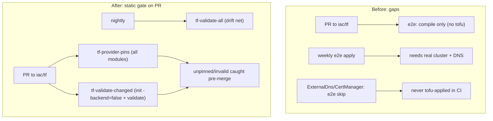

# Terraform Provider-Pin Guard + Static Validate CI; Close Remaining Unpinned Modules

**Date**: June 4, 2026
**Type**: Enhancement (CI hardening) + Bug Fix (latent unpinned providers)
**Components**: Build System, CI/CD, Kubernetes Provider, GCP Provider

## Summary

The helm-provider-v3 incident (KubernetesExternalDns failing in production on GoSilver)
was a **static** error -- an unpinned provider floated to a new major on `tofu init`, and
the now-invalid HCL was rejected by `tofu validate` -- yet nothing static ran in CI to catch
it. This change adds a Terraform static gate to the build lane (a provider-pin guard plus
`tofu validate`) and closes the 22 remaining unpinned modules so the gate ships green and
blocking. It turns a class of production incident into a sub-second red check on the PR.

## Problem Statement / Motivation

The fix for the helm v3 break removed the trigger, but the *reason it reached production*
was a process gap: the failure is statically detectable with zero infrastructure, but the
only Terraform execution in CI is the weekly e2e `apply`, which needs real clusters/DNS and
skips the DNS-dependent components entirely.

### Pain Points

- **PRs never run Terraform statically.** `e2e-kubernetes.yaml` only *compiles* e2e tests on
  PRs; the real init/apply runs weekly. No `tofu validate` runs on any PR.
- **No repo-wide `tofu validate`.** `terraform validate` exists only as a manual agent step
  in `complete-planton-component.mdc`, never in CI.
- **`.terraform.lock.hcl` is gitignored**, so every CI/runner `tofu init` resolves providers
  fresh -- an unpinned module floats to the latest major (exactly the helm v3 path).
- **The failing component was an e2e `skip`.** `KubernetesExternalDns` / `KubernetesCertManager`
  profiles are `status: skip` ("requires cloud DNS provider_config" / "ACME + DnsProvider"),
  so a real tofu apply of them never ran in CI -- the first tofu adopter (GoSilver) hit it.
- **Latent siblings.** 22 more modules had the same unpinned defect, undetected.

## Solution / What's New

The break is a config-decode error: it surfaces at `tofu init` + `tofu validate`, **before**
any cloud/DNS call. So the right place to catch it is the static build lane, not e2e.

### 1. Provider-pin guard (root cause, static, repo-wide, PR-blocking)

`hack/guards/ensure_tf_provider_pins.sh` fails if any `apis/**/v1/iac/tf` module references a
provider (`resource "
_..."` / `data "
_..."`) without declaring it in
`required_providers`. Unpinned providers are exactly what let `tofu init` float to a new
major. No network/cluster/creds, so it covers `skip`/`deferred` components too.

### 2. `tofu validate` in CI (`.github/workflows/lint.terraform-modules.yaml`)

- **tf-provider-pins** (PR + push): runs the guard.
- **tf-validate-changed** (PR): `tofu fmt -check` + `tofu init -backend=false` + `tofu validate`
  on the iac/tf modules changed in the PR -- fast feedback, catches malformed HCL at authoring.
- **tf-validate-all** (nightly + manual): init + validate across all modules -- the net for a
  provider-release breaking an UNCHANGED module (the ExternalDns scenario). Reports failures;
  does not gate PRs.

### 3. Closed the remaining unpinned modules (22)

Same latent class as ExternalDns, found while wiring the guard:

- **18 Kubernetes CRD-projection modules** used `kubernetes_manifest` with a bare
  `provider "kubernetes" {}` and no `required_providers` -- added `hashicorp/kubernetes ~> 2.35`:
  authorizationpolicy, certificate, clusterissuer, destinationrule, envoyfilter, gateway,
  gatewayclass, grpcroute, httproute, issuer, peerauthentication, prometheus, referencegrant,
  requestauthentication, serviceentry, tcproute, telemetry, tlsroute.
- **4 modules** used `random_*` without pinning `hashicorp/random` -- added `~> 3.6`:
  `gcp/gcpartifactregistryrepo`, `kubernetes/{jenkins,mongodb,redis}`.

After this, all 377 tofu modules pin every provider they reference (guard verified).

## Implementation Details

- **Pin parsing.** The guard collects referenced provider local names from `resource`/`data`
  headers (prefix before the first underscore: `helm_release` -> `helm`, `kubernetes_manifest`
  -> `kubernetes`, `random_password` -> `random`) and the declared keys inside
  `required_providers` (brace-depth-tracked so only top-level entries count), then diffs them.
  The builtin `terraform_*` data sources are ignored.
- **Changed-module detection.** `tf-validate-changed` derives unique `*/v1/iac/tf` dirs from
  `git diff --name-only "$base"...HEAD` (checkout uses `fetch-depth: 0`).
- **Drift net cost.** `tf-validate-all` uses `TF_PLUGIN_CACHE_DIR` + `actions/cache` to avoid
  re-downloading providers across 377 inits.
- **`.gitignore`.** A global `*.sh` rule was silently ignoring guard scripts (the existing
  guards were force-added); added `!hack/guards/*.sh` so CI guard scripts are tracked.

## Benefits

- A would-be production incident becomes a **~sub-second, infra-free red check** on the PR.
- Coverage finally includes **`skip`/`deferred` components** (ExternalDns, CertManager, etc.)
  that e2e can never `apply`-test.
- The nightly drift net catches a **provider release breaking an unchanged module** -- the
  exact, sneakiest variant that no changed-files check would see.
- The whole catalog (377 modules) is now provably pinned; future drift is structurally
  prevented, not just patched.

## Impact

- **Coding agents / contributors**: authoring an unpinned or malformed tofu module now fails
  fast at PR time with a precise message, instead of surfacing at a customer's first deploy.
- **Operators**: lower risk of provisioner-specific deploy breakage from provider releases.
- **No blast radius**: the 22 closures are version-pin-only additions; no resource/behavior
  changes.

## Known Limitations

`tf-validate-all` will report two **pre-existing, helm-unrelated** `tofu validate` failures
(conditional type mismatches): `kubernetesrookcephcluster` (`var.spec.cluster.network`) and
`kubernetesgharunnerscaleset` (github auth). Their helm v3 init resolves cleanly; flagged for
the parity sweep, not fixed here.

## Testing Strategy

- `bash hack/guards/ensure_tf_provider_pins.sh` passes across 377 modules; a negative test
  (a temporary unpinned `helm_release`) is correctly flagged and the guard exits non-zero.
- Workflow YAML validated (`yq`) and the guard script passes `bash -n`.

## Related Work

- Directly follows `2026-06-04-...-helm-provider-v3-migration-and-externaldns-parity.md`
  (the fix this gate prevents from regressing).
- Complements the existing static guards `hack/guards/ensure_pulumi_entrypoints.sh` and the
  `pkg/outputs` stack-output conformance test -- this is their Terraform-side counterpart.

---

**Status**: ✅ Production Ready
**Timeline**: Same session as the helm v3 migration
