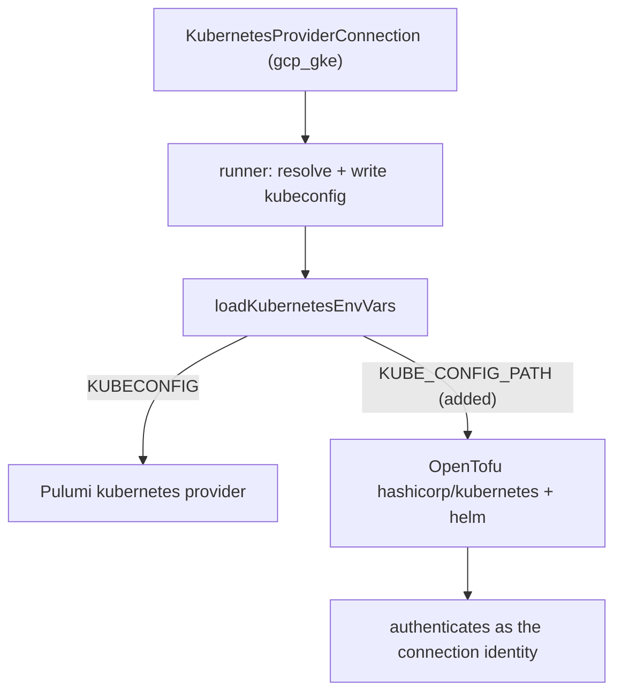

# Kubernetes Provider Credentials: Export KUBE_CONFIG_PATH for OpenTofu Parity

**Date**: June 4, 2026
**Type**: Bug Fix
**Components**: Kubernetes Provider, IAC Stack Runner, Provider Framework

## Summary

The runner resolves a `KubernetesProviderConnection` into a kubeconfig file and advertises
it to the IaC engine via environment variables, but `loadKubernetesEnvVars` exported only
`KUBECONFIG`. The Pulumi Kubernetes provider honors `KUBECONFIG`; the Terraform/OpenTofu
`hashicorp/kubernetes` (and `helm`) provider honors `KUBE_CONFIG_PATH`. As a result, an
OpenTofu deployment never saw the connection's kubeconfig and silently fell back to
in-cluster auth — the runner pod's own service account — targeting the wrong cluster. This
change exports both env vars from the single shared chokepoint, so either engine resolves
the connection.

## Problem Statement / Motivation

GoSilver is the first org deploying Kubernetes resources through the OpenTofu provisioner.
A `KubernetesClusterIssuer` deploy against a GKE connection (`gcp_gke`) failed during
`tofu refresh` with:

```
failed to look up GVK [cert-manager.io/v1, Kind=ClusterIssuer] among available CRDs:
customresourcedefinitions.apiextensions.k8s.io is forbidden:
User "system:serviceaccount:planton-prod-runners:planton-platform-default-runner"
cannot list resource "customresourcedefinitions" ... at the cluster scope
```

The identity in the error is the **runner pod's own in-cluster service account**, not the
GKE connection's service account. That is the tell: the OpenTofu `kubernetes` provider was
configured from in-cluster defaults, not from the kubeconfig the runner had generated for
the connection.

### Pain Points

- **Silent wrong-cluster fallback.** With no recognized config env var, the
  `hashicorp/kubernetes` provider quietly uses in-cluster credentials instead of failing
  loudly. The deploy "runs" against the wrong cluster and dies on an unrelated-looking RBAC
  error.
- **Engine asymmetry hidden in a shared helper.** `loadKubernetesEnvVars` is IaC-agnostic
  and feeds both Pulumi and OpenTofu, but it only emitted the Pulumi env var name. Pulumi
  worked; OpenTofu did not.
- **Already known in tests, never fixed in production.** The e2e harness
  (`e2e/framework/runner/terraform_input.go`) had already discovered that the TF provider
  needs `KUBE_CONFIG_PATH` and bridged it for the kind harness — but the production loader
  was never updated.

## Solution / What's New

Export the generated kubeconfig under **both** well-known env var names from the single
output chokepoint. The file is identical; only the name the consumer looks for differs.



### `loadKubernetesEnvVars` — emit both names

`pkg/iac/stackinput/providerenvvars/kubernetes.go`:

```go
// Pulumi honors KUBECONFIG; Terraform/OpenTofu hashicorp/kubernetes (and helm) honors
// KUBE_CONFIG_PATH. Both point at the same generated kubeconfig so either engine resolves
// the connection; setting the name the active engine ignores is harmless. Omitting
// KUBE_CONFIG_PATH makes the tofu provider silently fall back to in-cluster auth.
envVars := map[string]string{
    "KUBECONFIG":       kubeConfigPath,
    "KUBE_CONFIG_PATH": kubeConfigPath,
}
```

Because this loader is the one place both engines call
(`pulumistackrunner` and `terraformstackrunner` both go through
`providerenvvars.GetEnvVarsWithOptions`), every Kubernetes sub-provider that produces a
kubeconfig is covered by this one change.

## Implementation Details

- **`pkg/iac/stackinput/providerenvvars/kubernetes.go`** — return both `KUBECONFIG` and
  `KUBE_CONFIG_PATH`, with a breadcrumb explaining the Pulumi/OpenTofu split and the
  in-cluster-fallback failure mode it prevents.
- **`pkg/iac/stackinput/providerenvvars/kubernetes_test.go`** — the package's first test:
  asserts `loadKubernetesEnvVars` returns both keys pointing at the same on-disk kubeconfig.
- **`e2e/framework/runner/terraform_input.go`** — clarified the comment so the kind-harness
  `KUBECONFIG`→`KUBE_CONFIG_PATH` bridge and the production loader stay coherent (kept on
  purpose; it serves a different case — the harness exporting `KUBECONFIG` into the process).

### Follow-ups recorded (not fixed here)

While reading the loader, two adjacent gaps were documented in-code as explicit
follow-ups rather than blind-fixed:

- `buildAwsEksKubeConfig` / `buildAzureAksKubeConfig` are stubs returning `""`.
- The `loadKubernetesEnvVars` switch has no `digital_ocean_doks` arm even though the runner
  maps DOKS connections, so a DOKS connection would hit `default -> "unsupported kubernetes
  provider"`. Each needs its own change plus a real connection to validate.

## Benefits

- **OpenTofu Kubernetes deploys authenticate against the intended cluster** using the
  connection's credentials, instead of silently falling back to the runner's in-cluster SA.
- **One chokepoint, both engines** — no per-engine env wiring; the fix is provider-agnostic.
- **Regression-guarded** — the new unit test fails if either env var is ever dropped.

## Impact

- **Operators** deploying any Kubernetes resource through the OpenTofu provisioner against a
  provider connection (GoSilver is the first) now reach the correct cluster.
- **No blast radius for Pulumi** — `KUBE_CONFIG_PATH` is ignored by the Pulumi provider; the
  existing `KUBECONFIG` behavior is unchanged.

## Related Work

- The same failed stack job surfaced a separate, repo-external issue: a generic
  `protobuf error` masked the real cause in the operator-facing status. Those fixes live in
  the `planton` repo (runner engine-event consumer made schema-drift tolerant; the Temporal
  root-cause extractor fixed to stop at the application boundary) and are tracked there.
- Builds on the Tofu↔Pulumi parity initiative (`2026-06-04-153807-iac-tofu-pulumi-parity-postgres-fix-and-drift-detection`).

---

**Status**: ✅ Production Ready (pending runner dependency bump + redeploy)
**Timeline**: One session
