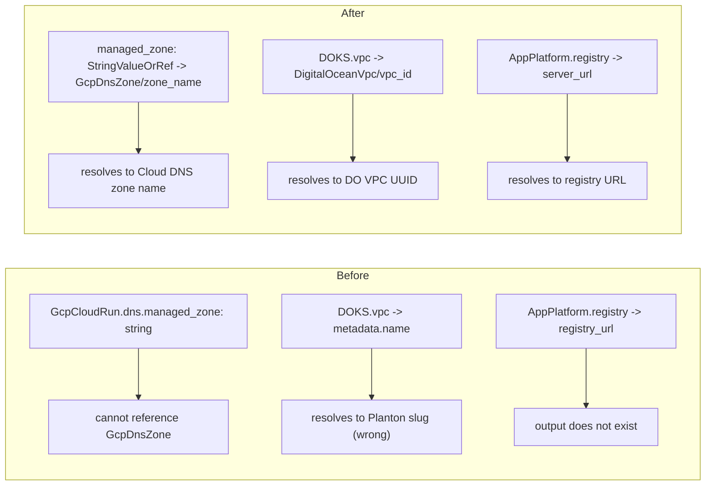

# FK Reference Annotation Corrections: Cloud Run managed_zone, DOKS VPC, App Platform registry

**Date**: June 4, 2026
**Type**: Breaking Change (GcpCloudRun) + Bug Fix
**Components**: API Definitions, GCP Provider, DigitalOcean Provider, Terraform Module, Pulumi Module

## Summary

Corrects three foreign-key (FK) reference annotations that were either semantically wrong or missing, so cross-resource references on these fields resolve to the value the IaC modules actually consume. `GcpCloudRun.dns.managed_zone` is promoted from a plain `string` to a `StringValueOrRef` so it can reference a `GcpDnsZone` (matching the existing `GcpDnsRecord.managed_zone` sibling); `DigitalOceanKubernetesCluster.vpc` now points at the VPC's `vpc_id` output instead of `metadata.name` (the cluster consumes the DigitalOcean UUID); and `DigitalOceanAppPlatformService.imageSource.registry` now points at the registry's real `server_url` output instead of the non-existent `registry_url`.

## Problem Statement / Motivation

The platform resolves a `StringValueOrRef.value_from { kind, name, field_path }` at deploy time via a generic JSONB lookup against the referenced resource's stored cloud-object (`spec.cloudObject.<field_path>`, snake_case canonical). For that to work, a field's `default_kind_field_path` annotation must name an output the referent actually exports, and the field itself must be a `StringValueOrRef`. Three fields violated this:

### Pain Points

- **`GcpCloudRun.dns.managed_zone` was a plain `string`** — it could not reference a `GcpDnsZone` at all, even though the directly analogous `GcpDnsRecord.managed_zone` is a `StringValueOrRef` referencing `GcpDnsZone/status.outputs.zone_name`. Consumers had to hand-copy the zone name.
- **`DigitalOceanKubernetesCluster.vpc` annotated `metadata.name`** — but both IaC modules consume the VPC's DigitalOcean UUID (`vpc.value` in Terraform, `Spec.Vpc.GetValue()` in Pulumi), and `DigitalOceanVpc` exports that UUID as `status.outputs.vpc_id`. A reference resolving to the Planton metadata name would have handed DOKS an invalid VPC identifier. The field comment ("Only the VPC's name is needed") was also misleading.
- **`DigitalOceanAppPlatformService.imageSource.registry` annotated `status.outputs.registry_url`** — `DigitalOceanContainerRegistry` exports no such output; it exports `server_url` (the registry URL the App Platform module consumes). The reference resolved to nothing.

## Solution / What's New



## Implementation Details

### 1. GcpCloudRun — `dns.managed_zone` promotion (breaking)

- **Proto**: `dns.managed_zone` changed from `string` to `org.openmcf.shared.foreignkey.v1.StringValueOrRef` with `default_kind = GcpDnsZone` and `default_kind_field_path = "status.outputs.zone_name"`. The `GcpCloudRunDns` CEL was updated from `this.managed_zone != ''` to the value/value_from form `((has(this.managed_zone.value) && this.managed_zone.value != '') || has(this.managed_zone.value_from))`, mirroring the established pattern used by `AwsEc2Instance`.
- **Terraform**: `variables.tf` `dns.managed_zone` type changed `string` -> `object({ value = string })` (the platform resolves any `value_from` to a literal before apply, so only `value` arrives — identical to `gcpdnsrecord`). `locals.tf` reads `.value`.
- **Pulumi**: `custom_dns.go` reads `Spec.Dns.ManagedZone.GetValue()`.
- **Docs/manifest/test**: Terraform README example, catalog-page row, `hack/manifest.yaml`, and `spec_test.go` (DNS CEL cases) updated to the `StringValueOrRef` shape.

### 2. DigitalOceanKubernetesCluster — `vpc` field path

- **Proto**: `default_kind_field_path` changed `metadata.name` -> `status.outputs.vpc_id`; the misleading comment corrected to state the cluster consumes the VPC's UUID.
- **Docs**: catalog-page reference example updated to `field: status.outputs.vpc_id`. (Type unchanged — annotation-only; no IaC change.)

### 3. DigitalOceanAppPlatformService — `imageSource.registry` field path

- **Proto**: `default_kind_field_path` changed `status.outputs.registry_url` -> `status.outputs.server_url`.
- **Docs**: catalog-page reference table and two `valueFrom` examples updated to `server_url`. (Type unchanged — annotation-only; no IaC change.)

## Breaking Changes

**`GcpCloudRun.dns.managed_zone` changed type** from `string` to `StringValueOrRef`. Manifests that set `managed_zone` as a bare string must wrap it:

```yaml
# Before
dns:
  enabled: true
  hostnames: ["api.example.com"]
  managedZone: example-com-zone

# After
dns:
  enabled: true
  hostnames: ["api.example.com"]
  managedZone:
    value: example-com-zone        # literal
    # or:
    # valueFrom: { kind: GcpDnsZone, name: my-zone, field: status.outputs.zone_name }
```

The DOKS and App Platform changes are annotation-only (no wire/type change) and require no manifest migration.

## Benefits

- Cross-resource references on all three fields now resolve to the exact value the IaC consumes — no silent broken references at deploy time.
- `GcpCloudRun` custom-domain wiring can now reference a `GcpDnsZone` directly, closing the gap with `GcpDnsRecord`.
- Removes a class of "looks annotated but never resolves" landmines from the FK surface.

## Impact

- **Cloud Run users** setting `dns.managed_zone` must use the `StringValueOrRef` shape (migration above).
- **DOKS / App Platform users** are unaffected at the manifest level; existing references now resolve correctly.
- **Downstream (Planton web)**: the consuming wizard treats `GcpCloudRun.dns.managed_zone` as an FK field and will pick up the corrected proto on the next stub regeneration; the DOKS/App-Platform UI overrides become redundant after regen.

## Related Work

- `2026-06-04-200000-fk-reference-annotation-fixes.md` — the preceding GKE/AWS/Hetzner/OpenSearch FK annotation pass.
- Mirrors `GcpDnsRecord.managed_zone` (`status.outputs.zone_name`) as the reference precedent for the Cloud Run promotion.

---

**Status**: ✅ Production Ready
**Validation**: `buf lint` + `buf build` clean; `make build` clean (multi-arch); `go test` green for all three components; `tofu validate` Success on the Cloud Run module.
