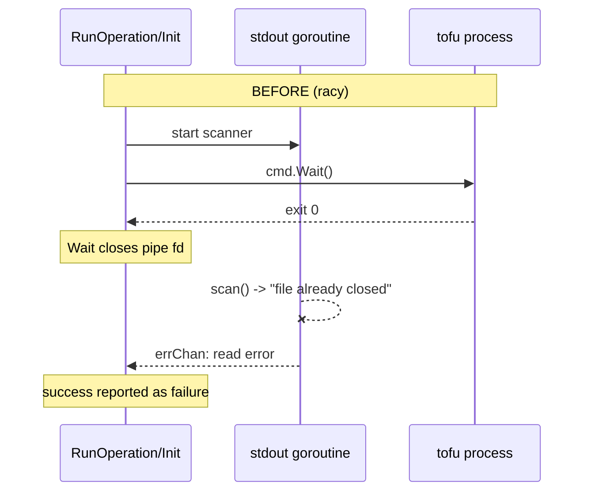
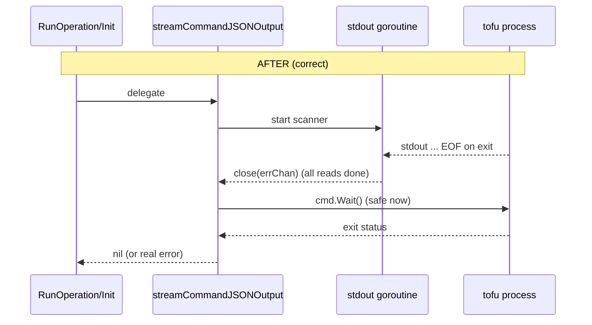

# Fix Sporadic "error reading tofu output: read |0: file already closed"

**Date**: June 4, 2026
**Type**: Bug Fix + Refactoring
**Components**: IAC Stack Runner, Error Handling, Provider Framework

## Summary

Stack jobs driven through the Planton runner intermittently failed with
`error reading tofu output: read |0: file already closed` on different operations
(refresh, plan, apply, destroy, init) — even when the underlying tofu/terraform run
had actually succeeded. The cause was a classic `os/exec` ordering bug in the two
HCL streaming functions: `cmd.Wait()` was called concurrently with the goroutine
still reading `cmd.StdoutPipe()`. This change drains the pipe to EOF before calling
`Wait()`, consolidates the duplicated read logic into a single tested helper, and
hardens the scanner buffer for large `-json` lines.

## Problem Statement / Motivation

`RunOperation` and `Init` stream tofu/terraform `-json` output line-by-line to a
progress channel so the runner can render live job progress. Both functions used
the same shape:

```go
go func() { scanner.Scan() loop -> errChan }()
if err := cmd.Wait(); err != nil { ... }   // closes the pipe
readErr := <-errChan                        // read AFTER Wait
```

Go's `exec.Cmd.StdoutPipe` documentation is explicit:

> Wait will close the pipe after seeing the command exit ... It is thus incorrect
> to call Wait before all reads from the pipe have completed.

`Wait()` closes the read end of the pipe the moment the process exits. If the
scanner goroutine was still draining buffered output at that instant, its read
returned `read |0: file already closed`, which `scanner.Err()` surfaced as
`error reading tofu output: ...`.

### Pain Points

- **A successful run reported as a failure.** tofu exits `0`, so `cmd.Wait()`
  returns `nil`; the step was then failed *solely* by the spurious read error. In
  the field this showed up as "Infrastructure updated / +N created" with the step
  still marked failed.
- **Sporadic and operation-agnostic.** It is a pure timing race, so it appeared
  on refresh, plan, apply, destroy, and init at random.
- **Duplicated defect.** The identical buggy block lived in both `run_operation.go`
  and `tofu_init.go`, so the two copies could (and did) drift.
- **Adjacent latent failure.** `bufio.Scanner`'s 64KB default token size could
  also fail large plan `-json` lines with `token too long` on the same path.

## Solution / What's New

The reader goroutine now fully drains the pipe (the goroutine closes `errChan` at
EOF; the caller blocks on it) **before** `cmd.Wait()` is called. The tricky
concurrency lives in exactly one place — a new private helper,
`streamCommandJSONOutput` — that both functions delegate to.

### Before vs After





## Implementation Details

**New file**: `pkg/iac/tofu/tofumodule/stream_output.go`

```go
func streamCommandJSONOutput(binaryName string, cmd *exec.Cmd, lines chan<- string) error {
    stdoutPipe, _ := cmd.StdoutPipe()
    cmd.Start()
    errChan := make(chan error, 1)
    go func() {
        defer func() { /* recover -> errChan */ ; close(errChan) }()
        scanner := bufio.NewScanner(stdoutPipe)
        scanner.Buffer(make([]byte, 0, bufio.MaxScanTokenSize), maxScanTokenSize) // 10MB cap
        for scanner.Scan() { /* send line / Println */ }
        if scanErr := scanner.Err(); scanErr != nil {
            errChan <- fmt.Errorf("error reading %s output: %v", binaryName, scanErr)
        }
    }()
    readErr := <-errChan          // block until ALL reads complete
    if waitErr := cmd.Wait(); waitErr != nil { return wrap(waitErr) }
    return readErr                 // Wait-error precedence preserved
}
```

- **`run_operation.go`** and **`tofu_init.go`**: the streaming branches now collapse
  to `return streamCommandJSONOutput(binaryName, cmd, jsonLogEventsChan)`. The
  non-streaming branches (`cmd.Stdout = os.Stdout; cmd.Run()`) are unchanged.
- **Behavior preserved exactly**: same `error reading %s output` string, same
  panic-recovery boundary (with stack trace), same precedence of a non-zero exit
  over a read error, process always reaped (no zombies).
- **Larger scanner buffer** (10MB) removes the adjacent `token too long` failure
  mode on big plan `-json` lines.

### Testing Strategy

New `stream_output_test.go` (the first test in this package):

- `TestStreamCommandJSONOutput_NoCloseRace` streams 5000 lines from a fake command
  and asserts all are delivered with no error. Run under `go test -race -count=20`
  it passed cleanly — the configuration that previously surfaced the race.
- `TestStreamCommandJSONOutput_NonZeroExit` asserts a non-zero process exit is still
  reported as an error.

```bash
go build ./... && go vet ./pkg/iac/tofu/tofumodule/...
go test -race -count=20 ./pkg/iac/tofu/tofumodule/...   # ok
```

## Benefits

- Eliminates the spurious stack-job failures for the tofu/terraform provisioner.
- One canonical, documented implementation of stream-then-wait instead of two
  drifting copies.
- Removes a second latent failure mode (oversized `-json` lines).
- Adds regression coverage to a previously untested package.

## Impact

Affects every tofu/terraform stack-job operation executed via the Planton runner
(`product/services/runner` consumes these functions). No API or CLI surface
changes; callers are unaffected beyond the bug no longer occurring.

## Related Work

Builds directly on the tofu execution path introduced/hardened in
`2026-06-04-153807-iac-tofu-pulumi-parity-postgres-fix-and-drift-detection.md`.

---

**Status**: ✅ Production Ready
**Timeline**: Single focused session
