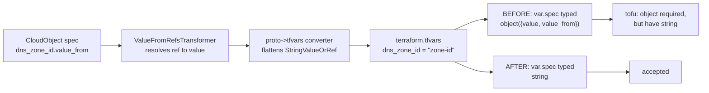
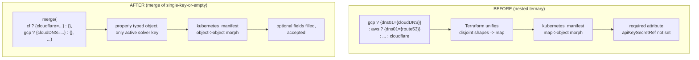

# Fix Two Tofu Stack-Job Failures: ExternalDNS StringValueOrRef Typing and ClusterIssuer Solver Map-Collapse

**Date**: June 5, 2026
**Type**: Bug Fix
**Components**: Kubernetes Provider, API Definitions, Manifest Processing

## Summary

Two `tofu` provisioner stack jobs in the `gosilver-networking-stack` infra pipeline
failed against OpenMCF modules pinned at `v0.3.75`. `KubernetesExternalDns` failed
variable parsing with `attribute "cloudflare": attribute "dns_zone_id": object
required, but have string`, and `KubernetesClusterIssuer` failed the
`kubernetes_manifest` morph with `Failed to transform Map element into Object
element type ... required attribute "apiKeySecretRef" not set`. Both were
module-side defects where the hand-authored Terraform drifted from conventions that
already exist elsewhere in the repo. The fixes conform each module to the canonical
form — the proto->tfvars flattening contract for ExternalDNS, and the
`kubernetescertificate` conditional-key `merge()` idiom for ClusterIssuer — with no
proto or Pulumi changes and 100% Pulumi parity preserved.

## Problem Statement / Motivation

Both kinds use foreign-key (`StringValueOrRef`) fields that the platform resolves
and the proto->tfvars converter (`pkg/iac/tofu/generators`) **flattens to plain
strings** before Terraform runs (`extractStringValueOrRef` in `typerules.go`,
mirrored by the `variables.tf` generator in `variablestf.go`). The two modules each
violated an invariant around that contract.

### Pain Points

- **ExternalDNS — variables.tf disagreed with the converter.** Its hand-authored
  `variables.tf` typed `namespace` and the `gke`/`eks`/`aks`/`cloudflare` DNS-zone
  foreign keys as `object({ value = optional(string), value_from = optional(any) })`
  and read them via `.value`. But the converter emits a bare string, so every tofu
  phase (refresh, plan, apply) aborted at variable evaluation. A grep for
  `value_from = optional(any)` matched **only this module** — it was the lone repo
  divergence from the flattening convention.
- **ClusterIssuer — a conditional collapsed a typed object into a map.**
  `local.solver` was a nested ternary returning four differently-shaped
  `{ dns01 = { <provider> = {...} } }` objects. Terraform unifies the disjoint
  ternary branch types and degrades the `dns01` value to a `map`. `kubernetes_manifest`
  tolerates omitted optional fields on the object->object morph path (note that
  `solvers[0]` carrying only `dns01` morphed fine), but on the **map->object** path
  it requires every target attribute, so the partial Cloudflare solver
  (`apiTokenSecretRef` only) was rejected for missing `apiKeySecretRef`/`email`.
- **Engine asymmetry hid both bugs.** The Pulumi siblings were correct (Go reads
  `GetValue()` for ExternalDNS; `buildDns01SolverConfig` sets only the active field
  via the typed crd2pulumi SDK for ClusterIssuer), so the defects only manifested on
  the Terraform engine.

## Solution / What's New

Each module is brought back in line with an existing repo convention; neither
introduces a new pattern.

### Bug 1 — ExternalDNS: consume foreign keys as flattened strings



The six `StringValueOrRef` fields (`namespace`, `gke.project_id`, `gke.dns_zone_id`,
`eks.route53_zone_id`, `aks.dns_zone_id`, `cloudflare.dns_zone_id`) are typed as plain
`string` and read directly in `locals.tf`, matching the `kubernetesissuer` /
`kubernetescertificate` siblings. `namespace` becomes a required `string` (the proto
marks it `required = true`), dropping the standalone `"external-dns"` default.

### Bug 2 — ClusterIssuer: build the solver with `merge()`



`local.solver`'s `dns01` is rebuilt with the `merge(cond ? { key = value } : {}, ...)`
idiom already used by `kubernetescertificate` (`iac/tf/main.tf`). Each branch
contributes a single key or nothing, so there is no cross-branch type unification and
the value stays a properly typed object carrying only the active provider's solver.

## Implementation Details

**Module**: `apis/org/openmcf/provider/kubernetes/kubernetesexternaldns/v1/iac/tf/`

- `variables.tf`: foreign-key fields flipped from `object({ value, value_from })` to
  `string`; the oneof `optional(object(...))` provider blocks and slim metadata block
  are unchanged. (A wholesale regen via `openmcf tofu generate-variables` was used to
  confirm the canonical `string` typing, but applied as a targeted edit because the
  generator emits a naive schema that drops the oneof `optional()` wrappers and the
  slim metadata.)
- `locals.tf`: dropped the `.value` accessor; `namespace = var.spec.namespace`.
- `README.md`: all provider examples use the plain-string foreign-key form.

**Module**: `apis/org/openmcf/provider/kubernetes/kubernetesclusterissuer/v1/iac/tf/`

```hcl
solver = {
  dns01 = merge(
    local.is_cloudflare ? {
      cloudflare = {
        apiTokenSecretRef = { name = local.cloudflare_secret_name, key = "api-token" }
      }
    } : {},
    local.is_gcp ? { cloudDNS = { project = var.spec.gcp_cloud_dns.project_id } } : {},
    local.is_aws ? { route53 = { region = var.spec.aws_route53.region } } : {},
    local.is_azure ? {
      azureDNS = {
        subscriptionID    = var.spec.azure_dns.subscription_id
        resourceGroupName = var.spec.azure_dns.resource_group
      }
    } : {},
  )
}
```

A comment in `locals.tf` documents the trap so the nested ternary is not
reintroduced. `main.tf` is unchanged (`solvers = [local.solver]`).

### Testing Strategy

Validated locally with the installed `openmcf` CLI and `tofu` (no live cluster):

```bash
# 1. Converter renders foreign keys as bare strings
openmcf tofu load-tfvars extdns-cloudflare.yaml   # namespace="...", dns_zone_id="01360d..."

# 2. HCL validity for both modules
tofu -chdir=<module> init -backend=false && tofu -chdir=<module> validate   # Success

# 3. ExternalDNS variable type now accepts the flattened tfvars
tofu -chdir=<externaldns> plan -var-file=extdns.tfvars
#   -> clears variable evaluation; fails only reaching the absent cluster
#      (no "object required, but have string")

# 4. ClusterIssuer solver is an object, not a map
echo 'type(local.solver)' | tofu -chdir=<clusterissuer> console -var-file=ci.tfvars
#   -> object({ dns01: object({ cloudflare: object({ apiTokenSecretRef: ... }) }) })

# 5. Output mapping unaffected
openmcf validate-outputs --kind KubernetesExternalDns   --module-dir <externaldns>    # passed
openmcf validate-outputs --kind KubernetesClusterIssuer --module-dir <clusterissuer>  # passed
```

## Benefits

- Unblocks the `gosilver-networking-stack` ExternalDNS and ClusterIssuer stack jobs
  on the tofu provisioner.
- Removes the only `StringValueOrRef`-as-object divergence in the Terraform module
  set, so the flattening contract now holds uniformly.
- Adopts the existing `kubernetescertificate` solver idiom, making the cert-manager
  modules consistent and teaching the pattern via an inline cautionary comment.
- Zero behavioral drift versus Pulumi; outputs and proto contracts unchanged.

## Impact

Affects only the two Terraform modules. No proto, Pulumi, CLI, or converter changes;
the Pulumi engine was already correct. Resources provisioned via the tofu engine for
these kinds will succeed once a release carrying the fixes is pinned.

## Related Work

- `2026-06-04-203257-helm-provider-v3-migration-and-externaldns-parity.md` — prior
  ExternalDNS parity work on the same module.
- `2026-06-04-223747-tofu-stdout-stream-read-before-wait-race-fix.md` and
  `2026-06-04-153807-iac-tofu-pulumi-parity-postgres-fix-and-drift-detection.md` —
  recent tofu execution-path hardening.

## Known Limitations / Future Enhancements

`kubernetesissuer` builds its issuer spec with a 2-branch ternary
(`is_ca ? {ca=...} : {selfSigned={}}`). Two single-key branches generally unify
cleanly (unlike the 4-way nested case fixed here), so it is likely fine, but
converting it to the same `merge()` idiom would make the cert-manager modules
uniformly consistent. Verify the CA path with `tofu validate` before changing.

---

**Status**: ✅ Production Ready
**Timeline**: Single focused session
