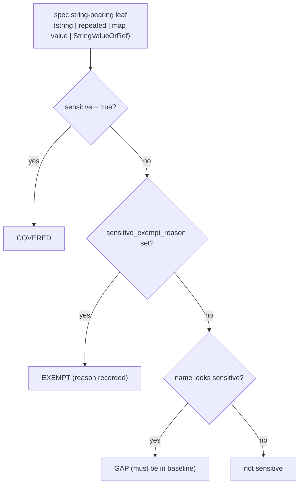

# Secret-Coverage Guardrail and `sensitive_exempt_reason` Escape Hatch

**Date**: June 16, 2026
**Type**: Feature
**Components**: API Definitions, CLI Commands, Build System, Testing Framework

## Summary

Added a reflective "secret coverage" analyzer that walks every production cloud-resource
kind and reports which string-bearing `spec` fields are annotated `sensitive`, which are
intentionally exempted, and which are gaps (look like a secret by name but are not
annotated). A new `openmcf secret-coverage` command surfaces the report and a ratcheting
CI guardrail (`go test ./pkg/secretcoverage/...`) fails when a new unannotated
secret-looking field ships. A co-located proto option, `sensitive_exempt_reason`, is the
escape hatch for intentional non-secrets, documented with an auditable justification.

## Problem Statement / Motivation

The `sensitive` field option (added in v0.3.76) makes downstream platforms enforce
secret-only values and resolve them just-in-time. But annotating it across 380+ kinds is a
large manual sweep, and there was no way to measure progress or to stop a brand-new
secret-bearing field from shipping unannotated -- silently re-opening the plaintext hole
the option exists to close.

### Pain Points

- No visibility into how many sensitive-looking fields are actually annotated.
- A new `password`/`client_secret`/`auth_token` field can ship with no annotation and no signal.
- Field names like `token_dialect` or `credential_provider` *look* sensitive but are not
  secrets, so any naive name check would nag authors with false positives.

## Solution / What's New

A high-precision name heuristic + a descriptor walk + a ratcheting baseline, with a proto
escape hatch for the inevitable false positives.



The walk is a descriptor-level twin of the downstream Java authority
(`secrets-commons.SensitiveFieldWalker`): proto field-NAME paths, `StringValueOrRef` as a
gated leaf, map/repeated handled, non-sensitive submessages descended. Scope is the `spec`
input surface only -- `status.outputs.*` are provider-computed results the user never
supplies and cannot make a reference, so they are not part of the annotation model.

### Escape hatch: `sensitive_exempt_reason` (field 60005)

```proto
// A non-empty value exempts a heuristic-positive field from the gap report and
// records WHY. Read ONLY by coverage tooling; NO effect on enforcement -- a field
// is secret-by-default solely when `sensitive` is true.
string sensitive_exempt_reason = 60005;
```

Two deliberately separate concepts: `sensitive_exempt_reason` is the *permanent* "this is
intentionally not a secret" marker; `pkg/secretcoverage/baseline.yaml` is the *temporary*
sweep backlog (fields that are secrets but not annotated yet), which shrinks to zero as the
sweep proceeds.

## Implementation Details

- `pkg/secretcoverage/heuristic.go` -- `LooksSensitiveByName`, a high-precision token list
  (`password`, `secret`, `token`, `credential`, `apikey`, `private_key`, ...) with a
  denylist for non-secret look-alikes (`*_id`, `*_name`, `*_arn`, `public_*`, ...). Bare
  `key` is intentionally excluded to keep precision high; recall gaps are annotated by hand.
- `pkg/secretcoverage/analyze.go` -- enumerates kinds via `crkreflect.KindsList()` /
  `NewInstance`, skips `_test` and unimplemented kinds, walks each `spec`, and classifies
  each leaf via a pure `classify(name, isSensitive, exemptReason)` (also flags the two
  annotation contradictions: `sensitive` + exempt, and exemption on a non-heuristic name).
- `pkg/secretcoverage/baseline.go` -- baseline load/write + `Gate`, the single comparison
  used by both the CLI `--check` and the CI test, so they cannot disagree.
- `cmd/openmcf/root/secret_coverage.go` -- `openmcf secret-coverage` (report / `--check` /
  `--write-baseline`), modeled on `openmcf kustomize schema`.
- `.github/workflows/lint.secret-coverage.yaml` -- a `pull_request` gate running
  `go test ./pkg/secretcoverage/...` (no general `go test` PR gate existed before).

### Pilot exemptions (proof of the escape hatch)

| Field | Why exempt |
|-------|------------|
| `Auth0ResourceServer:spec.token_dialect` | access-token format selector, not a secret |
| `AwsWafWebAcl:spec.token_domains` | CAPTCHA/Challenge domain names, not a token |
| `AwsCodeBuildProject:spec.environment.registry_credential.credential_provider` | provider-type selector (`SECRETS_MANAGER`), not the secret |

## Usage Examples

```bash
# See coverage and the gap backlog
openmcf secret-coverage

# CI gate (fails on a new gap, stale baseline entry, or contradictory annotation)
openmcf secret-coverage --check

# After an annotation pass, record the remaining accepted gaps
openmcf secret-coverage --write-baseline
```

## Benefits

- Current state is measured: **3.9% coverage** (1 covered, 3 exempt, 99 gaps) -- the sweep
  is now a tracked program with a number that trends to 100%.
- A new secret-bearing field can no longer ship silently: CI fails until it is annotated or
  explicitly exempted with a reason.
- False positives become one-line, self-documenting proto annotations instead of tribal
  knowledge.

## Impact

- Proto authors: a new heuristic-positive field must be annotated `sensitive` or exempted.
- Downstream platforms (e.g. Planton): can read `sensitive_exempt_reason` to render
  "intentionally not a secret" and to produce a coverage report without re-deriving the
  heuristic.
- Runtime enforcement is unchanged: a field is secret-by-default only when `sensitive` is true.

## Testing Strategy

`pkg/secretcoverage` ships with: a `classify` truth-table test (incl. both violations), a
descriptor-walk test against the hermetic `testcloudresourcegeneric` fixture (sensitive
string + sensitive `StringValueOrRef` both COVERED), synthetic `Gate` tests (new gap, stale
entry, contradiction), and `TestSecretCoverageGate` -- the live CI gate over all production
kinds. `make protos` + `go vet` + `go build` green; a downstream security review found no
medium-or-higher findings and confirmed the exemption cannot weaken enforcement.

## Related Work

Part of the downstream "secure-by-default-sensitive-fields" initiative that added the
`sensitive` option (v0.3.76) and the control-plane enforcement + runner JIT resolution.

---

**Status**: ✅ Production Ready
**Timeline**: 1 session
