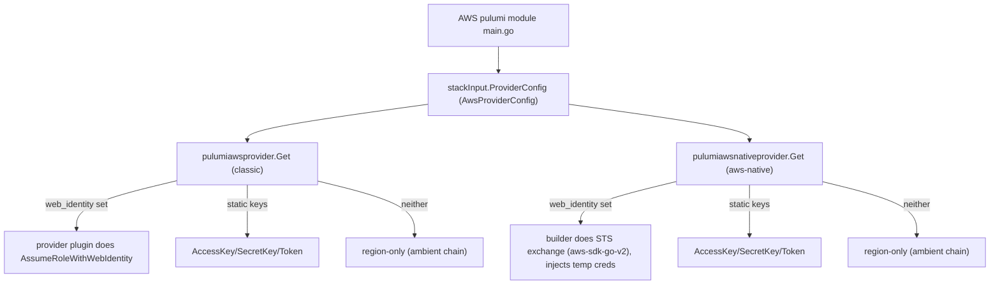
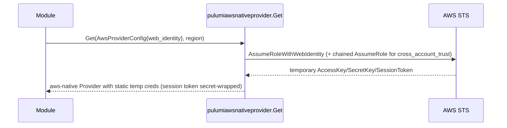

# Converge AWS Pulumi Providers on Shared Builders + Make pulumi-aws-native Keyless

**Date**: June 16, 2026
**Type**: Refactoring + Feature
**Components**: Provider Framework, AWS Provider, API Definitions, Build System

## Summary

Every AWS Pulumi module built its `aws.Provider` inline from static keys, so no AWS kind could use
keyless OIDC federation and the credential-resolution logic was duplicated ~65 times. This change
converges 63 classic modules onto the existing shared `pulumiawsprovider.Get` builder and adds a new
`pulumiawsnativeprovider.Get` for the pulumi-aws-native provider — which has no native web-identity
support — so `awsroute53zone` becomes fully keyless. The result: every migrated AWS kind is
keyless-by-construction (single-hop `oidc` and two-hop `cross_account_trust`), with one place per SDK
to read the credential path.

## Problem Statement / Motivation

The classic shared builder (`pulumiawsprovider.Get`) and the keyless `AwsWebIdentityProviderConfig`
contract already existed and were adopted only by `awss3bucket`. Every other AWS module still did:

```go
if awsProviderConfig == nil {
    provider, err = aws.NewProvider(ctx, "classic-provider", &aws.ProviderArgs{Region: ...})
} else {
    provider, err = aws.NewProvider(ctx, "classic-provider", &aws.ProviderArgs{
        AccessKey: ..., SecretKey: ..., Region: ..., Token: ...,
    })
}
```

### Pain Points

- **Not keyless**: an inline `aws.NewProvider` from static keys cannot do `AssumeRoleWithWebIdentity`,
  so OIDC/cross-account-trust connections fail at the provider with empty credentials.
- **Duplication / divergence**: ~65 modules each re-implemented the same nil/static branch — the exact
  inline divergence the shared builder was created to remove.
- **pulumi-aws-native gap**: `awsroute53zone` uses the aws-native provider, which has **no**
  web-identity field at all (upstream pulumi/pulumi-aws-native#1042, open since 2023), so the classic
  "hand the token to the provider" approach is impossible there.

## Solution / What's New



- **63 classic modules migrated** to `pulumiawsprovider.Get(ctx, stackInput.ProviderConfig, region)`,
  keeping the `classic-provider` resource name for Pulumi state continuity.
- **New `pulumiawsnativeprovider.Get`** mirrors the classic builder but, because the aws-native
  provider cannot exchange a web-identity token itself, performs the STS exchange in the builder and
  injects the resulting short-lived credentials. The `native-provider` resource name is pinned.
- **`awsroute53zone`** (the only aws-native module) now builds its native arm via the new builder and
  its classic arm via `pulumiawsprovider.Get` — fully keyless, with no destructive provider rename.

### Why builder-side exchange for aws-native

The aws-native `ProviderArgs` exposes only `AccessKey`/`SecretKey`/`Token`/`Region`/`RoleArn`/
`AssumeRole` — no `AssumeRoleWithWebIdentity`. Rather than the destructive alternative (converting
`awsroute53zone` to the classic `route53.Zone` resource, which would replace live hosted zones), the
builder resolves credentials itself and hands the provider static temporary keys. The token stays an
opaque OIDC JWT, so Planton remains issuer-agnostic.



## Implementation Details

- **`pkg/iac/pulumi/pulumimodule/provider/aws/pulumiawsnativeprovider/provider.go`** — `Get` +
  a pure, injectable `credentialResolver` seam so the dispatch is unit-testable offline; the real
  resolver uses `aws-sdk-go-v2` `stscreds` (`NewWebIdentityRoleProvider` single hop, then chained
  `NewAssumeRoleProvider` with `external_id` for the cross-account-trust second hop). The session
  token is `pulumi.ToSecret`-wrapped because the aws-native provider auto-secrets only
  `AccessKey`/`SecretKey`. Table-driven tests cover every arm without live STS.
- **63 module `main.go`** — inline blocks replaced with the shared builder via a brace-counting
  codemod (handles nested braces; extracts each module's region expression), then compiler-validated.
  `awseventbridgerule` retains the classic `aws` import (a helper in its `main.go` takes
  `*aws.Provider`, the builder's return type).
- **`apis/dev/planton/provider/aws/provider.proto`** — `AwsWebIdentityProviderConfig` doc comments
  generalized to be issuer-agnostic and to document the classic-vs-native exchange-site difference;
  stubs regenerated.
- **Dependencies** — promoted `aws-sdk-go-v2` (config/credentials/sts) from indirect to direct (the
  first in-process AWS SDK usage in Planton); `go.mod`/`go.sum`/`MODULE.bazel`/BUILD.bazel updated.

## Benefits

- **Every migrated AWS kind is keyless-capable by construction** — `oidc` and `cross_account_trust`
  now work uniformly, not just for `awss3bucket`.
- **One credential path per SDK** — classic and aws-native each have a single, documented builder; the
  ~65-way inline divergence is gone (only one flagged exception remains, below).
- **No state churn** — pinned provider resource names (`classic-provider` / `native-provider`) mean
  existing stacks adopt the builders without a provider replacement.

## Known Limitations

- **`awsroute53dnsrecord` not migrated (intentional)**: it names its provider resource `"aws-provider"`,
  so adopting the `classic-provider`-pinned builder would rename the provider and replace live DNS
  records. It is left inline pending a name-preserving migration (a builder base-name override or a
  deliberate state migration). It is now the only remaining inline AWS provider.
- **Builder-side exchange asymmetry (temporary)**: the classic provider exchanges the token itself; the
  aws-native builder exchanges in builder code because upstream #1042 leaves no alternative. When #1042
  ships, collapse the native builder onto the inline-token model and delete the exchange.

## Testing Strategy

- `go build ./apis/dev/planton/provider/aws/...` and `go build ./pkg/...` — green across all modules.
- `go test ./pkg/iac/pulumi/pulumimodule/provider/aws/pulumiawsprovider/... .../pulumiawsnativeprovider/...`
  — both builder suites pass (dispatch arms, validation errors, resolver error propagation).
- `go mod tidy` clean; `grep` confirms zero remaining inline `aws.NewProvider`/`awsclassic.NewProvider`
  except the builders and the flagged `awsroute53dnsrecord`. Live STS exchange is exercised separately
  (the same mechanism is already proven in the consuming runner's CloudOps path).

## Impact

- **Module authors**: build the AWS provider with one call — `pulumiawsprovider.Get(ctx,
  stackInput.ProviderConfig, region)` (or `pulumiawsnativeprovider.Get` for aws-native) — never inline.
- **Operators / users**: AWS connections using keyless OIDC federation now provision across the
  migrated kinds, not just S3.

## Related Work

- Builds on the existing `pulumiawsprovider.Get` and the `AwsWebIdentityProviderConfig` keyless
  contract (the AWS cross-account-trust / OIDC initiative).
- Product opportunity: a "federation-coverage map" of which kinds are keyless-ready across
  pulumi-classic, pulumi-aws-native, and tofu (the tofu provider path is still static-only).

---

**Status**: ✅ Production Ready (pending tag + downstream consumption)
**Timeline**: 1 session
