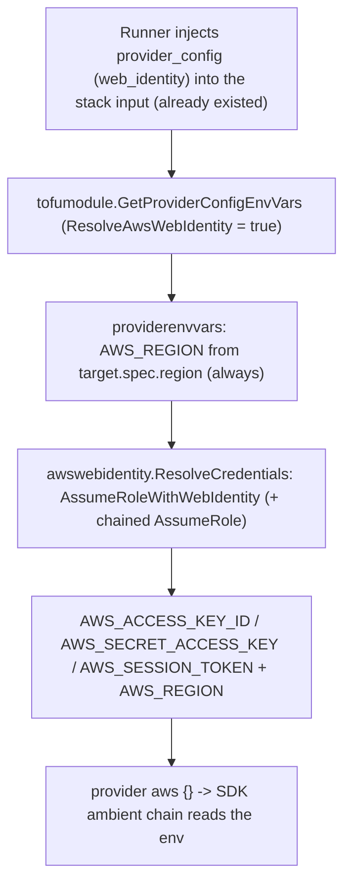
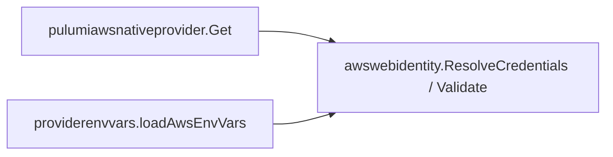

# Keyless Web-Identity (OIDC / Cross-Account-Trust) for the OpenTofu AWS Provider

**Date**: June 16, 2026
**Type**: Feature
**Components**: IAC Stack Runner, AWS Provider, Manifest Processing, API Definitions (Tofu modules)

## Summary

The OpenTofu/Terraform AWS path is now keyless. The runtime performs the STS `AssumeRoleWithWebIdentity` exchange (single hop for `oidc`, web-identity + chained `AssumeRole` for `cross_account_trust`) and injects the resulting short-lived credentials as environment variables, so an `aws-s3-bucket` (and every other AWS kind) can provision over tofu via an `oidc` connection with no static keys anywhere. All 66 AWS tofu modules converge on a single, empty `provider "aws" {}` block whose region and credentials both flow from stack-input injection. This brings the tofu engine to credential parity with the pulumi engine (which gained keyless web identity earlier) and adds no Planton coupling — the technique is issuer-agnostic.

## Problem Statement / Motivation

The pulumi AWS modules became keyless when the shared `pulumiawsprovider`/`pulumiawsnativeprovider` builders learned to consume the `web_identity` arm of `AwsProviderConfig`. The tofu path never did: it flattens `provider_config` into environment variables via `loadAwsEnvVars`, which emitted only `AWS_REGION` / `AWS_ACCESS_KEY_ID` / `AWS_SECRET_ACCESS_KEY` — dropping `web_identity` (and `session_token`) entirely. A keyless connection therefore reached tofu with empty credentials.

### Pain Points

- **No keyless tofu.** `web_identity` configs were silently dropped on the tofu path; only static-key connections could provision.
- **Three non-uniform `provider.tf` shapes.** Of the 66 AWS modules, 49 were region-only, 11 wired `var.provider_config.*`, and 6 wired standalone `var.access_key`/etc. The 17 non-region-only ones referenced a required `provider_config`/credential variable that the runtime **never injects as a tfvar** — a latent "No value for required variable" mismatch.
- **Two latent bugs in the env loader.** `AWS_SESSION_TOKEN` was never emitted (breaking temporary static creds once HCL stops wiring `token`), and credential keys were emitted even when empty (an empty `AWS_ACCESS_KEY_ID` poisons the SDK's ambient credential chain).
- **Region ambiguity.** Two modules sourced the provider region from the wrong place — `awselasticfilesystem` from a standalone `var.region`, `awsapprunnerservice` from `var.provider_config.region` (the *connection* region, not the resource region).

## Solution / What's New

Region is a **resource** property; credentials are a **connection** property. The empty `provider "aws" {}` block defers both to the runtime, exactly mirroring how the pulumi builders take the resource's `spec.Region` and resolve credentials from `AwsProviderConfig`.

### Engine-neutral STS exchange (`pkg/iac/provider/aws/awswebidentity`)

The web-identity STS dance — previously private to the pulumi-aws-native builder — moved to a new engine-neutral package consumed by **both** the native builder and the tofu env path. One tested place for the security-critical exchange instead of a per-engine copy.

## Implementation Details

- **`pkg/iac/provider/aws/awswebidentity/exchange.go`** (new): `ResolveCredentials` (single-hop web identity + chained `AssumeRole`), `Validate`, and an injectable `CredentialResolver` seam for tests. Extracted verbatim from `pulumiawsnativeprovider`, which now imports it.
- **`pkg/iac/stackinput/providerenvvars/loader.go`**: AWS is dispatched here (not in the generic `loadProviderEnvVars`) so `AWS_REGION` is emitted from `target.spec.region` even when `provider_config` is absent (the standalone-CLI ambient case). A new `Options.ResolveAwsWebIdentity` field (backward-compatible) gates the exchange.
- **`pkg/iac/stackinput/providerenvvars/aws.go`**: the rewritten `loadAwsEnvVars` — region-always; web-identity → STS exchange → temp creds; static → keys + `AWS_SESSION_TOKEN`; never emits empty credential keys. A bounded `context.Background()` keeps the exchange wholly within planton (no public-signature churn that would ripple into the runner).
- **`pkg/iac/tofu/tofumodule/providers.go`**: the tofu/terraform boundary sets `ResolveAwsWebIdentity: true`; the pulumi path calls `GetEnvVarsWithOptions` directly and leaves it false (its in-program builder owns the exchange; resolving here would be a wasteful, shadowed STS call).
- **All 66 `apis/dev/planton/provider/aws/*/v1/iac/tf/provider.tf`** converged to the canonical empty block; the dead `provider_config`/credential/region `variable` declarations were pruned from the 17 divergent `variables.tf` files.

> Why builder/runtime-side exchange (not an in-HCL `assume_role_with_web_identity` block): the two-hop `cross_account_trust` chain is not cleanly expressible as a single set of provider-block fields or SDK env vars, and the empty-block + injection model keeps all 66 modules uniform. This matches the accepted aws-native approach (forced there by upstream pulumi-aws-native#1042).

### Why there is no provider/backend env collision (unlike pulumi)

Tofu passes the R2 state-backend credentials as `-backend-config` **flags**, not env vars, so the injected `AWS_*` provider env never collides with the backend keys. The env-var credential channel is clean for tofu.

## Testing Strategy

- **Unit** (`providerenvvars/aws_test.go`): table-driven over the injectable resolver — single-hop, two-hop chained, static-with-session-token, region-only (asserts no empty cred keys), and region-without-provider_config; plus resolver-error propagation.
- **Convergence guard** (`providerenvvars/awsprovidertf_guard_test.go`): asserts exactly 66 provider.tf files, each byte-identical to the canonical block and free of credential/region wiring. Runs under `go test`; skips in the Bazel sandbox (it reads the `apis/` source tree).
- **Verified**: `make build` (protos, kind-map, gazelle, bazel CLI build, cross-compiles) green; `go test` + `bazel test` on the changed packages green.

## Benefits

- An `aws-s3-bucket` can provision over **tofu** via an `oidc` connection — no static keys (live proof gated on AWS sandbox credentials, like the pulumi skeleton).
- One canonical `provider.tf` shape across all 66 AWS modules; three latent bugs fixed (dropped session token, empty-cred env poisoning, wrong region source).
- The STS exchange lives in one engine-neutral, tested package shared by pulumi-native and tofu.

## Impact

- **Tofu AWS modules**: now keyless-capable; static-key and ambient (`runner`) modes are preserved and improved (session token now flows).
- **No proto, control-plane, or pulumi behavior change.** Pulumi keeps exchanging the inline token in its own builder. The Planton runner needs only a routine `make upgrade-planton` to consume this (no runner code change — the public planton signatures are unchanged).
- **Provider-resource state**: terraform provider blocks are not state-tracked resources, so converging them cannot replace live infrastructure.

## Related Work

- Pulumi keyless AWS path (shared `pulumiawsprovider`/`pulumiawsnativeprovider` builders) — this is the tofu counterpart.
- Planton project `20260614.02.aws-cross-account-trust-iac` (T03 item **D6**); architecture in DD-002.

---

**Status**: ✅ Production Ready (live oidc round-trip gated on AWS sandbox credentials)
