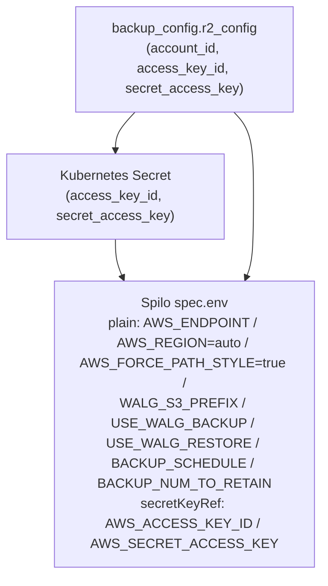

# KubernetesPostgres: per-database R2 backup credentials (secretKeyRef, both engines)

**Date**: June 16, 2026
**Type**: Enhancement
**Components**: API Definitions, Kubernetes Provider, IAC Stack Runner, Resource Management

## Summary

`KubernetesPostgres` can now back up a single database to a dedicated S3-compatible
(Cloudflare R2) bucket using **its own credentials and endpoint**, fully independent of
whatever object storage the cluster's Zalando operator is globally configured for. The
credentials are injected into the Spilo pod via a generated Kubernetes `Secret` +
`secretKeyRef` (never plaintext in the `postgresql` custom resource), and the same
secure path now also covers the pre-existing restore/standby flow. Implemented with
tofu/pulumi parity.

## Problem Statement / Motivation

The per-database `backup_config` only emitted `WALG_S3_PREFIX`, `BACKUP_SCHEDULE`, and
`USE_WALG_BACKUP`. The actual WAL-G **endpoint and credentials** were inherited from the
operator-level pod environment. That makes it impossible for one database on a shared
cluster to back up to a different bucket/account than the operator default — exactly the
case for a tenant that must own its own backup storage and credentials.

A second, related gap: the existing restore path (`restore.r2_config`) wrote the R2
secret access key as a **plaintext `value`** into the `postgresql` CR's `spec.env`,
leaving the secret readable to anyone with `get` on the CR or pod.

### Pain Points

- No way to point a single database's backups at a dedicated R2 bucket with dedicated keys.
- Secret access key exposed in plaintext in the CR/pod spec (restore path).
- Backup and restore credential handling diverged from the operator's own pattern
  (`PGPASSWORD_*` via `secretKeyRef`).

## Solution / What's New

A dedicated, purpose-prefixed credentials message plus a shared, secure injection path.

### Proto (`spec.proto`)

- New `KubernetesPostgresBackupR2Config` (`cloudflare_account_id`, `access_key_id`,
  `secret_access_key`) referenced as `KubernetesPostgresBackupConfig.r2_config`.
- Renamed the restore-side `KubernetesPostgresR2Config` -> `KubernetesPostgresRestoreR2Config`
  (kept separate from backup so the two evolve independently — duplication over coupling).
- Renumbered `KubernetesPostgresBackupConfig` sequentially: `enable_backup`=1, `s3_prefix`=2,
  `backup_schedule`=3, `backup_retain_count`=4 (NEW -> `BACKUP_NUM_TO_RETAIN`), `r2_config`=5
  (NEW), `restore_config`=6 (renamed from `restore`). Nothing is deployed and field numbers
  are not persisted, so this is a clean, gap-free renumber.
- `secret_access_key` on both messages is annotated `(options.sensitive) = true`. `access_key_id`
  is an identifier and is intentionally not annotated (the secret-coverage heuristic does not
  flag the `_id` suffix). Removed the now-covered `secret_access_key` entry from the
  secret-coverage baseline.

### Credential injection (both engines)

- **Pulumi** (`backup_config.go`): a shared `r2CredentialEnvVars` helper creates the
  `Secret` and returns the two `secretKeyRef` env entries; it is called by both the new
  backup path and `restore_config.go` (which dropped its plaintext `STANDBY_AWS_*` values).
- **Tofu** (`credentials.tf` + `locals.tf`): a `kubernetes_secret_v1` per direction, referenced
  via `valueFrom.secretKeyRef` env entries. `database.tf` depends on the secrets.

## Implementation Details

- `USE_WALG_BACKUP` is emitted once: an explicit `enable_backup` wins, otherwise a present
  `r2_config` implies `true`.
- The dedicated-R2 env mirrors the operator-level component's proven set
  (`AWS_FORCE_PATH_STYLE=true`, `AWS_REGION=auto`, `AWS_ENDPOINT`), so it is not guesswork.
- Tofu typing: plain (`{name,value}`) and `secretKeyRef` (`{name,valueFrom}`) env entries are
  appended via single-element `concat()` conditionals so the heterogeneous tuple type-checks
  (a single mixed-shape ternary does not).
- The preset `02-production-with-backup.yaml` now demonstrates `r2Config` + `backupRetainCount`.

## Validation

- `make protos` (regenerated stubs), `make build` (CLI + e2e matrix) — both green.
- `go test ./apis/dev/planton/provider/kubernetes/kubernetespostgres/v1/` — pass.
- `go test ./pkg/secretcoverage/...` — pass (baseline updated; `access_key_id` correctly
  not exempt-annotated).
- `terraform validate` + `terraform fmt` on the tofu module — clean.

## Impact

- Tenants can give a single PostgreSQL database its own R2 backup bucket + credentials,
  independent of operator-level storage.
- The restore/standby path is hardened to `secretKeyRef` in the same change (no more plaintext
  secret in the CR/pod), with no behavior change to standby bootstrap.

## Related Work

- Builds on the secret-coverage guardrail + `sensitive`/`sensitive_exempt_reason` options
  (`2026-06-16-072103-secret-coverage-guardrail-and-exempt-option.md`).
- Same tofu/pulumi parity discipline as the Postgres parity fix and the `Auth0Client` RS256
  default (`2026-06-08-121235-auth0client-jwt-alg-rs256-default-both-engines.md`).

---

**Status**: ✅ Production Ready
