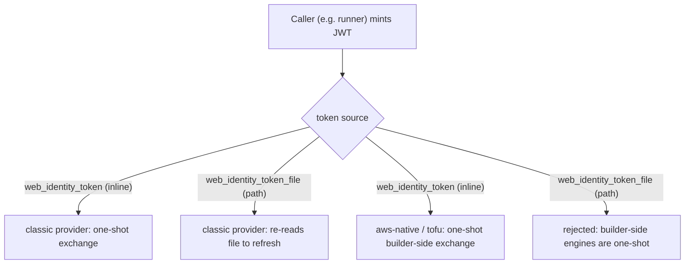

# AWS keyless: route53dnsrecord builder convergence + web-identity token-file source

**Date**: June 16, 2026
**Type**: Enhancement
**Components**: AWS Provider, Provider Framework, API Definitions, Build System

## Summary

Two related improvements to the AWS keyless web-identity path, plus a dead-doc cleanup:

1. **Convergence**: migrated `AwsRoute53DnsRecord` -- the last AWS pulumi module still
   constructing its provider inline -- onto the shared `pulumiawsprovider.Get` builder, so
   every AWS pulumi module now resolves credentials through one path and is keyless by
   construction.
2. **Feature**: added a file-based token source (`web_identity_token_file`) to
   `AwsWebIdentityProviderConfig` for long-running stack jobs whose runtime outlives a single
   assumed-role session, wired into the pulumi-aws "classic" provider (the only engine that
   can refresh by re-reading the file).
3. **Cleanup**: removed all 294 unused `overview.md` files from the API tree.

## Problem Statement / Motivation

### Pain Points

- **One module never converged.** The D2 sweep migrated 63 AWS pulumi modules onto the shared
  `pulumiawsprovider.Get` builder, but `AwsRoute53DnsRecord` was deferred because it named its
  provider resource `"aws-provider"` (vs the builder's pinned `"classic-provider"`), so a
  rename risked replacing live DNS records. With no live users of that component today, the
  rename is risk-free -- and leaving one inline `aws.NewProvider` in the tree teaches the next
  coding agent the pre-keyless pattern (the exact divergence the shared builder exists to end).
  The inline path also carried a latent bug: it passed an empty-string session-token pointer.
- **Inline tokens cannot refresh.** The keyless web identity is supplied inline
  (`web_identity_token`) and exchanged once. A stack job that outlives its assumed-role
  session (role chaining caps cross-account-trust at 1h) has no way to refresh -- the minted
  JWT is in memory only.
- **Dead docs.** 294 `overview.md` files sat in the API tree referenced by nothing in code,
  build, or content packaging (only by the deployment-component authoring rules). Several
  still documented the pre-D2 inline `aws.NewProvider` pattern, actively teaching the wrong
  shape.

## Solution / What's New

### 1. route53dnsrecord -> shared builder

`apis/org/openmcf/provider/aws/awsroute53dnsrecord/v1/iac/pulumi/module/main.go` now calls
`pulumiawsprovider.Get(ctx, stackInput.ProviderConfig, spec.Region)` -- the same convergent
path every other AWS module uses. The two inline `aws.NewProvider("aws-provider", ...)`
branches (and the empty-session-token-pointer bug) are gone. The module is now keyless by
construction (web identity / static keys / ambient chain), and `"aws-provider"` no longer
appears anywhere in the tree.

### 2. File-based web-identity token source

`AwsWebIdentityProviderConfig` gains `web_identity_token_file = 6`. Exactly one of
`web_identity_token` (inline) or `web_identity_token_file` (path) must be set, enforced by a
new message-level CEL (`aws.web_identity.token_xor_file`) and, defense-in-depth, by the
builder. The classic builder maps the file to pulumi-aws
`ProviderAssumeRoleWithWebIdentity.WebIdentityTokenFile`, which the provider re-reads to
refresh credentials when the assumed-role session expires -- so the caller keeps the file's
contents a currently-valid JWT for the job's lifetime.

**Classic-only, by design.** The builder-side exchange engines (aws-native, tofu) resolve
credentials once at build time, so a file there would be read once -- functionally identical
to the inline token they already accept, with zero added capability. The file source is
introduced only where it buys something (a provider that re-reads it). The shared
`awswebidentity.Validate` rejects `web_identity_token_file` with an explanation rather than
silently treating it as one-shot.

### 3. Removed all overview.md

All 294 `overview.md` files removed (`git rm`). Nothing in code, build, or content packaging
consumes them; only the deployment-component authoring rules mention generating/auditing them.

## Implementation Details

- **`apis/org/openmcf/provider/aws/provider.proto`**: added `web_identity_token_file = 6`;
  dropped `required` on `web_identity_token`; added the message-level `token_xor_file` CEL;
  documented that these provider-config fields are caller-constructed and intentionally
  outside the spec secret-coverage surface (so they carry no `sensitive` annotation, matching
  the existing `web_identity_token`).
- **`pkg/iac/pulumi/pulumimodule/provider/aws/pulumiawsprovider/provider.go`**: web-identity
  arm now requires `role_arn` plus exactly one of token/token_file, and sets
  `WebIdentityTokenFile` or `WebIdentityToken` accordingly. The `chained_assume_roles` ->
  `AssumeRoles` block is untouched, so file-based refresh also works for cross-account-trust
  (the SDK re-reads the file at hop 1 and re-chains hop 2).
- **`pkg/iac/provider/aws/awswebidentity/exchange.go`**: `Validate` rejects
  `web_identity_token_file` with a teaching message (builder-side exchange is one-shot;
  classic-only).
- **Tests**: builder tests for the file path and the both/neither error cases; a
  protovalidate test for the `token_xor_file` CEL; a `Validate` test for the file rejection
  and existing invariants.

## Benefits

- Every AWS pulumi module now builds its provider through one keyless-capable builder -- zero
  remaining inline `aws.NewProvider` in module code.
- Long-running stack jobs gain a credential-refresh path without lengthening JWT TTLs (each
  minted token stays short-lived; the runner refreshes the file).
- Latent empty-session-token-pointer bug removed.
- 294 dead docs gone; the codebase no longer teaches the pre-D2 inline pattern.

## Impact

- **Additive and backward-compatible** for the proto: callers that set `web_identity_token`
  inline (the current runner) keep validating unchanged. No connect-side / runner code change
  is required to consume this (the token source is a deploy-time execution detail).
- The runner-side writer that populates `web_identity_token_file` for long-running jobs is a
  follow-up in the consuming repo; this change ships the tested provider-side contract.

## Related Work

- Builds on the shared keyless builder convergence (`pulumiawsprovider.Get`) and the
  engine-neutral `awswebidentity` exchange (aws-native + tofu keyless work).
- Closes the deferred route53dnsrecord migration (the last inline AWS provider).

---

**Status**: ✅ Production Ready (provider-side; runner-side file writer is a follow-up)
