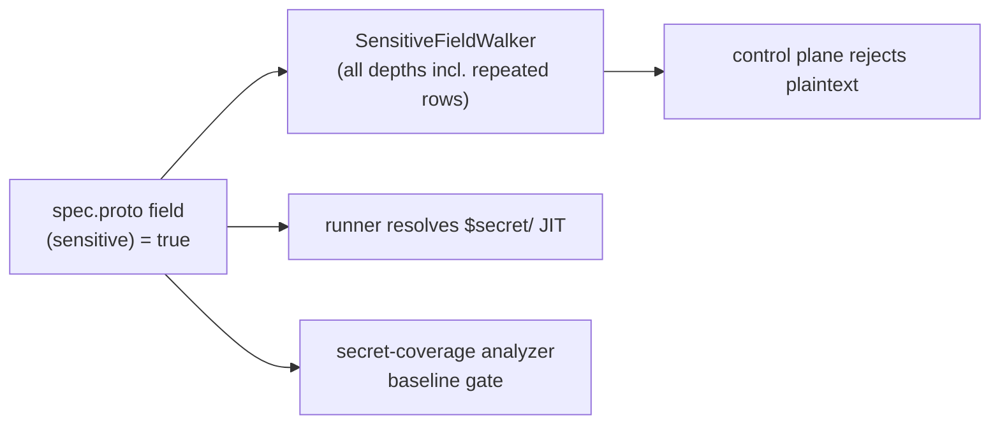

# Secure-by-default: close the R + FK annotation buckets (8 fields)

**Date**: June 17, 2026
**Type**: Enhancement (security)
**Components**: API Definitions, Secret Coverage, Provider Framework

## Summary

Annotates 8 more cloud-resource secret fields with `(org.openmcf.shared.options.sensitive) = true`, closing two of the four deferral buckets from the big-bang annotation sweep: **R** (secrets nested in repeated rows, 7 fields) and **FK** (a secret that is also a foreign-key reference, 1 field). With these, a sensitive field can never hold a plaintext literal — only a managed-secret reference resolved just-in-time on the runner. The secret-coverage baseline shrinks from 20 deferred gaps to **12** (only the C env-secret-maps and D secret-holder-kind buckets remain).

## Problem Statement / Motivation

The annotation sweep (`secret-coverage-guardrail-and-exempt-option`, and the follow-up sweep) deliberately deferred 20 real secrets in four buckets, each for a concrete reason. Two of those reasons were downstream-UX gaps, not doubts about the classification:

- **(R) Secret nested in a repeated row** — `accounts[].account_password`, `users[].password`, `certificates[].{private_key,passphrase}`, `image_pull_secrets[].password`. These are unambiguous secrets, held back only because the consuming web wizard rendered some of those rows with a plaintext text box (annotating would have created a "backend rejects plaintext, form offers no fix" dead-end).
- **(FK) Secret that is also a foreign key** — `AzureVirtualMachine.admin_password` is a real password AND a `StringValueOrRef` that can reference an AzureKeyVault secret. Held back pending a decision on how a field can be both.

Both blockers were downstream (the wizard), not in the proto/enforcement layer — which has always been depth-complete.

## Solution / What's New

The downstream wizard work that unblocks these fields landed in the consumer repo (the web console converged the repeated-row inputs onto the shared reference-only secret picker, and added a dual-mode "managed secret | reference `<Kind>`" picker for sensitive foreign-key fields). With the dead-ends closed, these fields are now annotated here.

### Fields annotated (8)

- `scaleway/scalewayrdbinstance` — `ScalewayRdbUser.password` (R)
- `scaleway/scalewaymongodbinstance` — `ScalewayMongodbUser.password` (R)
- `alicloud/alicloudpolardbcluster` — `accounts[].account_password` (R)
- `alicloud/alicloudrdsinstance` — `accounts[].account_password` (R)
- `oci/ociapplicationloadbalancer` — `certificates[].private_key`, `certificates[].passphrase` (R)
- `oci/ocicontainerinstance` — `image_pull_secrets[].password` (R)
- `azure/azurevirtualmachine` — `admin_password` (FK — a `StringValueOrRef` with `default_kind = AzureKeyVault`; the annotation forbids only a plaintext literal, leaving the cross-resource `value_from` reference intact)

The two OCI specs gained the `org/openmcf/shared/options/options.proto` import.

### Decision: annotate the 4 "no console UI" R fields too

Four of the seven R fields (AliCloud PolarDB/RDS accounts, OCI ALB certificates, OCI ContainerInstance image-pull-secrets) are not rendered in any consumer create/detail UI today — those collections are "managed after creation." Annotating them therefore carries **zero dead-end risk** and secures the only path that can set them (CLI / manifest / API). This closes the R bucket completely (7/7) rather than 2/7.

## Implementation Details

- **Field options**: appended `(org.openmcf.shared.options.sensitive) = true` to each field's option list (combined with existing `buf.validate` / `foreignkey` options where present).
- **Baseline**: `pkg/secretcoverage/baseline.yaml` reduced to the 12 remaining deferred gaps (C + D), with the header updated to record that R and FK are closed.
- **No enforcement-layer change needed**: `SensitiveFieldWalker` already recurses through singular, nested-message, `repeated`-of-message, map, and `StringValueOrRef` at any depth, so annotating a leaf inside a repeated row is enforced with no walker change. (The consumer repo added a hermetic repeated-message test that proves the walk descends `repeated <Message>` rows to their sensitive leaf — previously asserted only in docs.)

## Benefits

- **+8 fields secure-by-default**, including every secret in a repeated row across AliCloud, OCI, and Scaleway database/LB/container kinds.
- **Coverage baseline 20 → 12 gaps** — only the C (service env-secret maps) and D (secret-holder kinds) buckets remain, each tracked with a reason.
- The `sensitive` + foreign-key composition is now exercised by a real field (`AzureVirtualMachine.admin_password`), confirming the annotation means exactly one thing — "the literal may never be plaintext" — uniformly, even for FK fields.

## Impact

- **Reactive enforcement** (per the project's no-migration decision): a resource that next does a create/update/apply with a plaintext value in one of these fields is rejected and the owner re-points it to a `$secret/<slug>` reference; running deployments are unaffected (the runner only resolves `$secret/`/`$var/` strings and passes legacy plaintext through).
- Validated: `buf lint` clean; `make protos` green (stubs + Java compile gate + gazelle); `go vet` + `go test ./pkg/secretcoverage/...` green — the ratcheting coverage gate confirms the new baseline (C + D only).

## Related Work

- Builds on the secret-coverage analyzer + ratcheting gate + `sensitive_exempt_reason` option (`_changelog/2026-06/2026-06-16-072103-secret-coverage-guardrail-and-exempt-option.md`) and the big-bang annotation sweep.
- The consumer-side wizard convergence + DD-006 dual-mode picker + client coverage guardrail land in the planton repo (changelog `013-secure-by-default-planton-half`).

---

**Status**: ✅ Production Ready (release pending — to be cut as the next patch tag)
**Timeline**: Part of the secure-by-default sensitive-fields workstream
