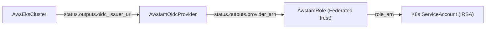
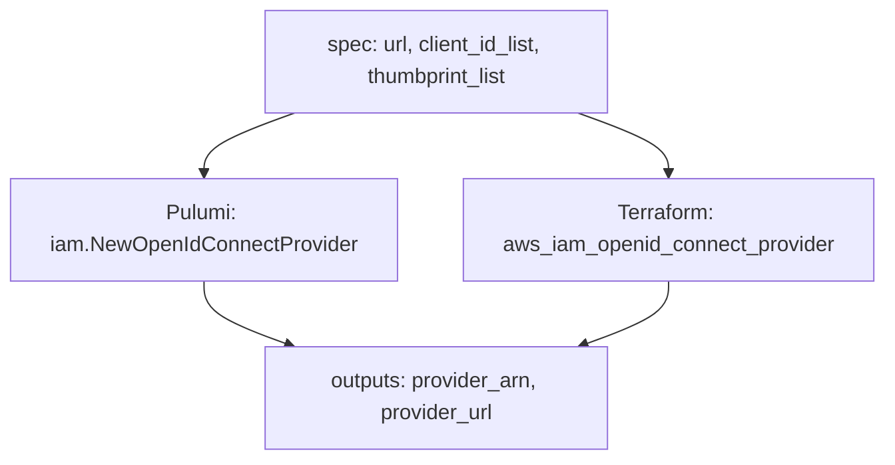

# AwsIamOidcProvider: Keyless Web-Identity Federation as a First-Class Component

**Date**: June 19, 2026
**Type**: Feature
**Components**: API Definitions, AWS Provider, Provider Framework, Resource Management

## Summary

Adds a complete `AwsIamOidcProvider` deployment component that registers an OpenID Connect identity provider in AWS IAM -- the trust anchor that lets external OIDC issuers (EKS clusters, GitHub Actions, GitLab) exchange short-lived tokens for AWS credentials via STS `AssumeRoleWithWebIdentity`, with no long-lived access keys. The component ships at full Pulumi/Terraform parity and models the issuer `url` as a first-class reference to an `AwsEksCluster`, making EKS IRSA setup composable rather than a manual copy-paste step.

## Problem Statement / Motivation

AWS IRSA (IAM Roles for Service Accounts) and keyless CI/CD both depend on an IAM OIDC provider, but the catalog had no way to create one. When `AwsEksCluster` provisions a cluster, AWS exposes an OIDC issuer endpoint -- yet the cluster module only *surfaces* that issuer URL (`status.outputs.oidc_issuer_url`); it does not register the IAM OIDC provider that STS actually checks during a web-identity exchange. Without that registration, IRSA simply does not work.

### Pain Points

- **No catalog primitive**: There was no component to register an OIDC provider, so the EKS -> IRSA -> role chain could not be expressed in Planton at all.
- **Manual issuer wiring**: Even outside Planton, the most error-prone IRSA step is hand-copying the cluster's issuer URL into the provider definition.
- **Long-lived keys in CI**: Without OIDC federation, pipelines fall back to static `AWS_ACCESS_KEY_ID`/`AWS_SECRET_ACCESS_KEY` secrets -- the exact failure mode this primitive eliminates.

## Solution / What's New

A new component at `apis/dev/planton/provider/aws/awsiamoidcprovider/v1/` with the standard anatomy: four protos, spec test, registry entry, docs, hack manifest, presets, and both IaC modules. It deliberately models the issuer URL as a composable reference.

### The federation triangle

Each node is real and independently ownable: the cluster produces an issuer, the OIDC provider trusts it, and an IAM role's trust policy references the provider ARN as a `Federated` principal.

## Implementation Details

### Spec (`spec.proto`)

- `region` -- selects the IAM/STS endpoint (IAM itself is global).
- `url` -- a `StringValueOrRef` with `(default_kind) = AwsEksCluster` and `(default_kind_field_path) = "status.outputs.oidc_issuer_url"`, so an EKS cluster reference resolves the issuer automatically.
- `client_id_list` -- required, at least one, unique, each 1-255 chars (the `aud` claim; `sts.amazonaws.com` for IRSA and GitHub Actions).
- `thumbprint_list` -- optional 40-char SHA-1 fingerprints; omitted by default so AWS derives them for well-known CAs.

### Stack outputs (`stack_outputs.proto`)

- `provider_arn` -- the ARN referenced as a `Federated` principal in role trust policies.
- `provider_url` -- the scheme-stripped issuer URL used to build `<url>:sub` / `<url>:aud` trust conditions.

### Cross-engine parity

Both engines create the same `aws_iam_openid_connect_provider` / `iam.OpenIdConnectProvider` from `metadata.name`, with identical tags and audience list. The single explicit parity point is thumbprint omission: Terraform normalizes an empty list to `null` (so the attribute stays Computed and AWS derives it), and Pulumi leaves `ThumbprintLists` unset for the same reason.

### Registration

Registered as `AwsIamOidcProvider = 229` (`id_prefix: "oidcp"`) in `cloud_resource_kind.proto`; `.pb.go` stubs, `pkg/crkreflect/kind_map_gen.go`, and Gazelle BUILD files regenerated.

### No secrets

An OIDC provider's inputs -- an issuer URL, audiences, public CA fingerprints -- are all public identifiers. The spec carries no sensitive fields, and `secret-coverage --check` passes with zero annotations.

## Verification

- `go build` (recursive + release-equivalent `iac/pulumi` entrypoint) -- pass
- `bazel build` of all new targets + `pkg/crkreflect` + `cloudresourcekind` -- pass (10 targets)
- `go test ./...awsiamoidcprovider/v1/` -- pass (valid + 5 negative cases)
- `planton secret-coverage --check` -- gate passed
- `planton validate-outputs` on both engines -- 2/2 proto fields populated, zero unmapped
- `terraform validate` + `terraform fmt` -- valid and formatted

## Benefits

- **Keyless by default**: Enables EKS IRSA and CI/CD federation, removing long-lived AWS keys from clusters and pipelines.
- **Composable**: The issuer URL wires onto an `AwsEksCluster` by reference; the provider ARN flows into an `AwsIamRole` trust policy -- three real graph nodes, not one opaque bundle.
- **Zero-friction thumbprints**: Well-known issuers need no thumbprint; AWS derives it.

## Impact

Platform users can now express the full keyless-federation chain in Planton manifests. AWS provider coverage gains the missing primitive that makes the existing `AwsEksCluster` IRSA output actually usable.

## Related Work

- Builds on the keyless web-identity work in `2026-06-16-122017-keyless-web-identity-for-tofu-aws-provider.md` and `2026-06-16-134341-aws-keyless-route53dnsrecord-and-web-identity-token-file.md`.
- Complements `AwsIamRole` (the role that trusts this provider) and `AwsEksCluster` (which produces the issuer URL).

---

**Status**: ✅ Production Ready
