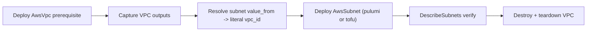

# AwsSubnet component + E2E foreign-key resolution for composed topologies

**Date**: June 20, 2026
**Type**: Feature
**Components**: API Definitions, AWS Provider, IAC Stack Runner, Testing Framework, Resource Management

## Summary

Added `AwsSubnet` as a first-class, standalone AWS networking primitive — the first
step in decomposing AWS networking into independently composable nodes. The component
ships its full anatomy (four protos, Pulumi and Terraform modules at behavioral parity,
validation tests, docs, three presets, kind registration) and is **live-proven on both
provisioners** against a real AWS account. To make a composed topology testable, the E2E
framework gained the ability to resolve foreign-key (`value_from`) references against a
deployed prerequisite's outputs — the resolution step the orchestrator performs in
production, now available to standalone E2E.

## Problem Statement / Motivation

`AwsVpc` bundled subnets inside one component, so a subnet could not be its own graph
node, independently owned, or referenced. AWS was the only major provider still bundling.
A standalone `AwsSubnet` is the foundation the rest of the decomposition (NAT, internet
gateways, consumer migration) builds on.

Separately, no composed two-resource cloud topology had ever been live-E2E'd: the
standalone runner consumes literal values, and `value_from` references are resolved by the
orchestrator before IaC runs (the tofu generator even errors on an unresolved reference).
A subnet needs the freshly-created `vpc_id` of its VPC, so testing it end to end required
the harness to perform that resolution itself.

## Solution / What's New

### `AwsSubnet` (`apis/org/openmcf/provider/aws/awssubnet/v1/`)

- **Spec** with `region`, a `vpc_id` foreign key (`default_kind = AwsVpc`), `availability_zone`,
  `cidr_block`, public-IP-on-launch, dual-stack IPv6, DNS64, resource-name DNS records, and
  `private_dns_hostname_type_on_launch`. Routing is folded in: `route_table_id` XOR inline
  `routes` (message-level CEL mutual-exclusivity); each route is a destination one-of plus a
  `target_type` enum and a `target_id` reference, which the modules map onto the correct AWS
  route attribute.
- **Outputs**: `subnet_id`, `subnet_arn`, `availability_zone`, `cidr_block`, `route_table_id`,
  `region`.
- **Registration**: `AwsSubnet = 284` with `prerequisites: [AwsVpc]`.
- **Dual-engine parity**: Pulumi and Terraform create the subnet and, when inline routes are
  given, a subnet-owned route table + association (else associate an external table, else use
  the VPC main table), with identical resource-identity tags and stack outputs.

### E2E foreign-key resolution (`e2e/framework/runner/`)

- After a prerequisite deploys, its outputs are captured and used to resolve the dependent
  manifest's `value_from` references to literals (driven by the proto's own `default_kind` /
  `default_kind_field_path` annotations) before stack input / tfvars generation.
- The capture also fixed a latent bug: `deployDependency` previously passed `nil` outputs to
  `VerifyDeployed`, so a prerequisite whose verifier needs the resource id could not be
  verified. It now passes the captured outputs.
- New EC2 `DescribeSubnets` / `DescribeVpcs` verifiers; `awsvpc` prerequisite profile;
  `awssubnet` E2E profile + scenario; `TestAwsSubnet_{Pulumi,Terraform}` entries.

## Implementation Details

- `StringValueOrRef` tofu variables are flat strings (the generator flattens them), so the
  subnet's `variables.tf` declares `vpc_id` / `route_table_id` / route `target_id` as plain
  strings and the orchestrator/E2E resolver supplies the literal — corrected from the older
  `object({value})` form that no `StringValueOrRef` tofu module had ever exercised.
- Added the `AwsSubnet` case to `pkg/outputs/conformance_test.go` (output-shape parity guard).

## Benefits

- Subnets are now independent, referenceable graph nodes — the foundation for externalizing
  NAT and internet gateways and migrating the ~30 subnet consumers.
- Composed topologies are testable end to end in standalone E2E for the first time.

## Impact

- New `AwsSubnet` kind available to manifests, charts, and the catalog.
- The E2E framework can now deploy-and-wire prerequisites for any composed component.

## Verification

- `make protos`, `make generate-cloud-resource-kind-map`, gazelle; package-scoped `go build`
  and `go test` for the component, modules, verifiers, framework, and `pkg/outputs`; `bazel
  build` (incl. nogo) of touched targets; `openmcf secret-coverage --check`; `tofu validate`.
- **Live E2E GREEN on both pulumi and tofu** (deploy VPC prerequisite → resolve `vpc_id` →
  deploy subnet → DescribeSubnets verify → destroy → verify-destroyed → teardown VPC), with a
  clean orphan sweep.

---

**Status**: ✅ Production Ready
